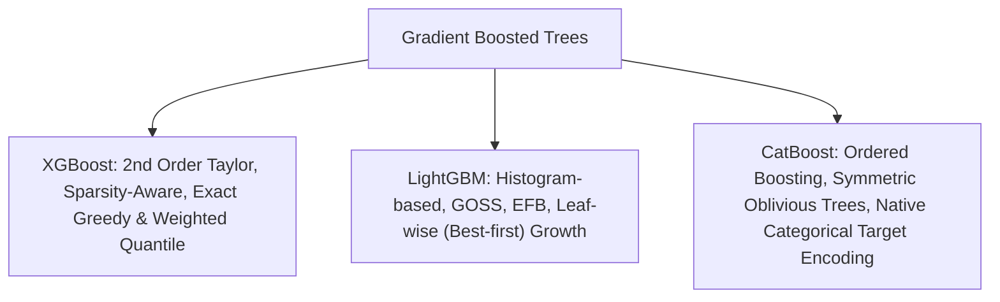

# Ensemble Learning: Bagging, Boosting & Stacking Architectures

A comprehensive technical guide to ensemble machine learning: variance reduction via Bagging, Random Forests, sequential stage-wise modeling via AdaBoost and Gradient Boosted Decision Trees (GBDT), modern high-performance implementations (XGBoost, LightGBM, CatBoost), and meta-learning via Stacking.

---

## 1. Ensemble Fundamentals: Bias-Variance Mechanics

The expected mean squared error of an estimator can be decomposed into:
$$\text{MSE} = \text{Bias}^2 + \text{Variance} + \sigma_{\text{irreducible}}^2$$

- **Bagging (Bootstrap Aggregation)**: Aims primarily to **reduce variance** by averaging predictions from multiple deeply grown, low-bias, high-variance base learners trained on independent bootstrap samples.
- **Boosting**: Aims primarily to **reduce bias** by sequentially training shallow, high-bias, low-variance weak learners to correct the residual errors of preceding models.
- **Stacking**: Learns a meta-model to combine predictions from structurally diverse algorithms (e.g., linear models, tree ensembles, nearest neighbors).

---

## 2. Bagging & Random Forests

### 2.1 The Mathematical Principle of Variance Reduction
Let $B$ individual estimators each have variance $\sigma^2$ and positive pairwise correlation $\rho \in [0, 1]$. The variance of their ensemble average $\bar{f}(\mathbf{x}) = \frac{1}{B} \sum_{b=1}^B f_b(\mathbf{x})$ is:
$$\text{Var}(\bar{f}(\mathbf{x})) = \rho \sigma^2 + \frac{1 - \rho}{B} \sigma^2$$
- As the number of trees $B \to \infty$, the second term $\frac{1 - \rho}{B} \sigma^2 \to 0$.
- The asymptotic floor is dictated entirely by tree correlation $\rho \sigma^2$.

### 2.2 Random Forest: De-correlating Trees
Standard bagging uses all $D$ features at each split, causing dominant features to be chosen repeatedly, which drives correlation $\rho$ up.
**Random Forest** injects two distinct sources of randomness:
1. **Sample Bagging**: Each tree trains on an independent bootstrap sample of size $N$ drawn with replacement ($\approx 63.2\%$ unique instances, leaving $\approx 36.8\%$ as Out-Of-Bag).
2. **Feature Subsampling**: At *every split node*, the algorithm selects a random subset of $m \approx \sqrt{D}$ features (for classification) or $m \approx D / 3$ (for regression). This de-correlates trees, drastically reducing $\rho$ and driving ensemble variance down.

### 2.3 Out-Of-Bag (OOB) Evaluation
The probability that a specific training observation is NOT included in a bootstrap sample of size $N$ is:
$$\lim_{N \to \infty} \left( 1 - \frac{1}{N} \right)^N = \frac{1}{e} \approx 0.368$$
Evaluating each sample using only trees that did not train on it provides an internal validation score (OOB error) without requiring a separate cross-validation loop.

---

## 3. Boosting: Sequential Error Correction

### 3.1 AdaBoost (Adaptive Boosting)
- **Model**: $F_M(\mathbf{x}) = \sum_{m=1}^M \alpha_m h_m(\mathbf{x})$
- **Loss**: Exponential loss $L(y, f(\mathbf{x})) = \exp(-y f(\mathbf{x}))$.
- **Mechanism**:
  1. Base learner $h_m$ (typically a decision stump, depth=1 tree) is fit using sample weights $w_i$.
  2. Weighted classification error is computed: $\epsilon_m = \sum_{i: y_i \neq h_m(\mathbf{x}_i)} w_i$.
  3. Model stage weight is calculated: $\alpha_m = \frac{1}{2} \ln \left( \frac{1 - \epsilon_m}{\epsilon_m} \right)$.
  4. Weights of misclassified samples are boosted: $w_i \leftarrow w_i \exp(\alpha_m \mathbb{I}(y_i \neq h_m(\mathbf{x}_i)))$.

---

## 4. Gradient Boosted Decision Trees (GBDT)

### 4.1 Functional Gradient Descent
Instead of optimizing parameters $\mathbf{w}$ in Euclidean space, Gradient Boosting performs gradient descent in **function space**:
$$F_m(\mathbf{x}) = F_{m-1}(\mathbf{x}) + \nu \cdot h_m(\mathbf{x})$$
where $\nu \in (0, 1]$ is the shrinkage parameter (learning rate).
At step $m$, weak learner $h_m(\mathbf{x})$ is fit to the **pseudo-residuals** (negative gradient of loss $\mathcal{L}$ with respect to current model prediction):
$$r_{im} = -\left[ \frac{\partial \mathcal{L}(y_i, F(\mathbf{x}_i))}{\partial F(\mathbf{x}_i)} \right]_{F = F_{m-1}}$$
For Mean Squared Error $\mathcal{L} = \frac{1}{2}(y - F)^2$, the pseudo-residual is the exact residual: $r_{im} = y_i - F_{m-1}(\mathbf{x}_i)$.

---

## 5. Modern High-Performance GBDT Implementations

### 5.1 XGBoost (Extreme Gradient Boosting)
1. **Second-Order Taylor Approximation**:
   $$\mathcal{L}^{(t)} \approx \sum_{i=1}^N \left[ \mathcal{L}(y_i, \hat{y}^{(t-1)}) + g_i f_t(\mathbf{x}_i) + \frac{1}{2} h_i f_t^2(\mathbf{x}_i) \right] + \Omega(f_t)$$
   where $g_i = \partial_{\hat{y}} \mathcal{L}$ (gradient) and $h_i = \partial^2_{\hat{y}} \mathcal{L}$ (Hessian).
2. **Explicit Regularization $\Omega(f)$**: Penalizes tree leaf count $\gamma T$ and leaf weights $\frac{1}{2}\lambda \sum w_j^2$.
3. **Sparsity-Aware Split Finding**: Learns optimal default split directions for missing values.

### 5.2 LightGBM (Light Gradient Boosting Machine)
1. **GOSS (Gradient-based One-Side Sampling)**: Retains instances with large gradients (under-fitted) and randomly samples instances with small gradients, preserving statistical training accuracy while training on small data subsets.
2. **EFB (Exclusive Feature Bundling)**: Bundles mutually exclusive sparse features (e.g., one-hot features) into dense composite bins.
3. **Leaf-Wise (Best-First) Tree Growth**: Splits the leaf with maximum loss reduction rather than growing level-wise, achieving lower loss with deeper asymmetric branches.

### 5.3 CatBoost (Categorical Boosting)
1. **Ordered Boosting**: Overcomes prediction shift (target leakage) by calculating gradients using models trained strictly on historical permutations of data.
2. **Native Categorical Encoding**: Target statistics calculated iteratively over permutations to prevent overfitting.
3. **Oblivious Trees**: Uses symmetric split criteria at each level, enabling fast parallel CPU/GPU vector evaluation via bitwise operations.

---

## 6. Stacking & Voting

### 6.1 Voting
- **Hard Voting**: Majority class vote across base estimators.
- **Soft Voting**: Probability-weighted argmax across base estimators: $\hat{y} = \arg\max_c \sum_{m=1}^M w_m P_m(y=c \mid \mathbf{x})$.

### 6.2 Stacked Generalization (Stacking)
- Avoids overfitting meta-learners by generating **out-of-fold predictions** via $K$-fold cross-validation.
- Level-1 meta-learner (e.g., Logistic Regression or Elastic Net) learns optimal weights to blend the out-of-fold predictions of Level-0 models.

---

## 7. Comparative Ensemble Architecture Matrix

| Algorithm | Base Learner | Paradigm | Primary Objective | Key Strengths | Primary Hyperparameters |
| :--- | :--- | :--- | :--- | :--- | :--- |
| **Random Forest** | Deep Decision Trees | Parallel Bagging | Variance Reduction | Resists overfitting, OOB error | `n_estimators`, `max_features` |
| **AdaBoost** | Decision Stumps | Sequential Boosting | Bias Reduction | Simple, clean math | `n_estimators`, `learning_rate` |
| **Gradient Boosting**| Shallow Trees | Functional GD | Bias & Variance | Flexible custom losses | `n_estimators`, `learning_rate`, `max_depth` |
| **XGBoost** | CART Trees | 2nd-order Taylor GBDT| High Accuracy | Fast, regularized, handles NaNs | `max_depth`, `subsample`, `colsample_bytree` |
| **LightGBM** | Histogram Trees | GOSS + EFB Leaf-wise | Speed & Scale | Ultra-fast on large tabular data| `num_leaves`, `max_depth`, `min_data_in_leaf` |
| **CatBoost** | Oblivious Trees | Ordered GBDT | Tabular Accuracy | SOTA on high-cardinality categoricals| `depth`, `learning_rate`, `l2_leaf_reg` |
| **Stacking** | Diverse Heterogeneous| Multi-level Stacking | Maximizes Ensembling| Combines diverse algorithmic biases | `cv`, `final_estimator` |

---

## 8. Topic Module Resources
- Interactive Lab: [`notebook.ipynb`](./notebook.ipynb)
- Source Implementation: [`code/ensemble_models.py`](./code/ensemble_models.py)
- Pytest Suite: [`code/test_ensemble.py`](./code/test_ensemble.py)
- Interview Drill: [`interview.md`](./interview.md)
- Curated Citations: [`references.md`](./references.md)
