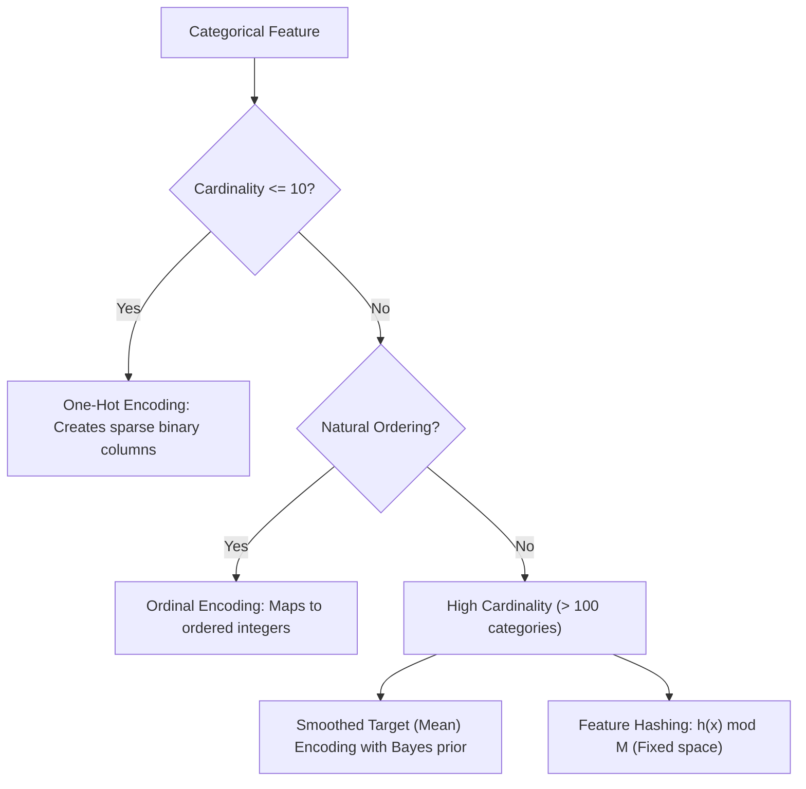
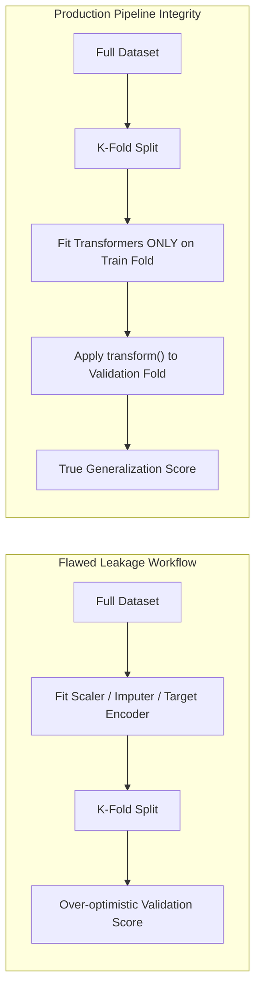

# Feature Engineering: Data Preprocessing, Encodings & Leakage Prevention

A comprehensive engineering guide to feature engineering in machine learning: handling missingness, categorical representations, numerical scalers, variance-stabilizing power transformations, outlier robustification, selection strategies, and data leakage defense.

---

## 1. Missing Value Mechanics: Imputation & Indicator Variables

### 1.1 The Three Missingness Mechanisms (Rubin's Taxonomy)
1. **Missing Completely at Random (MCAR)**: Probability of missingness is independent of both observed and unobserved data ($P(M \mid Y_{\text{obs}}, Y_{\text{mis}}) = P(M)$). Simple mean/median imputation causes minimal bias.
2. **Missing at Random (MAR)**: Missingness depends systematically on observed features ($P(M \mid Y_{\text{obs}}, Y_{\text{mis}}) = P(M \mid Y_{\text{obs}})$). Addressed via conditional regression or Iterative / MICE (Multivariate Imputation by Chained Equations).
3. **Missing Not at Random (MNAR)**: Missingness depends on the unobserved value itself (e.g., high-wealth individuals declining to report income). Imputing without a **missingness indicator** introduces severe bias because the state of being missing is itself a predictive feature.

### 1.2 Imputation Strategies
- **Univariate Baseline**: Mean (symmetric distributions), Median (skewed / outliers), Mode (categorical).
- **KNN Imputation**: Replaces missing values with the Euclidean distance-weighted average of the $k$ nearest complete records ($\mathcal{O}(ND)$ latency).
- **Missingness Indicator**: Adding binary flag column $\mathbb{I}(x_{ij} = \text{NaN})$ allows linear and tree models to branch specifically on missingness.

---

## 2. Categorical Encoding Strategies

### 2.1 One-Hot Encoding (OHE)
- Maps categorical levels $C$ into $C$ orthogonal binary columns.
- **Limitation**: When $C > 100$, creates severe dimensional explosion, high sparsity, and memory bloat. For linear models, drop one level ($C-1$) to eliminate the dummy variable trap (perfect collinearity with intercept).

### 2.2 Smoothed Target (Mean) Encoding
Replaces category $c$ with the smoothed posterior expectation of the target:
$$S_c = \lambda(n_c) \bar{y}_c + (1 - \lambda(n_c)) \bar{y}_{\text{global}}, \quad \lambda(n_c) = \frac{n_c}{n_c + m}$$
where $n_c$ is category frequency, $\bar{y}_c$ is local category mean, and $m > 0$ is the smoothing weight.
- When $n_c \ll m$, the category estimate shrinks safely toward the global baseline, preventing rare categories from memorizing noise.

---

## 3. Numerical Scaling & Normalization

| Scaler | Transformation Formula | Outlier Robustness | Output Distribution Range | Typical ML Algorithm |
| :--- | :--- | :--- | :--- | :--- |
| **StandardScaler** | $z = \frac{x - \mu}{\sigma}$ | Low (Outliers distort $\mu, \sigma$) | $\approx [-3, 3]$ (Mean 0, Std 1) | Linear Models, Neural Networks, PCA |
| **MinMaxScaler** | $z = \frac{x - x_{\min}}{x_{\max} - x_{\min}}$ | Very Low (Outliers compress range) | Strictly $[0, 1]$ | Image pixels, KNN, Naive Bayes |
| **RobustScaler** | $z = \frac{x - \text{median}}{\text{IQR}}$ | **High** (Uses percentiles) | Variable (Median 0, IQR 1) | Datasets with heavy anomalies |
| **$L_2$ Normalizer** | $\mathbf{x}_{\text{norm}} = \frac{\mathbf{x}}{\|\mathbf{x}\|_2}$ | Moderate | Unit Hypersphere $\|\mathbf{x}\| = 1$ | Text Embeddings, Cosine Distance |

---

## 4. Variance-Stabilizing Power Transformations

Many parametric algorithms assume homoscedasticity and Gaussian residuals. Heavy positive skewness violates these assumptions:
- **Logarithmic**: $y = \log(x + 1)$ (Applicable for $x \ge 0$).
- **Box-Cox Transformation**: Requires strictly positive values $x > 0$:
  $$y^{(\lambda)} = \begin{cases} \frac{x^\lambda - 1}{\lambda} & \text{if } \lambda \neq 0 \\ \ln(x) & \text{if } \lambda = 0 \end{cases}$$
- **Yeo-Johnson Transformation**: Extends Box-Cox to support zero and negative values through piecewise definitions.

---

## 5. Outlier Detection & Robustification

- **Tukey's IQR Rule**: Defines bounds $[Q_1 - 1.5 \cdot \text{IQR}, Q_3 + 1.5 \cdot \text{IQR}]$.
- **Winsorization (Capping)**: Instead of discarding rows (which deletes valuable contextual information), extreme values are clipped at the $1^{\text{st}}$ and $99^{\text{th}}$ percentiles.
- **Multivariate Outliers**: Points normal in marginal distributions but anomalous in joint space (e.g., age 12, income $150,000) detected via Mahalanobis distance or Isolation Forests.

---

## 6. Feature Selection Paradigms

1. **Filter Methods**: Compute univariate statistical dependency metrics independently of any model:
   - **Variance Threshold**: Drops constant or near-constant columns.
   - **Mutual Information**: $I(X; Y) = \iint p(x, y) \log \frac{p(x, y)}{p(x)p(y)} dx dy$ (captures non-linear dependencies).
   - **ANOVA F-value**: Linear dependency for continuous features and categorical labels.
2. **Wrapper Methods**: Search feature subsets using a model as an evaluation oracle:
   - **Recursive Feature Elimination (RFE)**: Iteratively fits model, ranks feature weights/importances, and prunes lowest-ranked features.
3. **Embedded Methods**: Feature selection executed internally during model optimization:
   - Lasso ($L_1$ penalty forcing coefficients to zero).
   - Tree-based split importances (MDI - Mean Decrease in Impurity, Permutation Importance).

---

## 7. Data Leakage Prevention

### 7.1 Forms of Data Leakage
1. **Pre-Split Transformation Leakage**: Computing means, standard deviations, min/max, or target encodings on the entire dataset prior to splitting.
2. **Temporal Leakage**: Randomly splitting time-series data, allowing future observations to inform past predictions.
3. **Group Leakage**: Splitting patient or user records across both train and validation sets, allowing models to memorize entity-specific traits rather than general patterns.
4. **Target Leakage**: Including features that are collected downstream of the target event (e.g., using "account closed date" to predict customer churn).

---

## 8. Topic Module Resources
- Interactive Lab: [`notebook.ipynb`](./notebook.ipynb)
- Source Implementation: [`code/transformers.py`](./code/transformers.py)
- Pytest Suite: [`code/test_feature_engineering.py`](./code/test_feature_engineering.py)
- Interview Drill: [`interview.md`](./interview.md)
- Curated Citations: [`references.md`](./references.md)
