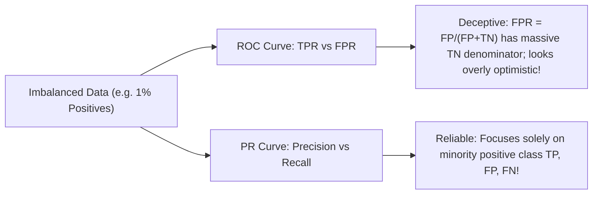

# Model Evaluation, Validation & Calibration: Diagnostic Engineering

A comprehensive guide to performance assessment in machine learning: split strategies, cross-validation protocols, classification metrics, ROC vs. PR curves under extreme imbalance, regression diagnostics, probability calibration, and bias-variance decomposition.

---

## 1. Data Splitting & Cross-Validation Protocols

### 1.1 The Golden Rule of Splitting: Train, Validation, Test
- **Training Set (60-80%)**: Used to fit model parameters ($\mathbf{w}, b$).
- **Validation Set (10-20%)**: Used to select hyperparameters ($\alpha$, tree depth, architecture), tune decision thresholds, and perform early stopping.
- **Test Set (10-20%)**: Held-out completely until the final model candidate is finalized. Evaluated strictly once to provide an unbiased estimate of real-world generalization error.

### 1.2 Cross-Validation Protocols
- **$K$-Fold Cross-Validation**: Splits data into $K$ equal subsets; iteratively trains on $K-1$ folds and evaluates on the held-out fold, averaging performance.
- **Stratified $K$-Fold**: Mandatory for classification. Ensures each fold preserves the exact relative class proportions of the complete population, preventing folds from missing rare minority instances.
- **Time-Series / Walk-Forward Split**: Mandatory for temporal data. Train set expands monotonically into the past, evaluating strictly on subsequent temporal horizons (no future data leakage).

---

## 2. Classification Metrics & The Confusion Matrix

### 2.1 The Confusion Matrix
| Prediction \ Reality | Actual Positive ($y = 1$) | Actual Negative ($y = 0$) |
| :--- | :--- | :--- |
| **Predicted Positive ($\hat{y} = 1$)** | **True Positive (TP)** | **False Positive (FP - Type I Error)** |
| **Predicted Negative ($\hat{y} = 0$)** | **False Negative (FN - Type II Error)**| **True Negative (TN)** |

### 2.2 Core Metric Formulations
- **Accuracy**: $\frac{\text{TP} + \text{TN}}{\text{Total}}$ (Fails completely under class imbalance: predicting 100% negative on a 99:1 dataset yields 99% accuracy!).
- **Precision (Positive Predictive Value)**:
  $$\text{Precision} = \frac{\text{TP}}{\text{TP} + \text{FP}}$$
  "Out of all samples predicted positive, how many were actually positive?" (Critical in spam filtering, recommendation).
- **Recall (Sensitivity / True Positive Rate)**:
  $$\text{Recall} = \frac{\text{TP}}{\text{TP} + \text{FN}}$$
  "Out of all truly positive samples, how many did we catch?" (Critical in disease screening, fraud detection).
- **Specificity (True Negative Rate)**: $\frac{\text{TN}}{\text{TN} + \text{FP}}$.
- **$F_\beta$ Score**: Harmonic mean balancing precision and recall:
  $$F_\beta = (1 + \beta^2) \frac{\text{Precision} \cdot \text{Recall}}{\beta^2 \text{Precision} + \text{Recall}}$$
  - $\beta = 1$: Standard $F_1$ score.
  - $\beta = 2$: Weights recall twice as heavily as precision.
  - $\beta = 0.5$: Weights precision twice as heavily as recall.

---

## 3. Threshold-Free Curves: ROC-AUC vs. PR-AUC

### 3.1 ROC Curve & ROC-AUC
- Plots **True Positive Rate (TPR)** vs. **False Positive Rate (FPR)** across all discrimination thresholds $\tau \in [0, 1]$.
- **ROC-AUC Interpretation**: The probability that a randomly chosen positive instance is assigned a higher predicted score than a randomly chosen negative instance:
  $$\text{ROC-AUC} = P(\hat{s}(x^+) > \hat{s}(x^-))$$
- Random guess baseline is strictly $0.5$.

### 3.2 The Imbalance Trap: Why PR-AUC is Superior
When positive instances represent only $0.1\%$ of the dataset, 1,000 false positives out of 1,000,000 negatives produces a tiny $\text{FPR} = \frac{1000}{1000 + 999000} \approx 0.001$, giving a deceptively stellar ROC-AUC of $> 0.98$.
However, those same 1,000 false positives against only 100 true positives collapse Precision to $\frac{100}{100 + 1000} \approx 9\%$.
**Golden Rule**: Use **Precision-Recall AUC (PR-AUC / Average Precision)** whenever evaluating imbalanced datasets.

---

## 4. Regression Metrics

- **Mean Squared Error (MSE)**: $\frac{1}{N} \sum (y_i - \hat{y}_i)^2$ (Penalizes large errors quadratically; sensitive to outliers).
- **Root Mean Squared Error (RMSE)**: $\sqrt{\text{MSE}}$ (In original target units; easily interpretable).
- **Mean Absolute Error (MAE)**: $\frac{1}{N} \sum |y_i - \hat{y}_i|$ (Linear penalty; robust to outliers).
- **Mean Absolute Percentage Error (MAPE)**: $\frac{100\%}{N} \sum \left| \frac{y_i - \hat{y}_i}{y_i} \right|$ (Relative error; undefined when $y_i = 0$).
- **Coefficient of Determination ($R^2$)**:
  $$R^2 = 1 - \frac{\sum (y_i - \hat{y}_i)^2}{\sum (y_i - \bar{y})^2}$$
  Fraction of target variance explained by the model ($R^2 = 1$ is perfect; $R^2 = 0$ equals baseline mean predictor; $R^2 < 0$ is worse than predicting constant mean).

---

## 5. Model Calibration & Reliability

A model outputting probability $\hat{p} = 0.8$ is **well-calibrated** if, among all instances where the model predicts $0.8$, exactly $80\%$ are true positives.
- Modern deep neural networks with high capacity often have high classification accuracy but are **severely overconfident** (poorly calibrated).
- **Brier Score**: $\text{Brier} = \frac{1}{N} \sum (\hat{p}_i - y_i)^2 \in [0, 1]$.
- **Post-Hoc Calibration Techniques**:
  1. **Platt Scaling**: Fits a scalar logistic regression on validation logits: $P(y=1 \mid z) = \sigma(a z + b)$.
  2. **Isotonic Regression**: Non-parametric piecewise constant isotonic fit (requires more data).

---

## 6. The Bias-Variance Trade-off

$$\mathbb{E}[(y - \hat{f}(\mathbf{x}))^2] = \underbrace{(\text{Bias}[\hat{f}(\mathbf{x})])^2}_{\text{Underfitting}} + \underbrace{\text{Var}(\hat{f}(\mathbf{x}))}_{\text{Overfitting}} + \underbrace{\sigma^2}_{\text{Irreducible Error}}$$

- **High Bias (Underfitting)**: Model is too simplistic to capture underlying patterns. Both training and validation errors are unacceptably high. Remediate by increasing model capacity, adding polynomial/interaction features, or reducing regularization.
- **High Variance (Overfitting)**: Model memorizes training noise. Training error is very low, but validation error is high (large generalization gap). Remediate by gathering more training data, increasing regularization, pruning trees, or applying dropout.

---

## 7. Topic Module Resources
- Interactive Lab: [`notebook.ipynb`](./notebook.ipynb)
- Source Implementation: [`code/metrics.py`](./code/metrics.py)
- Pytest Suite: [`code/test_evaluation.py`](./code/test_evaluation.py)
- Interview Drill: [`interview.md`](./interview.md)
- Curated Citations: [`references.md`](./references.md)
