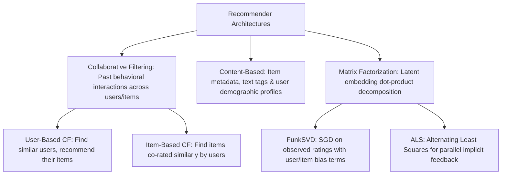

# Recommender Systems: Collaborative Filtering, Matrix Factorization & Ranking

A comprehensive guide to personalized recommendation architectures: Collaborative Filtering, Content-Based Filtering, Regularized Matrix Factorization (FunkSVD/ALS), production ranking metrics (NDCG, MAP, MRR), and Cold-Start mitigation.

---

## 1. Recommendation Paradigms: An Overview

### 1.1 The Fundamental Data Structure: Sparse Interaction Matrix
Given $M$ users and $N$ items, the interaction matrix $R \in \mathbb{R}^{M \times N}$ is typically $> 99.5\%$ sparse:
- **Explicit Feedback**: Direct ratings (1 to 5 stars, thumbs up/down). High quality, but sparse.
- **Implicit Feedback**: Clicks, view duration, purchases, page scrolls. Plentiful, but lacks negative signals (an unviewed item could mean dislike, or simply that the user never saw it).

---

## 2. Collaborative Filtering (Neighborhood Methods)

### 2.1 User-Based Collaborative Filtering (U2U)
Predicts rating of user $u$ on item $i$ as the similarity-weighted average of ratings from the $K$ most similar users:
$$\hat{r}_{ui} = \bar{r}_u + \frac{\sum_{v \in \mathcal{N}_i(u)} \text{sim}(u, v) (r_{vi} - \bar{r}_v)}{\sum_{v \in \mathcal{N}_i(u)} |\text{sim}(u, v)|}$$
where similarity is computed via Pearson correlation or cosine similarity over co-rated items:
$$\text{Pearson}(u, v) = \frac{\sum_{i \in I_{uv}} (r_{ui} - \bar{r}_u)(r_{vi} - \bar{r}_v)}{\sqrt{\sum (r_{ui} - \bar{r}_u)^2} \sqrt{\sum (r_{vi} - \bar{r}_v)^2}}$$

### 2.2 Item-Based Collaborative Filtering (I2I)
Items change much less frequently than user preferences, making item-item similarity matrices pre-computable offline. The prediction aggregates user $u$'s past ratings on items similar to target item $i$:
$$\hat{r}_{ui} = \frac{\sum_{j \in \mathcal{N}_u(i)} \text{sim}(i, j) \cdot r_{uj}}{\sum_{j \in \mathcal{N}_u(i)} |\text{sim}(i, j)|}$$

---

## 3. Matrix Factorization (FunkSVD & ALS)

### 3.1 Intuition
Users and items are projected into a shared low-dimensional latent embedding space $\mathbb{R}^k$ (e.g., $k=64$). A user's preference for an item is modeled by the inner product of their latent vectors:
$$R \approx P Q^T$$
where $P \in \mathbb{R}^{M \times k}$ are user embeddings and $Q \in \mathbb{R}^{N \times k}$ are item embeddings.

### 3.2 Formulation with Baseline Biases (FunkSVD)
Not all ratings reflect true affinity: some users are systematically critical (low baseline), and some blockbuster movies receive high ratings generally. We decompose predictions into global, user, and item bias terms:
$$\hat{r}_{ui} = \mu + b_u + b_i + \mathbf{p}_u^T \mathbf{q}_i$$
- **Objective Function (Regularized Loss on Observed Ratings $\mathcal{K}$)**:
  $$\min_{\mathbf{b}, P, Q} \sum_{(u, i) \in \mathcal{K}} (r_{ui} - \hat{r}_{ui})^2 + \lambda \left( b_u^2 + b_i^2 + \|\mathbf{p}_u\|_2^2 + \|\mathbf{q}_i\|_2^2 \right)$$
- **Stochastic Gradient Descent (SGD) Updates**:
  For prediction error $e_{ui} = r_{ui} - \hat{r}_{ui}$:
  $$b_u \leftarrow b_u + \eta (e_{ui} - \lambda b_u)$$
  $$b_i \leftarrow b_i + \eta (e_{ui} - \lambda b_i)$$
  $$\mathbf{p}_u \leftarrow \mathbf{p}_u + \eta (e_{ui} \mathbf{q}_i - \lambda \mathbf{p}_u)$$
  $$\mathbf{q}_i \leftarrow \mathbf{q}_i + \eta (e_{ui} \mathbf{p}_u - \lambda \mathbf{q}_i)$$

---

## 4. Content-Based Filtering

- **Representation**: Items are represented by dense metadata feature vectors $\mathbf{x}_i$ (genre, director, actors, TF-IDF text descriptions, embeddings).
- **User Profile Vector**: Computed as the weighted average of item profiles the user has consumed:
  $$\mathbf{u} = \frac{\sum_{i \in \text{Liked}} w_{ui} \mathbf{x}_i}{\sum w_{ui}}$$
- **Recommendation**: Rank items by cosine similarity $\cos(\mathbf{u}, \mathbf{x}_j)$.
- **Advantages**: No cold-start problem for newly added items with metadata; highly explainable.

---

## 5. Ranking Evaluation Metrics

Recommenders present an ordered slate of $K$ items. Evaluating absolute rating error (RMSE) does not assess ranking quality.

### 5.1 Precision@K & Recall@K
$$\text{Precision@K} = \frac{|\text{Top-K Recommendations} \cap \text{Relevant Items}|}{K}$$
$$\text{Recall@K} = \frac{|\text{Top-K Recommendations} \cap \text{Relevant Items}|}{|\text{Relevant Items}|}$$

### 5.2 Mean Average Precision (MAP@K)
$$\text{AP@K} = \frac{1}{\min(m, K)} \sum_{k=1}^K P(k) \cdot \mathbb{I}(\text{item } k \text{ is relevant})$$
$\text{MAP@K}$ averages AP@K across all users, rewarding recommenders that place relevant items at the very top of the list.

### 5.3 Normalized Discounted Cumulative Gain (NDCG@K)
Accounts for graded relevance and position decay:
$$\text{DCG@K} = \sum_{i=1}^K \frac{2^{\text{rel}_i} - 1}{\log_2(i + 1)}$$
$$\text{NDCG@K} = \frac{\text{DCG@K}}{\text{IDCG@K}} \in [0, 1]$$
where $\text{IDCG@K}$ is the ideal DCG obtained by sorting items in perfect descending relevance order.

### 5.4 Mean Reciprocal Rank (MRR)
$$\text{MRR} = \frac{1}{|U|} \sum_{u=1}^{|U|} \frac{1}{\text{rank}_u^*}$$
where $\text{rank}_u^*$ is the position of the *first* relevant recommendation.

---

## 6. The Cold-Start Problem & Industrial Solutions

1. **New User Problem**: No behavioral interaction history.
   - *Mitigation*: Onboarding preference quizzes, geo-temporal popularity baselines, demographic priors.
2. **New Item Problem**: No user has interacted with the item yet; collaborative filtering cannot recommend it.
   - *Mitigation*: Fall back to content-based metadata embeddings, multi-armed bandits ($\epsilon$-greedy exploration) to allocate exploration traffic.
3. **Two-Tower Neural Networks (Retrieval & Ranking)**:
   - Modern enterprise architecture (YouTube, Pinterest):
     - **Retrieval Tower**: Uses ANN vector search (HNSW) to filter catalog from $10^8$ items to top $10^3$ candidates in $< 10$ ms.
     - **Scoring/Ranking Tower**: Heavy deep neural network with cross-features scoring top $10^3$ candidates.

---

## 7. Topic Module Resources
- Interactive Lab: [`notebook.ipynb`](./notebook.ipynb)
- Source Implementation: [`code/recommender_models.py`](./code/recommender_models.py)
- Pytest Suite: [`code/test_recommender.py`](./code/test_recommender.py)
- Interview Drill: [`interview.md`](./interview.md)
- Curated Citations: [`references.md`](./references.md)
