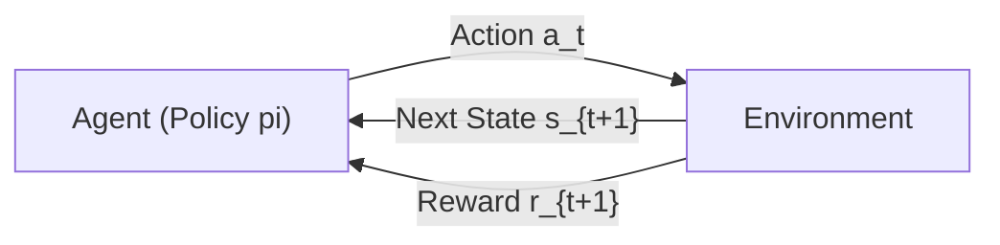
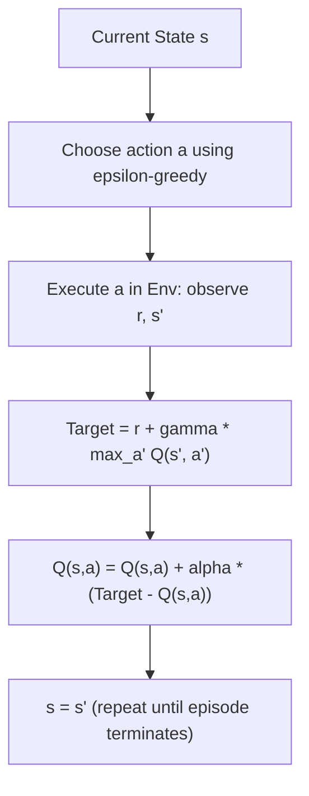

# Reinforcement Learning: MDPs, Dynamic Programming, Q-Learning & Policy Gradients

A rigorous, self-contained guide to Reinforcement Learning (RL): Markov Decision Processes, Bellman Equations, Dynamic Programming (Value Iteration), Model-Free Temporal Difference Control (Q-Learning), and Policy Gradient Foundations (REINFORCE).

---

## 1. Reinforcement Learning Paradigm

Reinforcement Learning studies how an **agent** learns to make sequential decisions by interacting with an uncertain **environment** to maximize cumulative numerical reward.

Unlike supervised learning (where ground-truth labels are provided per instance) or unsupervised learning (discovering latent data geometry), RL relies on **evaluative trial-and-error feedback** subject to delayed credit assignment and exploration-exploitation trade-offs.

---

## 2. Markov Decision Processes (MDP)

A discrete-time Markov Decision Process is formally defined by the 5-tuple:
$$\mathcal{M} = (\mathcal{S}, \mathcal{A}, \mathcal{P}, \mathcal{R}, \gamma)$$

1. **State Space $\mathcal{S}$**: The set of all valid environmental configurations.
2. **Action Space $\mathcal{A}$**: The set of decisions available to the agent (discrete or continuous).
3. **Transition Probability Kernel $\mathcal{P}$**: 
   $$\mathcal{P}(s' \mid s, a) = \mathbb{P}(S_{t+1} = s' \mid S_t = s, A_t = a)$$
4. **Reward Function $\mathcal{R}$**: 
   $$\mathcal{R}(s, a, s') = \mathbb{E}[R_{t+1} \mid S_t = s, A_t = a, S_{t+1} = s']$$
5. **Discount Factor $\gamma \in [0, 1)$**: Prioritizes immediate over distant rewards and ensures mathematical convergence of infinite-horizon returns.

### The Markov Property
The future is conditionally independent of the past given the present:
$$\mathbb{P}(S_{t+1} = s_{t+1}, R_{t+1} = r_{t+1} \mid S_t = s_t, A_t = a_t, \dots, S_0 = s_0, A_0 = a_0) = \mathbb{P}(S_{t+1} = s_{t+1}, R_{t+1} = r_{t+1} \mid S_t = s_t, A_t = a_t)$$

### Return and Trajectories
A trajectory is a sequence of interactions: $\tau = (s_0, a_0, r_1, s_1, a_1, r_2, \dots)$. The cumulative discounted return $G_t$ from step $t$ onward is:
$$G_t = \sum_{k=0}^{\infty} \gamma^k R_{t+k+1} = R_{t+1} + \gamma G_{t+1}$$

---

## 3. Policies, Value Functions & Bellman Equations

### 3.1 Policy
A policy $\pi$ specifies the agent's behavior:
- **Deterministic**: $a = \pi(s)$
- **Stochastic**: $\pi(a \mid s) = \mathbb{P}(A_t = a \mid S_t = s)$ where $\sum_{a \in \mathcal{A}} \pi(a \mid s) = 1$

### 3.2 State-Value Function $V^\pi(s)$
Expected return starting from state $s$ under policy $\pi$:
$$V^\pi(s) = \mathbb{E}_\pi [G_t \mid S_t = s] = \sum_{a \in \mathcal{A}} \pi(a \mid s) \sum_{s' \in \mathcal{S}} \mathcal{P}(s' \mid s, a) \left[ \mathcal{R}(s, a, s') + \gamma V^\pi(s') \right]$$

### 3.3 Action-Value Function $Q^\pi(s, a)$
Expected return starting from state $s$, taking action $a$, and subsequently following policy $\pi$:
$$Q^\pi(s, a) = \mathbb{E}_\pi [G_t \mid S_t = s, A_t = a] = \sum_{s' \in \mathcal{S}} \mathcal{P}(s' \mid s, a) \left[ \mathcal{R}(s, a, s') + \gamma \sum_{a' \in \mathcal{A}} \pi(a' \mid s') Q^\pi(s', a') \right]$$

### 3.4 Bellman Optimality Equations
The optimal value functions satisfy the non-linear Bellman optimality relations:
$$V^*(s) = \max_{a \in \mathcal{A}} \sum_{s' \in \mathcal{S}} \mathcal{P}(s' \mid s, a) \left[ \mathcal{R}(s, a, s') + \gamma V^*(s') \right]$$
$$Q^*(s, a) = \sum_{s' \in \mathcal{S}} \mathcal{P}(s' \mid s, a) \left[ \mathcal{R}(s, a, s') + \gamma \max_{a' \in \mathcal{A}} Q^*(s', a') \right]$$

The optimal policy is greedy with respect to $Q^*(s, a)$:
$$\pi^*(s) = \arg\max_{a \in \mathcal{A}} Q^*(s, a)$$

---

## 4. Dynamic Programming: Value Iteration

When the environment dynamics $(\mathcal{P}, \mathcal{R})$ are completely known, the Bellman optimality operator is a contraction mapping in the supremum norm. **Value Iteration** iteratively updates state values until convergence:

$$V_{k+1}(s) \leftarrow \max_{a \in \mathcal{A}} \sum_{s'} \mathcal{P}(s' \mid s, a) \left[ \mathcal{R}(s, a, s') + \gamma V_k(s') \right]$$

Termination occurs when $\max_{s} |V_{k+1}(s) - V_k(s)| < \theta \frac{1 - \gamma}{2\gamma}$.

---

## 5. Model-Free Reinforcement Learning: Q-Learning

When the transition matrix $\mathcal{P}$ and reward distribution $\mathcal{R}$ are unknown, the agent must learn directly from experienced transitions $(s, a, r, s')$.

### 5.1 Temporal Difference (TD) Learning
TD methods bootstrap: they update an estimate using another learned estimate rather than waiting for episodic termination (unlike Monte Carlo methods).
The 1-step TD target is $r + \gamma V(s')$, with TD error:
$$\delta_t = R_{t+1} + \gamma V(S_{t+1}) - V(S_t)$$

### 5.2 Q-Learning (Off-Policy TD Control)
Watkins' Q-learning estimates the optimal action-value function $Q^*$ directly, independent of the behavioral exploration policy:

$$Q(S_t, A_t) \leftarrow Q(S_t, A_t) + \alpha \underbrace{\left[ R_{t+1} + \gamma \max_{a'} Q(S_{t+1}, a') - Q(S_t, A_t) \right]}_{\text{Temporal Difference Error } \delta_t}$$

- **Target Policy**: Greedy with respect to $Q$ ($\max_{a'} Q(S_{t+1}, a')$).
- **Behavior Policy**: Typically $\epsilon$-greedy to maintain exploration:
  $$\pi(a \mid s) = \begin{cases} 1 - \epsilon + \frac{\epsilon}{|\mathcal{A}|}, & \text{if } a = \arg\max_b Q(s, b) \\ \frac{\epsilon}{|\mathcal{A}|}, & \text{otherwise} \end{cases}$$
- **Q-Learning vs. SARSA**:
  - **Q-Learning**: Off-policy; learns $Q^*$ directly assuming optimal subsequent play.
  - **SARSA**: On-policy; target uses the action actually selected by the behavior policy: $R_{t+1} + \gamma Q(S_{t+1}, A_{t+1})$.

---

## 6. Policy Gradient Methods: REINFORCE

Instead of deriving policies indirectly from action values, **Policy Gradient** methods parameterize the policy directly as $\pi_\theta(a \mid s)$ and perform gradient ascent on expected trajectory return:
$$J(\theta) = \mathbb{E}_{\tau \sim \pi_\theta} [R(\tau)]$$

### 6.1 The Policy Gradient Theorem
$$\nabla_\theta J(\theta) = \mathbb{E}_{\pi_\theta} \left[ \sum_{t=0}^T \nabla_\theta \log \pi_\theta(A_t \mid S_t) G_t \right]$$

### 6.2 Derivation (Log-Derivative Trick)
$$\nabla_\theta \mathbb{E}_{\tau}[R(\tau)] = \int \nabla_\theta P(\tau; \theta) R(\tau) d\tau = \int P(\tau; \theta) \frac{\nabla_\theta P(\tau; \theta)}{P(\tau; \theta)} R(\tau) d\tau = \mathbb{E}_{\tau} [\nabla_\theta \log P(\tau; \theta) R(\tau)]$$

Since $P(\tau; \theta) = \mu(s_0) \prod_{t=0}^T \pi_\theta(a_t \mid s_t) \mathcal{P}(s_{t+1} \mid s_t, a_t)$, environmental dynamics drop out when taking $\nabla_\theta \log P(\tau; \theta)$:
$$\nabla_\theta \log P(\tau; \theta) = \sum_{t=0}^T \nabla_\theta \log \pi_\theta(a_t \mid s_t)$$

### 6.3 Softmax Parameterization
For discrete actions, a linear/neural logit score $h(s, a; \theta)$ yields:
$$\pi_\theta(a \mid s) = \frac{e^{h(s, a; \theta)}}{\sum_{b} e^{h(s, b; \theta)}}$$
$$\nabla_\theta \log \pi_\theta(a \mid s) = \mathbf{x}(s, a) - \sum_{b} \pi_\theta(b \mid s) \mathbf{x}(s, b)$$

### 6.4 Variance Reduction via Baselines
Raw Monte Carlo returns $G_t$ suffer high empirical variance. Subtracting a baseline $b(s)$ that does not depend on action $a$ preserves unbiased gradients while dramatically reducing variance:
$$\nabla_\theta J(\theta) = \mathbb{E}_{\pi_\theta} \left[ \nabla_\theta \log \pi_\theta(A_t \mid S_t) (G_t - b(S_t)) \right]$$
Setting $b(s) = V^\phi(s)$ gives the foundation for **Actor-Critic** architectures where the advantage $A(s, a) = Q(s, a) - V(s)$ guides policy updates.

---

## 7. Comparison Matrix: RL Methodologies

| Dimension | Dynamic Programming (Value Iteration) | Q-Learning | REINFORCE Policy Gradient |
| :--- | :--- | :--- | :--- |
| **Model Requirements** | Model-based ($\mathcal{P}, \mathcal{R}$ known) | Model-free (Experience transitions) | Model-free (Sampled trajectories) |
| **Policy Type** | Deterministic greedy | Off-policy ($\epsilon$-greedy behavior) | On-policy stochastic |
| **Action Space** | Small discrete | Discrete (Continuous requires DDPG/SAC) | Discrete or Continuous (Gaussian policies) |
| **Convergence** | Exact contraction to $V^*$ | Guaranteed under Robbins-Monro conditions | Local optimum via gradient ascent |
| **Variance / Bias** | Zero variance, exact evaluation | Low variance, bootstrapping bias | High variance, unbiased gradients |

---

## 8. Critical Challenges in Practical RL

1. **The Deadly Triad**: Instability occurs when combining:
   - *Function Approximation* (Deep Neural Networks)
   - *Bootstrapping* (TD learning using estimates to update estimates)
   - *Off-Policy Training* (Learning target policy from behavior distribution)
   Mitigated by Experience Replay Buffers and Frozen Target Networks (DQN).
2. **Exploration vs. Exploitation**: Balancing greedy reward extraction with state discovery ($\epsilon$-greedy, UCB, entropy bonuses, curiosity-driven exploration).
3. **Credit Assignment Problem**: Determining which action in a sequence of thousands caused a delayed reward (sparse reward regimes).

---

## 9. Implementation & Module Structure

- **Core Module**: [`code/rl_engine.py`](./code/rl_engine.py) contains:
  - `GridWorldMDP`: Discrete 2D grid world environment with obstacles and goal states.
  - `value_iteration`: Bellman optimality dynamic programming solver.
  - `QLearningAgent`: Tabular off-policy TD control with $\epsilon$-greedy scheduling.
  - `REINFORCEPolicyGradient`: Analytical softmax policy gradient implementation.
- **Unit Tests**: [`code/test_rl.py`](./code/test_rl.py) validates environment transitions, Bellman convergence, TD updates, and gradient directionality.
- **Interactive Lab**: [`notebook.ipynb`](./notebook.ipynb) visualizes state-value heatmaps, optimal trajectories, and learning curves.
- **Interview Preparation**: [`interview.md`](./interview.md) contains deep-dive RL screening questions and rigorous technical solutions.
- **Curated References**: [`references.md`](./references.md) lists seminal books (Sutton & Barto) and foundational papers.
