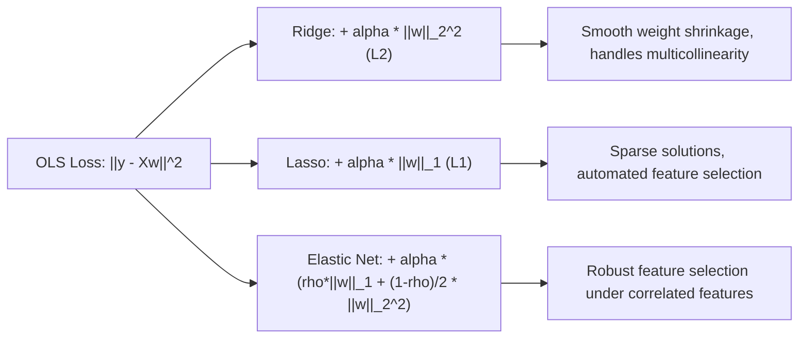

# Supervised Learning: Parametric & Non-Parametric Modeling

A rigorous, end-to-end mathematical and engineering guide to supervised classification and regression algorithms, from linear regularized estimators to maximum-margin machines, tree ensembles, and boosting.

---

## 1. Linear Regression & Polynomial Expansion

### 1.1 Intuition
Linear regression models the conditional expectation $\mathbb{E}[y \mid \mathbf{x}]$ as a linear combination of input features. When relationships are non-linear, polynomial basis expansion maps input vectors into a higher-dimensional feature space $\phi(\mathbf{x}) = [1, x_1, x_2, x_1^2, x_1 x_2, x_2^2, \dots]^T$, allowing linear models to fit curved response surfaces.

### 1.2 Mathematical Formulation & Loss Function
- **Model**: $\hat{y} = \mathbf{w}^T \mathbf{x} + b$
- **Loss Function (Mean Squared Error)**:
  $$\mathcal{L}(\mathbf{w}, b) = \frac{1}{2N} \|\mathbf{y} - X\mathbf{w}\|_2^2 = \frac{1}{2N} \sum_{i=1}^N (y_i - \mathbf{w}^T \mathbf{x}_i - b)^2$$
- **Closed-Form Normal Equation**:
  Setting $\nabla_{\mathbf{w}} \mathcal{L} = \mathbf{0} \implies X^T (X\mathbf{w} - \mathbf{y}) = \mathbf{0}$:
  $$\mathbf{w}^* = (X^T X)^{-1} X^T \mathbf{y}$$

### 1.3 Assumptions (Gauss-Markov Theorem)
Under the following conditions, the OLS estimator is the **Best Linear Unbiased Estimator (BLUE)**:
1. **Linearity in Parameters**: $y = X\mathbf{w} + \epsilon$.
2. **Strict Exogeneity**: $\mathbb{E}[\epsilon \mid X] = \mathbf{0}$.
3. **No Multicollinearity**: $X$ has full column rank ($\text{rank}(X) = D$, so $X^T X$ is invertible).
4. **Spherical Errors (Homoscedasticity & No Autocorrelation)**: $\text{Var}(\epsilon \mid X) = \sigma^2 I_N$.

---

## 2. Regularized Regression: Ridge, Lasso & Elastic Net

### 2.1 Ridge Regression ($L_2$ Regularization)
- **Objective**: $\min_{\mathbf{w}} \|\mathbf{y} - X\mathbf{w}\|_2^2 + \lambda \|\mathbf{w}\|_2^2$
- **Closed-Form Solution**:
  $$\mathbf{w}^*_{\text{Ridge}} = (X^T X + \lambda I)^{-1} X^T \mathbf{y}$$
  Adding $\lambda I$ guarantees invertibility even when $X^T X$ is singular (e.g., $D > N$ or severe multicollinearity).
- **Effect**: Shrinks weights continuously toward zero without setting any strictly to zero.

### 2.2 Lasso Regression ($L_1$ Regularization)
- **Objective**: $\min_{\mathbf{w}} \frac{1}{2N} \|\mathbf{y} - X\mathbf{w}\|_2^2 + \lambda \|\mathbf{w}\|_1$
- **Non-Differentiability & Coordinate Descent**:
  Because $\|\mathbf{w}\|_1 = \sum |w_j|$ has a sharp non-differentiable kink at $w_j = 0$, OLS gradient descent is replaced with coordinate descent using the **soft-thresholding operator**:
  $$S(z, \gamma) = \text{sign}(z) \max(|z| - \gamma, 0)$$
- **Effect**: Drives non-essential coefficients strictly to zero, performing intrinsic feature selection.

### 2.3 Elastic Net
Combines $L_1$ and $L_2$ penalties:
$$\min_{\mathbf{w}} \frac{1}{2N} \|\mathbf{y} - X\mathbf{w}\|_2^2 + \lambda \left( \rho \|\mathbf{w}\|_1 + \frac{1 - \rho}{2} \|\mathbf{w}\|_2^2 \right)$$
Overcomes Lasso's limitation when multiple features are highly correlated (Lasso arbitrarily picks one; Elastic Net groups and retains them together).

---

## 3. Logistic Regression & Softmax Classification

### 3.1 Intuition
Linear regression is inappropriate for classification because predictions $\hat{y} \in (-\infty, \infty)$ violate probability bounds $[0, 1]$ and squared error penalizes over-confident correct classifications. Logistic regression squashes linear predictions through the logistic sigmoid function.

### 3.2 Formulation & Log-Loss
- **Hypothesis**: $P(y=1 \mid \mathbf{x}) = \sigma(\mathbf{w}^T \mathbf{x} + b) = \frac{1}{1 + e^{-(\mathbf{w}^T \mathbf{x} + b)}}$
- **Objective (Binary Cross-Entropy)**:
  $$\mathcal{L}(\mathbf{w}) = -\frac{1}{N} \sum_{i=1}^N \left[ y_i \log(\hat{y}_i) + (1 - y_i) \log(1 - \hat{y}_i) \right]$$
- **Gradient**:
  $$\nabla_{\mathbf{w}} \mathcal{L} = \frac{1}{N} X^T (\hat{\mathbf{y}} - \mathbf{y})$$
  Remarkably, the gradient has the exact same structural form as linear regression, but with $\hat{\mathbf{y}} = \sigma(X\mathbf{w})$.

---

## 4. k-Nearest Neighbors (k-NN)

- **Paradigm**: Non-parametric, instance-based "lazy" learning. No explicit training phase ($\mathcal{O}(1)$ fit); inference computes distances to all $N$ training points ($\mathcal{O}(ND)$ query).
- **Distance Metrics**: Euclidean ($L_2$), Manhattan ($L_1$), Cosine distance.
- **Curse of Dimensionality**: In high dimensions ($D > 20$), distances between points concentrate ($d_{\max} \approx d_{\min}$), rendering neighborhood queries uninformative.

---

## 5. Naive Bayes Classifier

- **Bayes' Rule with Conditional Independence Assumption**:
  $$P(y = c \mid \mathbf{x}) \propto P(y = c) \prod_{j=1}^D P(x_j \mid y = c)$$
- **Gaussian Naive Bayes (Continuous Features)**:
  $$P(x_j \mid y = c) = \frac{1}{\sqrt{2\pi \sigma_{cj}^2}} \exp\left( -\frac{(x_j - \mu_{cj})^2}{2\sigma_{cj}^2} \right)$$
- **Strengths**: Extremely fast ($\mathcal{O}(ND)$ training and inference), robust to irrelevant features, effective in sparse high-dimensional text classification (Multinomial NB).
- **Weaknesses**: The feature independence assumption rarely holds in reality.

---

## 6. Decision Trees (CART)

- **Recursive Binary Partitioning**: Evaluates all candidate feature splits to maximize impurity reduction:
  $$\Delta I = I(\text{Parent}) - \left( \frac{N_{\text{left}}}{N} I(\text{Left}) + \frac{N_{\text{right}}}{N} I(\text{Right}) \right)$$
- **Impurity Criteria**:
  - **Gini Impurity (Classification)**: $I_G(S) = 1 - \sum_{c=1}^C p_c^2$
  - **Entropy (Information Gain)**: $H(S) = -\sum_{c=1}^C p_c \log_2(p_c)$
  - **Variance Reduction (Regression)**: $\text{MSE}(S) = \frac{1}{|S|} \sum_{i \in S} (y_i - \bar{y})^2$
- **Failure Mode**: Unconstrained trees overfit rapidly, learning single-sample leaf partitions. Mitigated via `max_depth`, `min_samples_split`, and cost-complexity pruning ($\alpha \cdot |T|$).

---

## 7. Support Vector Machines (SVM)

### 7.1 Hard-Margin vs. Soft-Margin SVM
SVM finds the maximum-margin hyperplane separating classes. For non-separable data, slack variables $\xi_i \ge 0$ penalize margin violations:
$$\min_{\mathbf{w}, b, \boldsymbol{\xi}} \frac{1}{2} \|\mathbf{w}\|_2^2 + C \sum_{i=1}^N \xi_i \quad \text{s.t.} \quad y_i (\mathbf{w}^T \mathbf{x}_i + b) \ge 1 - \xi_i, \quad \xi_i \ge 0$$
- $C$ controls the regularization trade-off: large $C$ penalizes violations heavily (narrow margin, risks overfitting); small $C$ tolerates violations (wide margin, higher bias).

### 7.2 The Kernel Trick
Maps inputs into a high-dimensional Hilbert space via mapping $\phi(\mathbf{x})$ without explicitly computing high-dimensional coordinates, by using positive definite kernel functions $K(\mathbf{x}, \mathbf{x}') = \langle \phi(\mathbf{x}), \phi(\mathbf{x}') \rangle$:
- **Linear**: $K(\mathbf{x}, \mathbf{x}') = \mathbf{x}^T \mathbf{x}'$
- **Polynomial**: $K(\mathbf{x}, \mathbf{x}') = (\gamma \mathbf{x}^T \mathbf{x}' + c)^d$
- **Radial Basis Function (RBF / Gaussian)**:
  $$K(\mathbf{x}, \mathbf{x}') = \exp\left( -\gamma \|\mathbf{x} - \mathbf{x}'\|_2^2 \right)$$
  (Corresponds to an infinite-dimensional feature space).

---

## 8. Summary Comparison Matrix

| Algorithm | Model Class | Loss Function | Training Complexity | Inference Complexity | Primary Hyperparameters |
| :--- | :--- | :--- | :--- | :--- | :--- |
| **Linear Regression** | Linear / Parametric | Squared Error (MSE) | $\mathcal{O}(N D^2 + D^3)$ | $\mathcal{O}(D)$ | `fit_intercept`, `solver` |
| **Ridge Regression** | Linear / Parametric | MSE + $L_2$ Penalty | $\mathcal{O}(N D^2 + D^3)$ | $\mathcal{O}(D)$ | `alpha` ($\lambda$) |
| **Lasso Regression** | Linear / Parametric | MSE + $L_1$ Penalty | Iterative $\mathcal{O}(\text{epochs} \cdot ND)$ | $\mathcal{O}(D)$ | `alpha` ($\lambda$), `max_iter` |
| **Logistic Regression**| Linear / Parametric | Binary Cross-Entropy | Iterative $\mathcal{O}(\text{epochs} \cdot ND)$ | $\mathcal{O}(D)$ | `C`, `penalty`, `solver` |
| **k-NN** | Instance / Non-parametric| N/A | $\mathcal{O}(1)$ | $\mathcal{O}(ND)$ | `n_neighbors`, `metric` |
| **Naive Bayes** | Generative / Probabilistic | Negative Log-Likelihood | $\mathcal{O}(ND)$ | $\mathcal{O}(CD)$ | `var_smoothing`, `alpha` |
| **Decision Tree** | Non-parametric / Rule | Gini / Entropy / MSE | $\mathcal{O}(D \cdot N \log N)$ | $\mathcal{O}(\text{depth})$ | `max_depth`, `min_samples_split`|
| **SVM (RBF Kernel)** | Kernelized / Dual | Hinge Loss + $L_2$ | $\mathcal{O}(N^2 D)$ to $\mathcal{O}(N^3)$ | $\mathcal{O}(N_{\text{support}} \cdot D)$ | `C`, `gamma` |

---

## 9. Topic Module Resources
- Interactive Lab: [`notebook.ipynb`](./notebook.ipynb)
- Source Modules: [`code/linear_models.py`](./code/linear_models.py), [`code/trees_and_neighbors.py`](./code/trees_and_neighbors.py)
- Pytest Suite: [`code/test_supervised.py`](./code/test_supervised.py)
- Interview Drill: [`interview.md`](./interview.md)
- Curated Citations: [`references.md`](./references.md)
