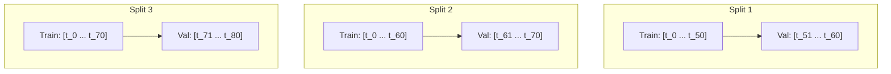

# Time Series Analysis & Forecasting: Statistical Modeling to Machine Learning

A comprehensive engineering guide to time series modeling: temporal cross-validation, stationarity testing and differencing, classical ARIMA/SARIMA frameworks, tabular lag feature engineering, and specialized time series evaluation metrics.

---

## 1. Temporal Data Splitting & Avoiding Lookahead Bias

### 1.1 The Fundamental Flaw of Standard K-Fold CV
In standard machine learning, observations are assumed to be independent and identically distributed (i.i.d.). In time series, observations exhibit **temporal autocorrelation** ($y_t$ depends on $y_{t-1}$).
- Random K-Fold cross-validation randomly shuffles rows across folds, placing future samples ($t+k$) in the training set to predict historical samples ($t$).
- This causes catastrophic **lookahead leakage**, producing unrealistically optimistic validation metrics that collapse in production.

### 1.2 Walk-Forward (Expanding & Sliding Window) Validation

- **Expanding Window**: Training history grows progressively larger at each iteration.
- **Sliding (Rolling) Window**: Training history maintains fixed length $W$, discarding the oldest data to adapt to regime shifts.

---

## 2. Stationarity: Theory & Transformations

### 2.1 Formal Definition of Weak (Covariance) Stationarity
A stochastic process $\{y_t\}$ is weakly stationary if:
1. **Constant Mean**: $\mathbb{E}[y_t] = \mu, \quad \forall t$.
2. **Constant Variance**: $\text{Var}(y_t) = \sigma^2 < \infty, \quad \forall t$.
3. **Time-Invariant Autocovariance**: $\text{Cov}(y_t, y_{t-k}) = \gamma(k)$, depending strictly on lag distance $k$, not on absolute time $t$.

### 2.2 Statistical Stationarity Tests
- **Augmented Dickey-Fuller (ADF) Test**:
  - $H_0$: The series possesses a unit root (non-stationary).
  - $H_1$: The series is stationary.
  - Rejecting $H_0$ ($p < 0.05$) indicates empirical stationarity.
- **KPSS Test**: Null hypothesis assumes stationarity (used jointly with ADF to distinguish trend from unit root).

### 2.3 Transformations for Stationarity
- **Trend Stationarity**: Order-1 differencing: $y'_t = y_t - y_{t-1}$.
- **Seasonal Stationarity**: Seasonal differencing with period $s$: $y''_t = y_t - y_{t-s}$.
- **Variance Stabilization**: Logarithmic or Box-Cox transformation prior to differencing.

---

## 3. Classical Statistical Frameworks: ARIMA & SARIMA

### 3.1 The ARIMA$(p, d, q)$ Architecture
Combines Autoregression ($AR$), Integration ($I$), and Moving Average ($MA$):
- **$AR(p)$**: Linear regression of $y_t$ on its own past $p$ values:
  $$y_t = c + \sum_{i=1}^p \phi_i y_{t-i} + \epsilon_t$$
- **$I(d)$**: Degree of differencing required to achieve stationarity.
- **$MA(q)$**: Linear combination of current and past $q$ white noise shock errors:
  $$y_t = \mu + \epsilon_t + \sum_{j=1}^q \theta_j \epsilon_{t-j}$$
- **Full Model Formula**:
  $$\left( 1 - \sum_{i=1}^p \phi_i B^i \right) (1 - B)^d y_t = c + \left( 1 + \sum_{j=1}^q \theta_j B^j \right) \epsilon_t$$
  where $B$ is the backshift lag operator ($B^k y_t = y_{t-k}$).

### 3.2 Diagnostics: ACF and PACF
- **Autocorrelation Function (ACF)**: Identifies $MA(q)$ order (cuts off after lag $q$).
- **Partial Autocorrelation Function (PACF)**: Measures correlation between $y_t$ and $y_{t-k}$ removing intermediate lag effects; identifies $AR(p)$ order (cuts off after lag $p$).

---

## 4. Tabular Machine Learning for Time Series

Tree models (XGBoost, LightGBM) cannot extrapolate raw continuous trends ($t, t+1, \dots$). Tabular ML requires transforming temporal sequences into stationary tabular matrices:
1. **Autoregressive Lag Features**: $[y_{t-1}, y_{t-2}, y_{t-7}, y_{t-14}]$.
2. **Rolling Window Aggregations**: Rolling Mean, Rolling Standard Deviation, Rolling Min/Max over windows $W \in \{7, 14, 30\}$:
   $$\mu_{t, W} = \frac{1}{W} \sum_{i=1}^W y_{t-i}$$
   (Important: The window must end strictly at $t-1$ to prevent target leakage!).
3. **Calendar & Holiday Indicators**: Day-of-week, month, is_weekend, holiday flags.
4. **Cyclical Trigonometric Encodings**: Preserves modular periodicity (hour 23 is adjacent to hour 0):
   $$\sin\left( \frac{2\pi \cdot \text{hour}}{24} \right), \quad \cos\left( \frac{2\pi \cdot \text{hour}}{24} \right)$$

---

## 5. Forecasting Paradigms: Recursive vs. Direct

- **Recursive Multi-Step Forecasting**: Trains a single model for 1-step-ahead ($y_{t+1}$). For step $t+2$, feeds the model's own prior prediction $\hat{y}_{t+1}$ back as a lag feature.
  - *Risk*: Error accumulation compounds over long horizons.
- **Direct Multi-Step Forecasting**: Trains $H$ independent models, each predicting step $t+h$ directly: $M_h(\mathbf{x}_t) = y_{t+h}$.
  - *Advantage*: No error compounding; higher compute cost.

---

## 6. Time Series Evaluation Metrics

- **Mean Absolute Error (MAE)**: $\frac{1}{H} \sum |y_{t+h} - \hat{y}_{t+h}|$.
- **Root Mean Squared Error (RMSE)**: $\sqrt{\frac{1}{H} \sum (y_{t+h} - \hat{y}_{t+h})^2}$.
- **Mean Absolute Scaled Error (MASE)**:
  $$\text{MASE} = \frac{\frac{1}{H} \sum_{h=1}^H |y_{t+h} - \hat{y}_{t+h}|}{\frac{1}{N - 1} \sum_{i=2}^N |y_i - y_{i-1}|}$$
  Scales forecast error by the in-sample naive persistence baseline ($y_t = y_{t-1}$).
  - $\text{MASE} < 1$: Model outperforms a naive persistence random walk.
  - $\text{MASE} > 1$: Model is worse than naive copying of yesterday's value.
- **Symmetric MAPE (sMAPE)**:
  $$\text{sMAPE} = \frac{100\%}{H} \sum_{h=1}^H \frac{2 |y_{t+h} - \hat{y}_{t+h}|}{|y_{t+h}| + |\hat{y}_{t+h}|}$$

---

## 7. Topic Module Resources
- Interactive Lab: [`notebook.ipynb`](./notebook.ipynb)
- Source Implementation: [`code/timeseries_engine.py`](./code/timeseries_engine.py)
- Pytest Suite: [`code/test_timeseries.py`](./code/test_timeseries.py)
- Interview Drill: [`interview.md`](./interview.md)
- Curated Citations: [`references.md`](./references.md)
