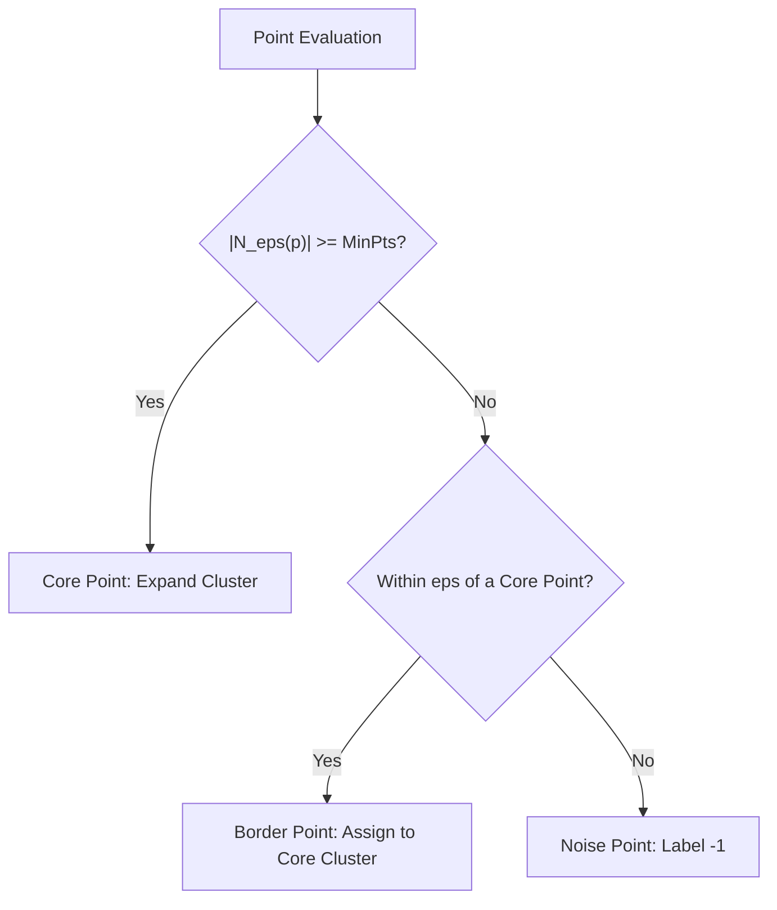

# Unsupervised Learning: Clustering, Density Estimation & Manifold Learning

A comprehensive mathematical and architectural guide to unsupervised algorithms: centroid, density, and hierarchical clustering, probabilistic mixture modeling, linear/non-linear dimensionality reduction, and anomaly detection.

---

## 1. Centroid-Based Clustering: K-Means & K-Means++

### 1.1 Intuition
K-Means partitions an unlabeled dataset into $K$ non-overlapping clusters by iteratively assigning each observation to its nearest cluster centroid, then updating centroids to the mean of their assigned members.

### 1.2 Mathematical Formulation & Objective Function
- **Inertia (Within-Cluster Sum of Squares - WCSS)**:
  $$\mathcal{J}(\mathbf{r}, \boldsymbol{\mu}) = \sum_{i=1}^N \sum_{k=1}^K r_{ik} \|\mathbf{x}_i - \boldsymbol{\mu}_k\|_2^2$$
  where $r_{ik} \in \{0, 1\}$ is a binary indicator ($\sum_k r_{ik} = 1$) representing cluster membership.
- **Coordinate Descent (Lloyd's Algorithm)**:
  1. **Assignment Step**: Minimize $\mathcal{J}$ with respect to $\mathbf{r}$ holding $\boldsymbol{\mu}$ fixed:
     $$r_{ik} = \begin{cases} 1 & \text{if } k = \arg\min_j \|\mathbf{x}_i - \boldsymbol{\mu}_j\|_2^2 \\ 0 & \text{otherwise} \end{cases}$$
  2. **Update Step**: Minimize $\mathcal{J}$ with respect to $\boldsymbol{\mu}$ holding $\mathbf{r}$ fixed:
     $$\boldsymbol{\mu}_k = \frac{\sum_{i=1}^N r_{ik} \mathbf{x}_i}{\sum_{i=1}^N r_{ik}}$$

### 1.3 K-Means++ Initialization
Standard random initialization risks converging to poor local minima. **K-Means++** samples initial centroids sequentially with probability proportional to the squared distance from the nearest existing centroid:
$$P(\mathbf{x}_i) = \frac{D(\mathbf{x}_i)^2}{\sum_{j=1}^N D(\mathbf{x}_j)^2}$$
This guarantees an $\mathcal{O}(\log K)$ competitive bound against optimal clustering.

---

## 2. Density-Based Clustering: DBSCAN

### 2.1 Intuition
Unlike K-Means, which assumes convex, spherical clusters, **DBSCAN** (Density-Based Spatial Clustering of Applications with Noise) groups points that are densely packed together and marks points that lie alone in low-density regions as outliers.

### 2.2 Formal Definitions
Given neighborhood radius $\epsilon > 0$ and minimum points $\text{MinPts} \in \mathbb{N}$:
1. **$\epsilon$-Neighborhood**: $N_\epsilon(\mathbf{p}) = \{\mathbf{q} \in \mathcal{D} \mid \|\mathbf{p} - \mathbf{q}\| \le \epsilon\}$.
2. **Core Point**: A point $\mathbf{p}$ with $|N_\epsilon(\mathbf{p})| \ge \text{MinPts}$.
3. **Directly Density-Reachable**: $\mathbf{q}$ is directly reachable from $\mathbf{p}$ if $\mathbf{p}$ is a Core point and $\mathbf{q} \in N_\epsilon(\mathbf{p})$.
4. **Density-Connected**: Points $\mathbf{p}$ and $\mathbf{q}$ are density-connected if there exists a chain of core points connecting them.

### 2.3 Strengths & Weaknesses
- **Strengths**: Automatically determines the number of clusters; isolates noise; identifies arbitrary non-convex geometric shapes (e.g., spirals, concentric rings).
- **Weaknesses**: Struggles with clusters of variable densities; $\mathcal{O}(N^2)$ distance computation without spatial indexing (reduced to $\mathcal{O}(N \log N)$ with KD-Trees).

---

## 3. Hierarchical Clustering (Agglomerative)

- **Bottom-Up Paradigm**: Starts with $N$ individual single-point clusters and iteratively merges the closest pair of clusters until only 1 cluster remains.
- **Linkage Criteria**:
  - **Single Linkage**: $\min_{\mathbf{a} \in A, \mathbf{b} \in B} d(\mathbf{a}, \mathbf{b})$ (susceptible to "chaining" effect).
  - **Complete Linkage**: $\max_{\mathbf{a} \in A, \mathbf{b} \in B} d(\mathbf{a}, \mathbf{b})$ (compact, spherical clusters).
  - **Average Linkage (UPGMA)**: $\frac{1}{|A||B|} \sum_{\mathbf{a}} \sum_{\mathbf{b}} d(\mathbf{a}, \mathbf{b})$.
  - **Ward's Minimum Variance**: Merges clusters that minimize the increase in total within-cluster variance.
- **Dendrogram**: Visual tree representation allowing post-hoc selection of cluster granularity by cutting horizontal distance thresholds.

---

## 4. Probabilistic Clustering: Gaussian Mixture Models (GMM)

### 4.1 Intuition
K-Means performs hard assignment ($r_{ik} \in \{0, 1\}$). GMM generalizes K-Means to soft, probabilistic assignments by modeling the data distribution as a convex combination of $K$ multivariate Gaussian densities.

### 4.2 Formulation & Expectation-Maximization (EM)
$$P(\mathbf{x}) = \sum_{k=1}^K \pi_k \mathcal{N}(\mathbf{x}; \boldsymbol{\mu}_k, \Sigma_k), \quad \sum_{k=1}^K \pi_k = 1$$
1. **E-step (Expectation)**: Compute posterior responsibility that component $k$ generated point $\mathbf{x}_i$:
   $$\gamma_{ik} = P(z_i = k \mid \mathbf{x}_i) = \frac{\pi_k \mathcal{N}(\mathbf{x}_i; \boldsymbol{\mu}_k, \Sigma_k)}{\sum_{j=1}^K \pi_j \mathcal{N}(\mathbf{x}_i; \boldsymbol{\mu}_j, \Sigma_j)}$$
2. **M-step (Maximization)**: Update parameters given current responsibilities:
   $$N_k = \sum_{i=1}^N \gamma_{ik}, \quad \pi_k = \frac{N_k}{N}, \quad \boldsymbol{\mu}_k = \frac{1}{N_k} \sum_{i=1}^N \gamma_{ik} \mathbf{x}_i$$
   $$\Sigma_k = \frac{1}{N_k} \sum_{i=1}^N \gamma_{ik} (\mathbf{x}_i - \boldsymbol{\mu}_k)(\mathbf{x}_i - \boldsymbol{\mu}_k)^T$$

---

## 5. Dimensionality Reduction: PCA, t-SNE & UMAP

### 5.1 Principal Component Analysis (PCA)
- **Linear Projection**: Solves for orthogonal projection matrix $W \in \mathbb{R}^{D \times d}$ maximizing preserved variance $\text{Tr}(W^T C W)$.
- **Global Structure**: Preserves large pairwise distances; compresses non-linear manifolds poorly.

### 5.2 t-Distributed Stochastic Neighbor Embedding (t-SNE)
- **Non-Linear Manifold Learning**: Converts pairwise Euclidean distances into conditional probabilities:
  - **High-Dimensional Affinities (Gaussian)**:
    $$p_{j|i} = \frac{\exp(-\|\mathbf{x}_i - \mathbf{x}_j\|^2 / 2\sigma_i^2)}{\sum_{k \neq i} \exp(-\|\mathbf{x}_i - \mathbf{x}_k\|^2 / 2\sigma_i^2)}, \quad p_{ij} = \frac{p_{j|i} + p_{i|j}}{2N}$$
  - **Low-Dimensional Affinities (Student-t with 1 DoF / Cauchy)**:
    $$q_{ij} = \frac{(1 + \|\mathbf{y}_i - \mathbf{y}_j\|^2)^{-1}}{\sum_k \sum_{l \neq k} (1 + \|\mathbf{y}_k - \mathbf{y}_l\|^2)^{-1}}$$
- **Loss Function**: Kullback-Leibler divergence $\text{KL}(P \parallel Q) = \sum_i \sum_j p_{ij} \log \frac{p_{ij}}{q_{ij}}$.
- **The "Crowding Problem"**: In high dimensions, space expands exponentially. The heavy tails of the Student-t distribution in low-dimensional space allow distant clusters to separate cleanly without crowding the map.

### 5.3 Uniform Manifold Approximation and Projection (UMAP)
- Grounded in Riemannian geometry and algebraic topology.
- Assumes data lies on a local Riemannian manifold with uniform local metric.
- Preserves both **local** and **global** structure substantially better than t-SNE while executing faster ($\mathcal{O}(N)$ using Approximate Nearest Neighbors via PyNNDescent).

---

## 6. Unsupervised Anomaly Detection

### 6.1 Isolation Forest
- **Principle**: Anomalies are "few and different", meaning they occupy sparse regions of feature space and can be isolated with very few random recursive splits.
- **Path Length $h(\mathbf{x})$**: Number of edges traversed from root to termination leaf in an isolation tree.
- **Anomaly Score**:
  $$s(\mathbf{x}, n) = 2^{-\frac{\mathbb{E}[h(\mathbf{x})]}{c(n)}}$$
  where $c(n) = 2(\ln(n - 1) + 0.5772) - \frac{2(n-1)}{n}$ is the average depth of an unsuccessful search in a Binary Search Tree.
  - $s \to 1$: Definite anomaly.
  - $s < 0.5$: Normal inlier.

---

## 7. Comparative Algorithm Matrix

| Algorithm | Paradigm | Parameters | Scalability | Handles Noise | Finds Arbitrary Shapes |
| :--- | :--- | :--- | :--- | :--- | :--- |
| **K-Means** | Centroid / Voronoi | `n_clusters`, `n_init` | $\mathcal{O}(N K D)$ (Linear) | No (pulls centroids) | No (Convex only) |
| **DBSCAN** | Density-based | `eps`, `min_samples` | $\mathcal{O}(N \log N)$ to $\mathcal{O}(N^2)$ | Yes (Marks $-1$) | Yes |
| **GMM** | Probabilistic Mixture| `n_components`, `covariance_type`| $\mathcal{O}(N K D^2)$ | Moderate | No (Ellipsoids) |
| **PCA** | Linear Projection | `n_components` | $\mathcal{O}(N D^2 + D^3)$ | Moderate | Linear only |
| **t-SNE** | Non-Linear Manifold | `perplexity`, `learning_rate` | $\mathcal{O}(N^2)$ or $\mathcal{O}(N \log N)$ | No (Strictly visual) | Yes |
| **Isolation Forest**| Tree Ensemble | `n_estimators`, `contamination` | $\mathcal{O}(T \cdot \psi \log \psi)$ | Yes (Detects Noise) | Yes |

---

## 8. Topic Module Resources
- Interactive Lab: [`notebook.ipynb`](./notebook.ipynb)
- Source Modules: [`code/clustering.py`](./code/clustering.py), [`code/dim_reduction_and_anomaly.py`](./code/dim_reduction_and_anomaly.py)
- Pytest Suite: [`code/test_unsupervised.py`](./code/test_unsupervised.py)
- Interview Drill: [`interview.md`](./interview.md)
- Curated Citations: [`references.md`](./references.md)
