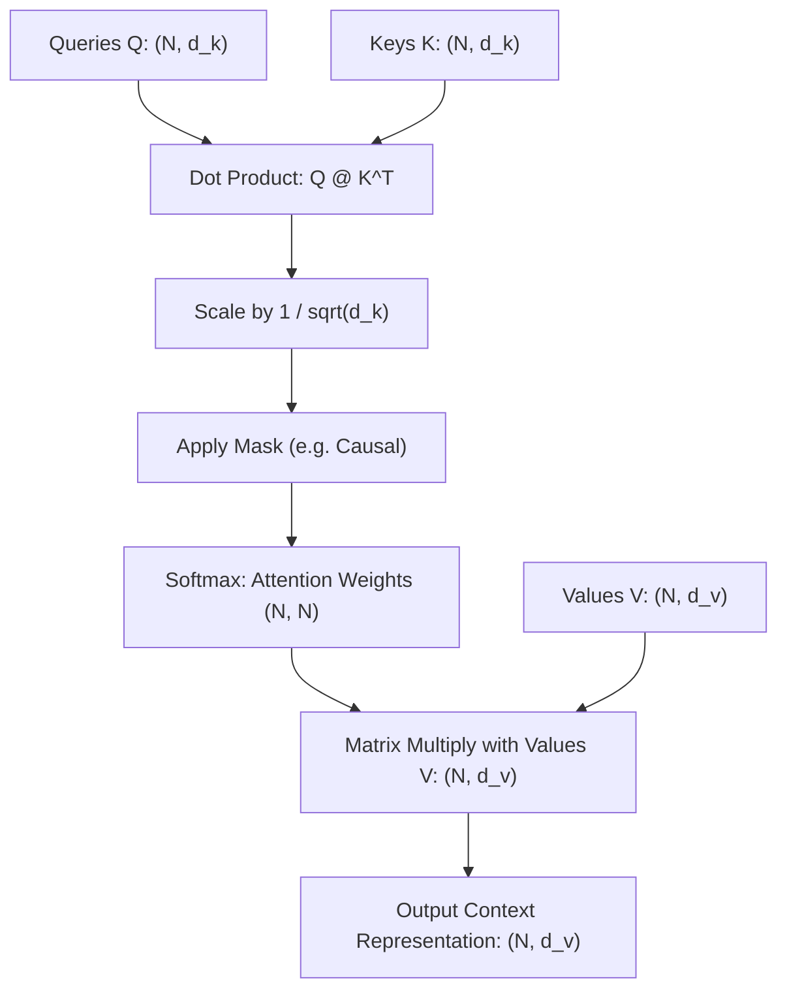
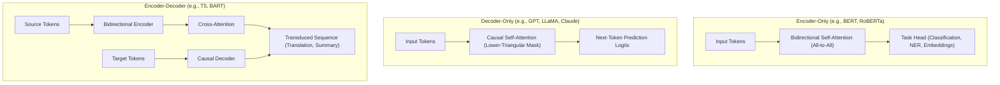

# Attention & Transformer Architectures: Mechanics, Formulations & Paradigms

A comprehensive guide to Transformer architectures: Scaled Dot-Product Attention, Multi-Head Attention (MHA), Positional Encoding schemes (Sinusoidal, Learned, RoPE), Encoder-Decoder paradigms (BERT vs. GPT vs. T5), and Vision Transformers (ViT).

---

## 1. The Attention Mechanism

Attention solves the information bottleneck of recurrent encoder-decoder models by allowing tokens to dynamically query and aggregate representations across the entire sequence in $O(1)$ path length.

### 1.1 Scaled Dot-Product Attention
$$\text{Attention}(Q, K, V) = \text{softmax}\left( \frac{Q K^T}{\sqrt{d_k}} + M \right) V$$

### 1.2 Why Divide by $\sqrt{d_k}$?
Assume query components $q_i$ and key components $k_i$ are independent random variables with zero mean and unit variance ($\mathbb{E}[q_i] = 0, \text{Var}(q_i) = 1$):
$$\mathbb{E}[q \cdot k] = \sum_{i=1}^{d_k} \mathbb{E}[q_i k_i] = 0$$
$$\text{Var}(q \cdot k) = \sum_{i=1}^{d_k} \text{Var}(q_i k_i) = \sum_{i=1}^{d_k} \mathbb{E}[q_i^2] \mathbb{E}[k_i^2] = d_k$$
As dimension $d_k$ grows large (e.g., $d_k = 64$ or $128$), the dot-product magnitudes scale up by $\sqrt{d_k}$. Large inputs into the softmax push it into extreme saturation regions where softmax gradients vanish ($\sigma'(z) \to 0$). Dividing by $\sqrt{d_k}$ scales variance back to $1.0$, preserving stable gradient flow.

---

## 2. Multi-Head Attention (MHA)

Instead of performing a single attention function with $d_{\text{model}}$-dimensional queries, keys, and values, Multi-Head Attention linearly projects $Q, K, V$ into $h$ distinct representation subspaces of dimension $d_k = d_v = d_{\text{model}} / h$:

$$\text{MultiHead}(Q, K, V) = \text{Concat}(\text{head}_1, \dots, \text{head}_h) W^O$$
$$\text{where } \text{head}_i = \text{Attention}(Q W_i^Q, K W_i^K, V W_i^V)$$

- **Subspace Specialization**: Individual heads specialize in capturing different syntactic and semantic relationships (e.g., one head attends to direct grammatical objects, another to long-range pronoun coreference).
- **Computational Cost**: Splitting $d_{\text{model}}$ across $h$ heads ensures the total computational cost and parameter count are identical to single-head attention with full dimensionality.

---

## 3. Positional Encodings

Because self-attention is permutation-equivariant ($\text{Attention}(P X) = P \text{Attention}(X)$), position information must be explicitly injected.

### 3.1 Sinusoidal Positional Encoding (Vaswani et al., 2017)
Deterministic trigonometric functions across even and odd embedding dimensions:
$$PE_{(pos, 2i)} = \sin\left(\frac{pos}{10000^{2i / d_{\text{model}}}}\right)$$
$$PE_{(pos, 2i+1)} = \cos\left(\frac{pos}{10000^{2i / d_{\text{model}}}}\right)$$
*Key Property*: For any fixed offset $k$, $PE_{pos + k}$ can be represented as a linear transformation of $PE_{pos}$ via angle sum trigonometric identities, enabling the model to learn relative position offsets.

### 3.2 Rotary Position Embedding (RoPE - Su et al., 2021)
Modern standard in LLMs (LLaMA, Mistral, PaLM). Encodes relative position directly into the attention dot product by rotating queries and keys in the 2D complex plane:
$$\tilde{q}_m = \mathcal{R}_{\Theta, m} q_m, \quad \tilde{k}_n = \mathcal{R}_{\Theta, n} k_n$$
$$\tilde{q}_m^T \tilde{k}_n = q_m^T \mathcal{R}_{\Theta, n - m} k_n$$
The inner product depends strictly on relative distance $n - m$.

---

## 4. Architectural Paradigms: Encoder vs. Decoder vs. Enc-Dec

### 4.1 Comparison Matrix
| Architectural Paradigm | Canonical Models | Attention Masking | Primary Objective | Best Suited Tasks |
| :--- | :--- | :--- | :--- | :--- |
| **Encoder-Only** | BERT, RoBERTa, DeBERTa | Bidirectional (Unmasked) | Masked Language Modeling (MLM) | Sentence classification, token tagging, embedding extraction |
| **Decoder-Only** | GPT-4, LLaMA 3, Mistral | Causal (Future-masked) | Autoregressive Next-Token Prediction | Text generation, code synthesis, reasoning, chat agents |
| **Encoder-Decoder** | T5, BART, Original Transformer | Bidirectional (Enc) + Causal/Cross (Dec) | Sequence-to-Sequence Transduction | Machine translation, abstractive summarization |

---

## 5. Pre-LN vs. Post-LN Transformer Layer Stacking

- **Post-LN (Original Transformer)**:
  $$x_{l+1} = \text{LayerNorm}(x_l + \text{SubLayer}(x_l))$$
  Gradients passing through LayerNorm scale inversely with depth, causing severe vanishing gradients in early layers of deep models. Requires a delicate warmup learning rate schedule.
- **Pre-LN (Modern Standard)**:
  $$x_{l+1} = x_l + \text{SubLayer}(\text{LayerNorm}(x_l))$$
  Establishes a clean, direct residual highway ($x_L = x_0 + \sum_{l=0}^{L-1} \dots$). Gradients flow directly to shallow layers without normalization damping, enabling stable training from step 0 without warm-up.

---

## 6. Vision Transformers (ViT)

Dosovitskiy et al. (2020) demonstrated that the pure Transformer architecture can be directly applied to visual classification:

1. **Patch Extraction & Projection**:
   An image $X \in \mathbb{R}^{H \times W \times C}$ is divided into non-overlapping patches of size $P \times P$ (e.g., $16 \times 16$).
   Number of patches: $N = \frac{H \cdot W}{P^2}$.
   Each flattened patch ($P^2 C$) is linearly projected to embedding dimension $D$: $X_{\text{patches}} \in \mathbb{R}^{N \times D}$.
2. **`[CLS]` Token & Positional Embedding**:
   A learnable classification token $x_{\text{class}} \in \mathbb{R}^{1 \times D}$ is prepended, and 1D learnable position embeddings $E_{\text{pos}} \in \mathbb{R}^{(N+1) \times D}$ are added.
3. **Transformer Encoder & MLP Head**:
   Processed through standard Transformer encoder blocks; output of `[CLS]` token is fed to a linear classification head.

---

## 7. Implementation & Module Reference

- **Core Module**: [`code/transformer_engine.py`](./code/transformer_engine.py) provides:
  - `ScaledDotProductAttention`: Vectorized attention with arbitrary mask support.
  - `MultiHeadAttention`: Parallel head projection, concatenation, and output mapping.
  - `SinusoidalPositionalEncoding`: Absolute trigonometric positional cache.
  - `TransformerBlock`: Pre-LN self-attention and MLP feed-forward block.
  - `MiniTransformerLM`: Autoregressive decoder-only language model.
  - `ViTPatchEmbedding`: Image-to-sequence patch conversion module.
- **Unit Tests**: [`code/test_transformer.py`](./code/test_transformer.py) validates causal masking, softmax normalization, and ViT patch geometry.
- **Interactive Lab**: [`notebook.ipynb`](./notebook.ipynb) inspects attention weight heatmaps and trains autoregressive language models.
- **Interview Preparation**: [`interview.md`](./interview.md) details deep-dive transformer interview questions.
- **Curated References**: [`references.md`](./references.md) lists seminal papers from Vaswani to RoPE and ViT.
