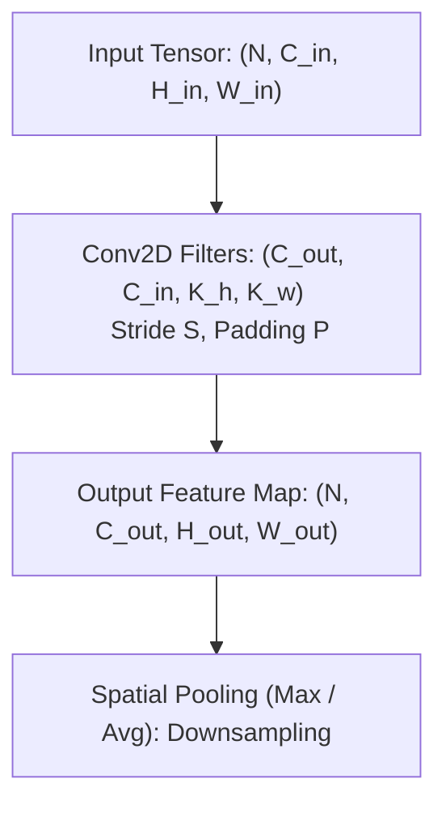
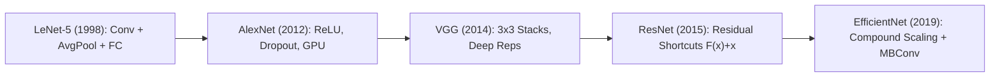

# Convolutional Neural Networks (CNN): Operations, Receptive Fields & Architecture Evolution

A comprehensive guide to Convolutional Neural Networks: discrete 2D convolutions, spatial geometry (padding, stride, dilation), receptive field dynamics, and architectural evolution from LeNet-5 to AlexNet, VGG, ResNet, and EfficientNet.

---

## 1. The 2D Convolution Operation

In Deep Learning, a convolutional layer performs a **cross-correlation** operation between an input tensor and learnable kernel filters.

### 1.1 Mathematical Formulation
For input $X \in \mathbb{R}^{C_{\text{in}} \times H \times W}$ and kernel $W \in \mathbb{R}^{C_{\text{in}} \times K_h \times K_w}$ with bias $b$:
$$Y(c_{\text{out}}, i, j) = b(c_{\text{out}}) + \sum_{c_{\text{in}}=0}^{C_{\text{in}}-1} \sum_{m=0}^{K_h-1} \sum_{n=0}^{K_w-1} X(c_{\text{in}}, i \cdot S + m, j \cdot S + n) \cdot W(c_{\text{out}}, c_{\text{in}}, m, n)$$

### 1.2 Output Dimension Formula
Given input height $H$, kernel size $K$, zero-padding $P$, dilation $d$, and stride $S$:
$$H_{\text{out}} = \left\lfloor \frac{H + 2P - d(K - 1) - 1}{S} \right\rfloor + 1$$
- **Valid Padding ($P = 0$)**: No padding; spatial resolution strictly decreases: $H_{\text{out}} = \lfloor \frac{H - K}{S} \rfloor + 1$.
- **Same Padding**: Chooses $P = \frac{K - 1}{2}$ (for odd $K$) with $S=1$ such that $H_{\text{out}} = H$.

---

## 2. Receptive Field Dynamics

The **Effective Receptive Field (ERF)** defines the spatial region in the input image that directly influences a specific neuron's activation in layer $l$.

### 2.1 Recursive Receptive Field Formula
Let $RF_0 = 1$ (raw pixel) and cumulative stride jump $J_0 = 1$:
$$RF_l = RF_{l-1} + (K_l - 1) \cdot J_{l-1}$$
$$J_l = J_{l-1} \cdot S_l$$

### 2.2 Why Stack Small $3 \times 3$ Kernels Instead of $5 \times 5$ or $7 \times 7$?
Consider replacing one $5 \times 5$ convolutional layer with two stacked $3 \times 3$ layers (both with stride 1):
1. **Identical Receptive Field**: $RF_1 = 1 + (3 - 1) \cdot 1 = 3$; $RF_2 = 3 + (3 - 1) \cdot 1 = 5$. Both cover $5 \times 5$ input pixels.
2. **Parameter Reduction**:
   - Single $5 \times 5$: $5 \times 5 \times C^2 = 25 C^2$.
   - Stack of two $3 \times 3$: $2 \times (3 \times 3 \times C^2) = 18 C^2$ ($\mathbf{28\% \text{ parameter reduction}}$).
3. **Increased Non-Linearity**: Two activation functions instead of one, enabling richer function approximation.

---

## 3. Pooling Mechanisms

- **Max Pooling**: Selects $\max(x)$ across window. Invariant to small spatial translations; preserves dominant edge/texture activations.
- **Average Pooling**: Averages activations across window. Smoother, but can dilute peak signals.
- **Global Average Pooling (GAP)**: Computes spatial mean $\frac{1}{H \times W} \sum_{i, j} X_{c, i, j}$, reducing $(N, C, H, W) \to (N, C, 1, 1)$. Eliminates massive fully-connected parameter bottlenecks (Lin et al., Network in Network, 2013).

---

## 4. CNN Architectural Evolution

### 4.1 LeNet-5 (LeCun et al., 1998)
- Pioneer of modern CNNs for handwritten digit recognition (MNIST).
- Architecture: 2 Conv layers (5x5) with average pooling and Tanh activations, followed by 3 Fully Connected layers.

### 4.2 AlexNet (Krizhevsky et al., 2012)
- Won ImageNet 2012 by an unprecedented 10.8% error reduction.
- Key Breakthroughs: ReLU non-linearities (combating vanishing gradients), Dropout ($p=0.5$) for regularization, Heavy Data Augmentation, and Multi-GPU parallel training.

### 4.3 VGG (Simonyan & Zisserman, 2014)
- Standardized homogeneous design: strictly $3 \times 3$ convolutions with stride 1, padding 1, and $2 \times 2$ MaxPool with stride 2.
- Demonstrated that network depth (16 to 19 layers) is a primary driver of visual representation performance.

### 4.4 ResNet (He et al., 2015)
- **The Degradation Problem**: Deeper plain networks ($>20$ layers) exhibited *higher* training error, not due to overfitting or vanishing gradients (thanks to BatchNorm), but optimization difficulty.
- **Residual Formulation**: Instead of fitting an underlying mapping $\mathcal{H}(x)$, intermediate layers fit a residual mapping $\mathcal{F}(x) = \mathcal{H}(x) - x$:
  $$\mathcal{H}(x) = \mathcal{F}(x) + x$$
- **Gradient Highway**: During backpropagation, $\frac{\partial L}{\partial x} = \frac{\partial L}{\partial \mathcal{H}} \left( \frac{\partial \mathcal{F}}{\partial x} + I \right)$. Even if $\frac{\partial \mathcal{F}}{\partial x}$ vanishes, the identity term $I$ guarantees unobstructed gradient flow across hundreds of layers.

### 4.5 EfficientNet (Tan & Le, 2019)
- **Compound Scaling**: Rather than arbitrarily scaling depth ($d$), width ($w$), or image resolution ($r$), EfficientNet balances all three using a fixed compound coefficient $\phi$:
  $$d = \alpha^\phi, \quad w = \beta^\phi, \quad r = \gamma^\phi$$
  subject to $\alpha \cdot \beta^2 \cdot \gamma^2 \approx 2$ (doubling total FLOPS per integer increment of $\phi$).
- **MBConv Block**: Mobile Inverted Residual Bottleneck with Depthwise Separable Convolutions and Squeeze-and-Excitation (SE) channel reweighting.

---

## 5. Architectural Comparison Matrix

| Architecture | Year | Depth (Layers) | ImageNet Top-1 Acc | Parameters | Key Architectural Innovation |
| :--- | :--- | :--- | :--- | :--- | :--- |
| **LeNet-5** | 1998 | 7 | N/A (MNIST) | 60K | Early Conv-Pool-FC paradigm |
| **AlexNet** | 2012 | 8 | 63.3% | 61M | ReLU, Dropout, GPU parallelization |
| **VGG-16** | 2014 | 16 | 74.4% | 138M | Uniform $3 \times 3$ conv filter stacks |
| **ResNet-50** | 2015 | 50 | 76.1% | 25.6M | Residual skip connections $\mathcal{F}(x) + x$ |
| **EfficientNet-B0** | 2019 | 18 (blocks) | 77.1% | 5.3M | Compound scaling + MBConv SE |

---

## 6. Implementation & Module Reference

- **Core Module**: [`code/cnn_engine.py`](./code/cnn_engine.py) provides:
  - `conv2d_forward_scratch`: Manual vectorized sliding window convolution with stride and padding.
  - `maxpool2d_forward_scratch`: Manual 2D spatial downsampling.
  - `compute_receptive_field`: Exact theoretical receptive field and stride tracker.
  - `LeNet5`, `ResidualBlock`, `MiniResNet`, `MBConvBlock`: Production PyTorch implementations.
- **Unit Tests**: [`code/test_cnn.py`](./code/test_cnn.py) tests numerical equivalence with PyTorch and receptive field equations.
- **Interactive Lab**: [`notebook.ipynb`](./notebook.ipynb) visualizes feature maps and compares parameter budgets.
- **Interview Preparation**: [`interview.md`](./interview.md) contains deep-dive CNN screening questions.
- **Curated References**: [`references.md`](./references.md) lists seminal papers from LeNet to EfficientNet.
