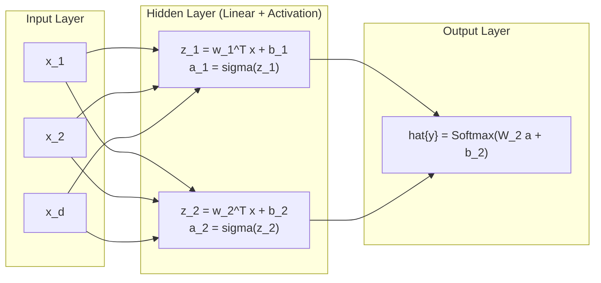
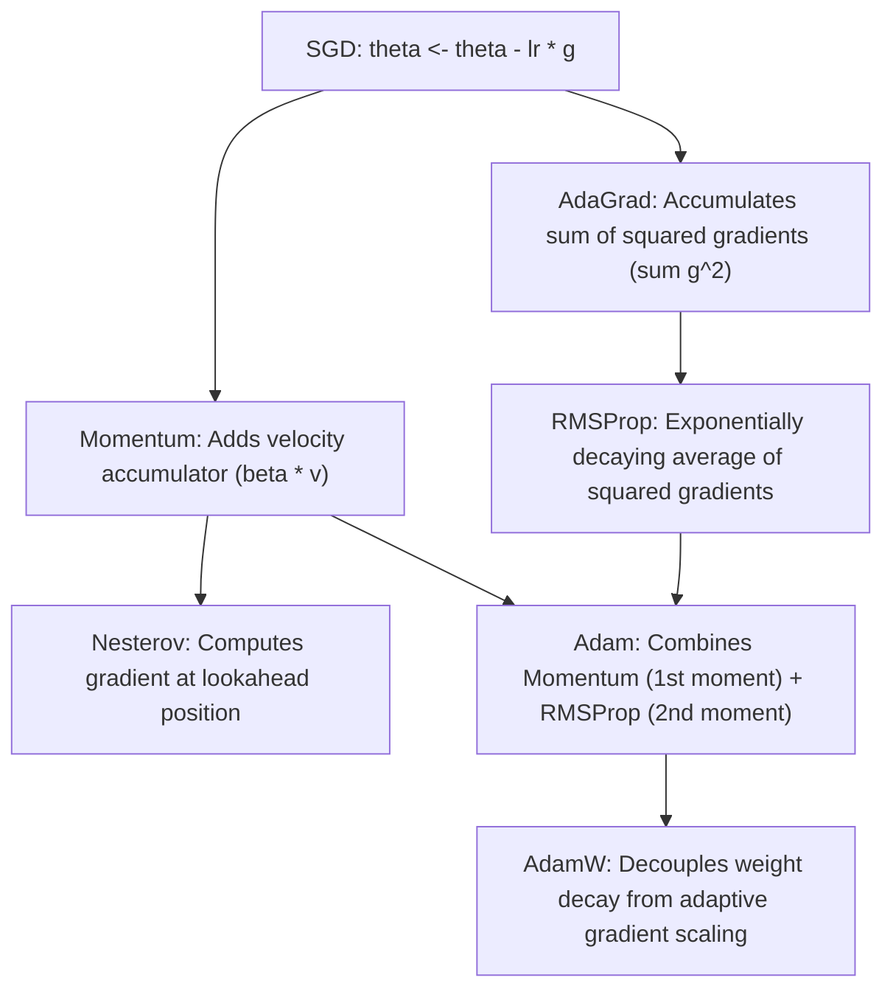

# Deep Learning Fundamentals: Computational Graphs, Backpropagation & Optimizers

A comprehensive guide to neural network mechanics: forward propagation, backpropagation via computational graphs, activation dynamics, weight initialization, and first-order optimization algorithms (SGD, Momentum, RMSProp, Adam, AdamW).

---

## 1. The Perceptron & Multi-Layer Perceptrons (MLP)

### 1.1 Universal Approximation Theorem
A feedforward network with a single hidden layer containing a finite number of non-linear neurons can approximate any continuous function on compact subsets of $\mathbb{R}^n$ to arbitrary precision (Cybenko, 1989; Hornik, 1991). In practice, **depth** provides exponential parameter efficiency over shallow width.

### 1.2 Forward Propagation in Matrix Notation
For batch input $X \in \mathbb{R}^{N \times d_{\text{in}}}$:
$$Z^{[1]} = X W^{[1]} + \mathbf{b}^{[1]}, \quad A^{[1]} = \sigma(Z^{[1]})$$
$$Z^{[l]} = A^{[l-1]} W^{[l]} + \mathbf{b}^{[l]}, \quad A^{[l]} = \sigma(Z^{[l]})$$
$$\hat{Y} = \text{Softmax}(Z^{[L]})$$

---

## 2. Computational Graphs & Backpropagation

Backpropagation is reverse-mode automatic differentiation applied to the computational graph of a neural network via the multivariate chain rule.

### 2.1 The Chain Rule in Vector/Matrix Form
Let $L$ be the scalar loss objective, $X \in \mathbb{R}^{N \times d_{\text{in}}}$, $W \in \mathbb{R}^{d_{\text{in}} \times d_{\text{out}}}$, and $Z = XW + b$:

$$\frac{\partial L}{\partial W} = X^T \left( \frac{\partial L}{\partial Z} \right)$$
$$\frac{\partial L}{\partial \mathbf{b}} = \sum_{i=1}^N \left( \frac{\partial L}{\partial Z} \right)_{i, :}$$
$$\frac{\partial L}{\partial X} = \left( \frac{\partial L}{\partial Z} \right) W^T$$

For an element-wise activation $A = \sigma(Z)$:
$$\frac{\partial L}{\partial Z} = \frac{\partial L}{\partial A} \odot \sigma'(Z)$$

### 2.2 Combined Softmax & Cross-Entropy Loss
For logits $Z \in \mathbb{R}^{N \times K}$ and one-hot ground-truth $Y \in \{0, 1\}^{N \times K}$:
$$P_{ik} = \frac{e^{Z_{ik} - \max_j Z_{ij}}}{\sum_j e^{Z_{ij} - \max_j Z_{ij}}} \quad \text{(Numerically Stable Softmax)}$$
$$L = -\frac{1}{N} \sum_{i=1}^N \sum_{k=1}^K Y_{ik} \log P_{ik}$$
$$\frac{\partial L}{\partial Z} = \frac{1}{N} (P - Y)$$

---

## 3. Activation Functions: Mechanics & Gradient Properties

| Activation | Formula $\sigma(z)$ | Derivative $\sigma'(z)$ | Range | Key Properties & Failure Modes |
| :--- | :--- | :--- | :--- | :--- |
| **Sigmoid** | $\frac{1}{1 + e^{-z}}$ | $\sigma(z)(1 - \sigma(z))$ | $(0, 1)$ | Vanishing gradients ($\max \sigma' = 0.25$); non-zero centered output causing zig-zagging gradient updates. |
| **Tanh** | $\frac{e^z - e^{-z}}{e^z + e^{-z}}$ | $1 - \tanh^2(z)$ | $(-1, 1)$ | Zero-centered, but still saturates at extremes ($\max \sigma' = 1.0$). |
| **ReLU** | $\max(0, z)$ | $\mathbb{I}(z > 0)$ | $[0, \infty)$ | Constant non-saturating gradient for $z > 0$; vulnerable to "Dying ReLU" if neurons receive large negative updates. |
| **Leaky ReLU** | $\max(\alpha z, z)$ | $1$ if $z > 0$, else $\alpha$ | $(-\infty, \infty)$ | Prevents dead neurons with small positive leak slope ($\alpha \approx 0.01$). |
| **GELU** | $z \Phi(z) \approx z \sigma(1.702 z)$ | Smooth non-monotonic | $(-0.17, \infty)$ | Standard in Transformers (BERT, GPT); probabilistic gating via Gaussian CDF. |
| **SiLU / Swish** | $z \cdot \sigma(z)$ | $\sigma(z) + z\sigma(z)(1-\sigma(z))$ | $(-0.28, \infty)$ | Smooth self-gated activation; standard in modern architectures (LLaMA, EfficientNet). |

---

## 4. Weight Initialization Dynamics

Improper initialization leads to exponential explosion or vanishing of activation variances through successive layers: $\text{Var}(z^{[l]}) = (d_{\text{in}} \text{Var}(w)) \text{Var}(a^{[l-1]})$.

### 4.1 Xavier / Glorot Initialization (for Sigmoid / Tanh)
Preserves variance during both forward pass ($d_{\text{in}} \text{Var}(w) = 1$) and backward pass ($d_{\text{out}} \text{Var}(w) = 1$):
$$W \sim \mathcal{N}\left(0, \frac{2}{d_{\text{in}} + d_{\text{out}}}\right) \quad \text{or} \quad \mathcal{U}\left(-\sqrt{\frac{6}{d_{\text{in}} + d_{\text{out}}}}, \sqrt{\frac{6}{d_{\text{in}} + d_{\text{out}}}}\right)$$

### 4.2 He / Kaiming Initialization (for ReLU / GELU)
Because ReLU sets half the activations to zero on average, activation variance is halved. To compensate, the variance must be doubled:
$$W \sim \mathcal{N}\left(0, \frac{2}{d_{\text{in}}}\right)$$

---

## 5. First-Order Optimizers: Evolution & Mathematical Formulations

### 5.1 SGD with Polyak Momentum
Accelerates SGD along consistent directions and dampens transverse oscillations:
$$v_t = \beta v_{t-1} + \eta g_t$$
$$\theta_t = \theta_{t-1} - v_t$$

### 5.2 RMSProp
Normalizes the gradient step coordinate-wise using an exponentially decaying moving average of squared gradients:
$$s_t = \gamma s_{t-1} + (1 - \gamma) g_t^2$$
$$\theta_t = \theta_{t-1} - \frac{\eta}{\sqrt{s_t} + \epsilon} \odot g_t$$

### 5.3 Adam (Adaptive Moment Estimation)
Maintains running estimates of both the first moment (mean) and second raw moment (uncentered variance):
$$m_t = \beta_1 m_{t-1} + (1 - \beta_1) g_t \quad (\text{First Moment})$$
$$v_t = \beta_2 v_{t-1} + (1 - \beta_2) g_t^2 \quad (\text{Second Moment})$$

**Bias Correction** (counteracts zero initialization bias during early steps):
$$\hat{m}_t = \frac{m_t}{1 - \beta_1^t}, \quad \hat{v}_t = \frac{v_t}{1 - \beta_2^t}$$
$$\theta_t = \theta_{t-1} - \frac{\eta}{\sqrt{\hat{v}_t} + \epsilon} \odot \hat{m}_t$$

### 5.4 AdamW: Decoupled Weight Decay
In standard $L_2$ regularization with Adam, adding $\lambda \theta$ to the gradient causes weights with large historical gradients to experience less regularization than weights with small historical gradients:
$$\nabla \tilde{L} = g_t + \lambda \theta \implies \Delta \theta \propto \frac{g_t + \lambda \theta}{\sqrt{v_t}}$$
Loshchilov & Hutter (2019) restored true weight decay by decoupling it from the adaptive update:
$$\theta_t = \theta_{t-1} - \eta \lambda \theta_{t-1} - \frac{\eta}{\sqrt{\hat{v}_t} + \epsilon} \odot \hat{m}_t$$

---

## 6. Implementation & Module Reference

- **Modular Scratch Implementation**: [`code/dl_fundamentals.py`](./code/dl_fundamentals.py) provides:
  - `DenseLayer`: Analytical forward and backward linear mappings.
  - `ReLU`, `Sigmoid`, `SoftmaxCrossEntropyLoss`: Numerically stable vectorized functions.
  - `SGDMomentum`, `RMSprop`, `AdamW`: Vectorized custom optimizers.
  - `ReferencePyTorchMLP`: Production PyTorch module with Kaiming initialization.
- **Unit Tests**: [`code/test_fundamentals.py`](./code/test_fundamentals.py) tests finite-difference gradient checks and optimizer convergence.
- **Interactive Lab**: [`notebook.ipynb`](./notebook.ipynb) trains MLPs on non-linear datasets and benchmarks optimizer convergence curves.
- **Interview Preparation**: [`interview.md`](./interview.md) details deep-dive backprop derivations and architectural trade-offs.
- **Curated References**: [`references.md`](./references.md) lists seminal deep learning papers and textbooks.
