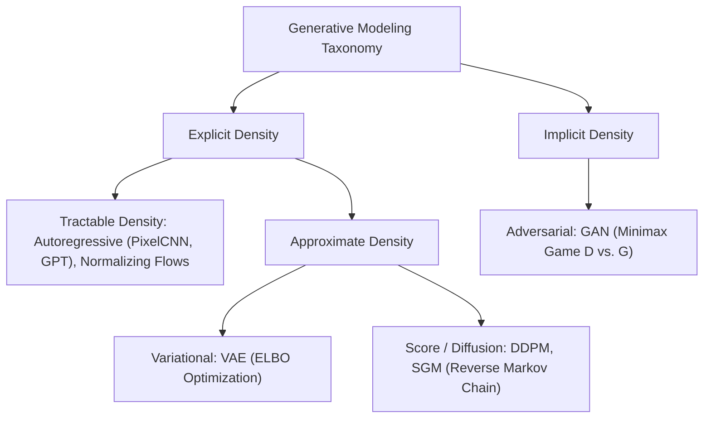
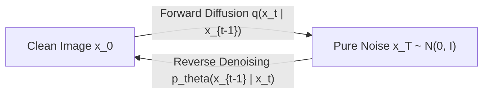

# Generative Deep Learning: Autoencoders, VAEs, GANs & Diffusion Models

A rigorous, self-contained guide to deep generative modeling: deterministic Autoencoders, Variational Autoencoders (VAEs), Generative Adversarial Networks (GANs), and Denoising Diffusion Probabilistic Models (DDPM).

---

## 1. Generative Modeling Landscape

Generative models learn to model the underlying probability distribution $p_{\text{data}}(x)$ from which training samples are drawn, allowing synthesis of novel, realistic instances.

---

## 2. Deterministic Autoencoders vs. VAEs

### 2.1 Why Vanilla Autoencoders Cannot Generate
A deterministic autoencoder maps $x \to z \to \hat{x}$ through a dimensional bottleneck.
While effective for lossy compression and denoising, the latent space $\mathcal{Z}$ has no continuity constraint:
- Regions between training clusters are empty ("holes" in the manifold).
- Sampling an arbitrary point $z \sim \mathcal{N}(0, I)$ produces nonsensical, corrupted outputs.

### 2.2 Variational Autoencoder (VAE) Formulation
Kingma & Welling (2013) framed generation as a probabilistic latent-variable model:
$$p(x) = \int p_\theta(x \mid z) p(z) dz \quad \text{(Intractable Integral)}$$

To circumvent intractable marginalization, we introduce an amortized recognition model $q_\phi(z \mid x) \approx \mathcal{N}(\mu(x), \text{diag}(\sigma^2(x)))$.

### 2.3 Mathematical Derivation of the ELBO
Using Jensen's Inequality on the true log-evidence $\log p_\theta(x)$:
$$\log p(x) = \log \int p(x, z) dz = \log \int q_\phi(z \mid x) \frac{p_\theta(x, z)}{q_\phi(z \mid x)} dz$$
$$\log p(x) \ge \mathbb{E}_{q_\phi(z \mid x)} \left[ \log \frac{p_\theta(x, z)}{q_\phi(z \mid x)} \right] = \mathcal{L}_{\text{ELBO}}(\theta, \phi; x)$$

Expanding the Evidence Lower Bound (ELBO):
$$\mathcal{L}_{\text{ELBO}} = \underbrace{\mathbb{E}_{q_\phi(z \mid x)} [\log p_\theta(x \mid z)]}_{\text{Reconstruction Fidelity (e.g., MSE or BCE)}} - \underbrace{\mathbb{D}_{\text{KL}}(q_\phi(z \mid x) \parallel p(z))}_{\text{Regularization toward Prior } \mathcal{N}(0, I)}$$

### 2.4 Analytical KL Divergence
When prior $p(z) = \mathcal{N}(0, I)$ and posterior $q_\phi(z \mid x) = \mathcal{N}(\mu, \text{diag}(\sigma^2))$:
$$\mathbb{D}_{\text{KL}}(q \parallel p) = -\frac{1}{2} \sum_{j=1}^d \left( 1 + \log(\sigma_j^2) - \mu_j^2 - \sigma_j^2 \right)$$

### 2.5 The Reparameterization Trick
Sampling $z \sim \mathcal{N}(\mu, \sigma^2)$ is a non-differentiable stochastic operation that blocks backpropagation.
The **reparameterization trick** isolates stochasticity into an external independent noise variable $\epsilon \sim \mathcal{N}(0, I)$:
$$z = \mu(x) + \sigma(x) \odot \epsilon$$
This makes $z$ a deterministic, differentiable transformation of network parameters $(\mu, \sigma)$ and input $x$, allowing standard end-to-end backpropagation!

---

## 3. Generative Adversarial Networks (GAN)

Introduced by Goodfellow et al. (2014) as a two-player zero-sum game between:
1. **Generator $G(z; \theta_g)$**: Transforms random noise $z \sim p_z$ into candidate samples $\hat{x}$.
2. **Discriminator $D(x; \theta_d)$**: Predicts the probability that sample $x$ is real rather than generated ($D(x) \in [0, 1]$).

### 3.1 Minimax Objective Function
$$\min_G \max_D V(D, G) = \mathbb{E}_{x \sim p_{\text{data}}} [\log D(x)] + \mathbb{E}_{z \sim p_z} [\log (1 - D(G(z)))]$$

- **Optimal Discriminator**:
  For a fixed Generator $G$, the optimal discriminator is analytically:
  $$D^*(x) = \frac{p_{\text{data}}(x)}{p_{\text{data}}(x) + p_g(x)}$$
- **Virtual Objective (Jensen-Shannon Divergence)**:
  Plugging $D^*$ back into $V(D^*, G)$:
  $$V(D^*, G) = 2 \cdot \mathbb{D}_{\text{JS}}(p_{\text{data}} \parallel p_g) - 2 \log 2$$
  Global minimum occurs if and only if $p_g = p_{\text{data}}$, where $D^*(x) = \frac{1}{2}$ and $V(D^*, G) = -\log 4$.

### 3.2 Critical Failure Modes & WGAN Solution
1. **Mode Collapse**: The generator produces samples from only a few narrow modes of the data distribution, ignoring the rest.
2. **Vanishing Gradients**: In high-dimensional spaces, real and generated distributions are low-dimensional manifolds that rarely overlap. A perfect discriminator yields $\mathbb{D}_{\text{JS}} = \log 2$, causing $D$'s gradients to vanish to zero.
3. **Wasserstein GAN (WGAN)**: Replaces JS divergence with Earth Mover's (Wasserstein-1) Distance via Kantorovich-Rubinstein duality with 1-Lipschitz continuity enforced via Gradient Penalty (WGAN-GP).

---

## 4. Denoising Diffusion Probabilistic Models (DDPM)

Diffusion models generate data by reversing a progressive multi-step noisy degradation process (Sohl-Dickstein et al., 2015; Ho et al., 2020).

### 4.1 Forward (Noising) Process
Given variance schedule $\beta_1, \dots, \beta_T$:
$$q(x_t \mid x_{t-1}) = \mathcal{N}(x_t; \sqrt{1 - \beta_t} x_{t-1}, \beta_t I)$$
Defining $\alpha_t = 1 - \beta_t$ and $\bar{\alpha}_t = \prod_{s=1}^t \alpha_s$, we can jump directly to any timestep $t$ in **closed form**:
$$q(x_t \mid x_0) = \mathcal{N}\left(x_t; \sqrt{\bar{\alpha}_t} x_0, (1 - \bar{\alpha}_t) I\right)$$
$$x_t = \sqrt{\bar{\alpha}_t} x_0 + \sqrt{1 - \bar{\alpha}_t} \epsilon, \quad \epsilon \sim \mathcal{N}(0, I)$$

### 4.2 Reverse (Denoising) Process & Simplified Objective
A neural network (typically a U-Net with cross-attention) is trained to predict the noise $\epsilon$ added at step $t$:
$$L_{\text{simple}}(\theta) = \mathbb{E}_{x_0, \epsilon \sim \mathcal{N}(0, I), t} \left[ \left\| \epsilon - \epsilon_\theta(x_t, t) \right\|^2 \right]$$

Sampling novel images starts from pure noise $x_T \sim \mathcal{N}(0, I)$ and iteratively steps backwards:
$$x_{t-1} = \frac{1}{\sqrt{\alpha_t}} \left( x_t - \frac{\beta_t}{\sqrt{1 - \bar{\alpha}_t}} \epsilon_\theta(x_t, t) \right) + \sigma_t z, \quad z \sim \mathcal{N}(0, I)$$

---

## 5. Generative Architecture Comparison Matrix

| Dimension | Variational Autoencoder (VAE) | Generative Adversarial Network (GAN) | Diffusion Models (DDPM) |
| :--- | :--- | :--- | :--- |
| **Objective** | Maximize ELBO | Minimax Game ($D$ vs. $G$) | Denoising Score Matching |
| **Training Stability** | Highly stable (standard gradient ascent) | Notoriously unstable (Nash equilibrium) | Highly stable (mean squared error) |
| **Sample Quality** | Blurry / overly smoothed | Sharp, high perceptual realism | State-of-the-art visual quality |
| **Mode Coverage** | Complete (covers all modes) | Vulnerable to mode collapse | High mode diversity |
| **Sampling Speed** | Instantaneous ($1$ decoder pass) | Instantaneous ($1$ generator pass) | Iterative (50 - 1000 sequential steps) |

---

## 6. Implementation & Module Reference

- **Core Module**: [`code/generative_engine.py`](./code/generative_engine.py) provides:
  - `VanillaAutoencoder`: Deterministic bottleneck autoencoder.
  - `VariationalAutoencoder`: Reparameterization trick + analytical ELBO loss calculation.
  - `GANGenerator` & `GANDiscriminator`: Adversarial minimax pair.
  - `DDPMNoiseSchedule`: Linear noise schedule and closed-form forward sampling.
- **Unit Tests**: [`code/test_generative.py`](./code/test_generative.py) tests latent dimensions, ELBO backpropagation, and alpha schedules.
- **Interactive Lab**: [`notebook.ipynb`](./notebook.ipynb) trains VAEs, executes GAN optimization, and tracks diffusion SNR decay.
- **Interview Preparation**: [`interview.md`](./interview.md) details deep-dive VAE derivations and GAN failure diagnoses.
- **Curated References**: [`references.md`](./references.md) lists seminal papers from Kingma & Welling to Ho et al.
