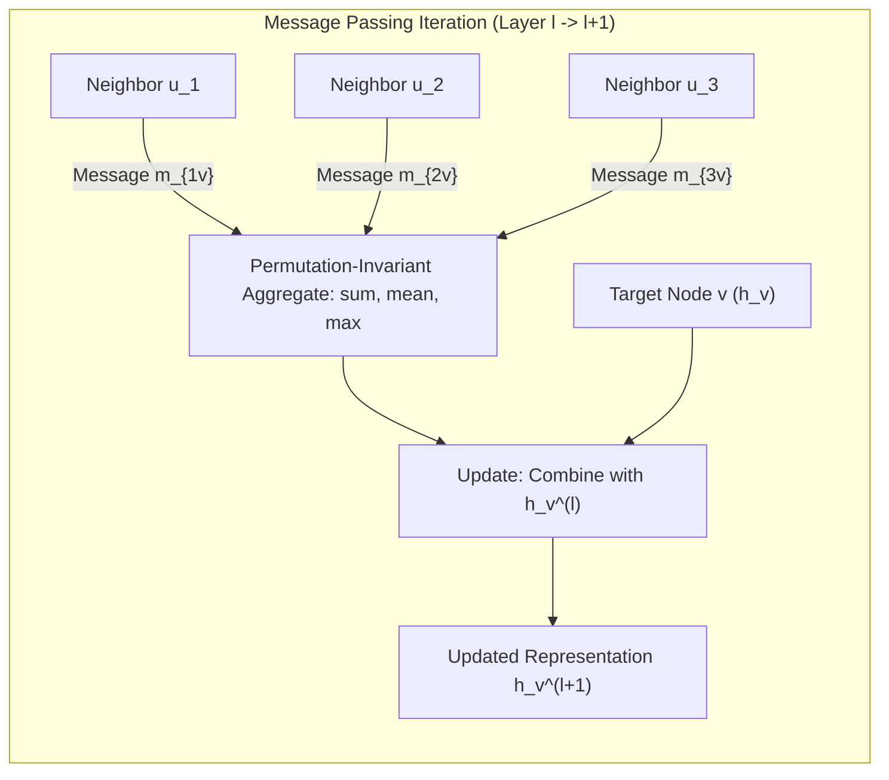

# Graph Neural Networks: Message Passing, GCN, GraphSAGE & GAT

A comprehensive guide to deep learning on non-Euclidean graph topologies: graph representations, the Message Passing Neural Network (MPNN) abstraction, Graph Convolutional Networks (GCN), GraphSAGE inductive sampling, and Graph Attention Networks (GAT).

---

## 1. Graph Representations & The Non-Euclidean Challenge

Unlike grids (images) or sequences (audio, text), graphs lack canonical ordering, fixed neighborhood sizes, and shift-invariance.

### 1.1 Structural Graph Matrices
For a graph $G = (\mathcal{V}, \mathcal{E})$ with $N = |\mathcal{V}|$ nodes and feature matrix $X \in \mathbb{R}^{N \times d}$:
1. **Adjacency Matrix $A \in \{0, 1\}^{N \times N}$**: $A_{ij} = 1$ if $(i, j) \in \mathcal{E}$, else $0$.
2. **Degree Matrix $D \in \mathbb{R}^{N \times N}$**: Diagonal matrix where $D_{ii} = \sum_j A_{ij} = \text{deg}(i)$.
3. **Graph Laplacian $L = D - A$**: Measures the smoothness of signals over graph edges.
   - **Symmetric Normalized Laplacian**:
     $$L_{\text{sym}} = D^{-1/2} L D^{-1/2} = I_N - D^{-1/2} A D^{-1/2}$$

### 1.2 Permutation Invariance & Equivariance
A GNN must be **permutation equivariant**: permuting the input node order by permutation matrix $P$ must permute the output node embeddings identically:
$$f(P A P^T, P X) = P f(A, X)$$

---

## 2. The Message Passing Framework (MPNN)

Gilmer et al. (2017) unified spatial graph deep learning into 3 operations per layer:
1. **Message**: $m_{uv}^{(l)} = M_l(h_u^{(l)}, h_v^{(l)}, e_{uv})$
2. **Aggregate**: $m_v^{(l)} = \bigoplus_{u \in \mathcal{N}(v)} m_{uv}^{(l)}$ where $\bigoplus \in \{\sum, \text{Mean}, \text{Max}\}$ is permutation-invariant.
3. **Update**: $h_v^{(l+1)} = U_l\left( h_v^{(l)}, m_v^{(l)} \right)$

---

## 3. Graph Convolutional Networks (GCN)

Kipf & Welling (ICLR 2017) derived a first-order localized spectral convolution:

$$H^{(l+1)} = \sigma\left( \tilde{D}^{-1/2} \tilde{A} \tilde{D}^{-1/2} H^{(l)} W^{(l)} \right)$$

where $\tilde{A} = A + I_N$ (adds self-loops) and $\tilde{D}_{ii} = \sum_j \tilde{A}_{ij}$.

### 3.1 Why Self-Loops ($\tilde{A} = A + I_N$)?
Without self-loops, multiplying $A X$ aggregates *only* the features of neighboring nodes, completely discarding node $v$'s own feature vector $h_v^{(l)}$! Adding $I_N$ ensures a node's own state is updated alongside its neighbors.

### 3.2 Why Symmetric Normalization ($\tilde{D}^{-1/2} \tilde{A} \tilde{D}^{-1/2}$)?
If we multiply by $\tilde{A}$ unnormalized, high-degree "hub" nodes with thousands of neighbors will aggregate thousands of vectors, causing activation magnitudes and gradient norms to explode.
$$\left( \tilde{D}^{-1/2} \tilde{A} \tilde{D}^{-1/2} \right)_{ij} = \frac{\tilde{A}_{ij}}{\sqrt{\tilde{D}_{ii} \tilde{D}_{jj}}}$$
Normalizing by the geometric mean of both endpoint degrees prevents gradient explosion while preserving structural symmetry.

---

## 4. GraphSAGE: Inductive Neighborhood Sampling

Standard GCNs are **transductive**: computing $\tilde{D}^{-1/2} \tilde{A} \tilde{D}^{-1/2} X$ requires the full graph adjacency matrix in memory, making it impossible to scale to billion-node industrial graphs (e.g., Pinterest, LinkedIn).

Hamilton et al. (NeurIPS 2017) introduced **GraphSAGE** (Sample and Aggregate):
1. **Uniform Neighborhood Sampling**: At layer $l$, sample a fixed number of neighbors $S_l$ (e.g., $S_1 = 25, S_2 = 10$) instead of the full neighborhood. This bounds memory and compute per mini-batch.
2. **Inductive Representation**: Learns aggregator functions that generalize to completely unseen nodes and new subgraphs at test time.

### 4.1 SAGE Aggregators
- **Mean Aggregator**:
  $$h_{\mathcal{N}(v)}^{(l)} = \frac{1}{|\mathcal{N}(v)|} \sum_{u \in \mathcal{N}(v)} h_u^{(l-1)}$$
  $$h_v^{(l)} = \sigma\left( W \cdot [h_v^{(l-1)} \,\|\, h_{\mathcal{N}(v)}^{(l)}] \right)$$
- **Pooling Aggregator**: $h_{\mathcal{N}(v)}^{(l)} = \max_{u \in \mathcal{N}(v)} \left( \sigma(W_{\text{pool}} h_u^{(l-1)} + b) \right)$
- **LSTM Aggregator**: Applied to a randomly permuted sequence of neighbors.

---

## 5. Graph Attention Networks (GAT)

GCN assigns fixed isotropic weights $\frac{1}{\sqrt{d_i d_j}}$ to all neighbors. Veličković et al. (ICLR 2018) introduced **anisotropic self-attention coefficients** $\alpha_{ij}$:

$$e_{ij} = \text{LeakyReLU}\left( \mathbf{a}^T [W h_i \,\|\, W h_j] \right)$$
$$\alpha_{ij} = \frac{\exp(e_{ij})}{\sum_{k \in \mathcal{N}(i)} \exp(e_{ik})}$$
$$h_i^{(l+1)} = \sigma\left( \sum_{j \in \mathcal{N}(i)} \alpha_{ij} W h_j \right)$$

### 5.1 Multi-Head Attention on Graphs
To stabilize learning, GAT employs $K$ independent attention heads:
$$h_i^{(l+1)} = \Vert_{k=1}^K \sigma\left( \sum_{j \in \mathcal{N}(i)} \alpha_{ij}^k W^k h_j \right) \quad \text{(Concatenation for Hidden Layers)}$$
$$h_i^{(L)} = \sigma\left( \frac{1}{K} \sum_{k=1}^K \sum_{j \in \mathcal{N}(i)} \alpha_{ij}^k W^k h_j \right) \quad \text{(Averaging for Output Layer)}$$

---

## 6. GNN Comparison Matrix

| Architecture | Aggregator Type | Inductive / Transductive | Scalability | Key Characteristic |
| :--- | :--- | :--- | :--- | :--- |
| **GCN** | Symmetric Normalized Sum | Transductive (Full Graph) | $\mathcal{O}(|\mathcal{E}| \cdot d)$ | Fast, isotropic, elegant spectral derivation |
| **GraphSAGE** | Sampled Mean / Max / LSTM | Inductive (Mini-batch) | $\mathcal{O}(\prod S_k \cdot d)$ | Scalable to massive graphs via neighborhood sampling |
| **GAT** | Dynamic Self-Attention | Inductive & Transductive | $\mathcal{O}(|\mathcal{E}| \cdot d \cdot K)$ | Anisotropic edge weighting, interpretable attention scores |

---

## 7. Critical Challenges in Deep GNNs

1. **Over-Smoothing**:
   As network depth $L \to \infty$, repeated message passing acts as a Laplacian smoothing operator. All node embeddings exponentially converge to identical vectors determined strictly by graph connected components:
   $$\lim_{L \to \infty} h_v^{(L)} = c \cdot \sqrt{\text{deg}(v)}$$
   *Mitigation*: Keep GNNs shallow ($2-4$ layers), use residual connections (Jumping Knowledge networks, APPNP), or DropEdge regularization.
2. **Over-Squashing**:
   Exponentially growing neighborhoods ($d^L$ nodes) compressed into fixed-size node vectors creates an information bottleneck.

---

## 8. Implementation & Module Reference

- **Core Module**: [`code/gnn_engine.py`](./code/gnn_engine.py) provides:
  - `GCNLayer`: Normalized symmetric adjacency message passing.
  - `GraphSAGELayer`: Mean aggregator with feature concatenation.
  - `GATLayer`: Parameterized edge self-attention.
  - `GCNNodeClassifier`: End-to-end 2-layer semi-supervised node classifier.
- **Unit Tests**: [`code/test_gnn.py`](./code/test_gnn.py) tests Laplacian normalization symmetry, attention weight sums, and classification gradients.
- **Interactive Lab**: [`notebook.ipynb`](./notebook.ipynb) visualizes normalized adjacencies, GAT attention coefficients, and node classification convergence.
- **Interview Preparation**: [`interview.md`](./interview.md) details deep-dive GNN interview questions.
- **Curated References**: [`references.md`](./references.md) lists seminal papers from Kipf & Welling to Hamilton and Veličković.
