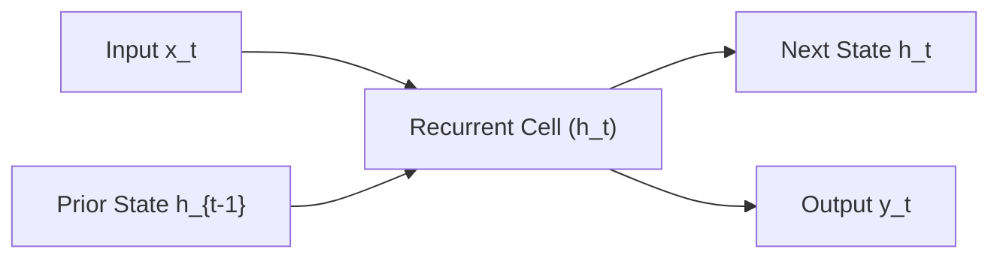
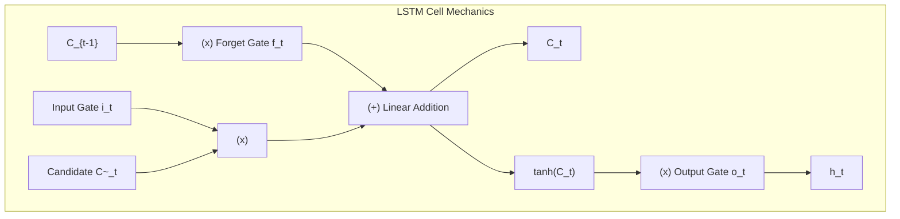
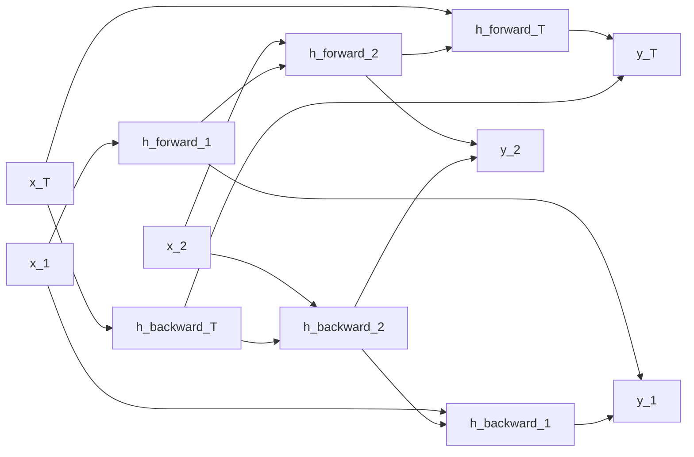

# Recurrent Neural Networks: RNNs, LSTMs, GRUs & Sequence Modeling

A comprehensive guide to sequential neural architectures: recurrent hidden transitions, Backpropagation Through Time (BPTT), vanishing and exploding gradients, LSTM gating mechanics, Gated Recurrent Units (GRU), and Bidirectional networks.

---

## 1. The Recurrent Sequence Modeling Paradigm

Unlike feedforward networks that assume independent and identically distributed (i.i.d.) inputs, Recurrent Neural Networks (RNNs) process sequential dependencies via an evolving internal memory state $h_t$.

### 1.1 Elman RNN Forward Formulation
At timestep $t \in \{1, \dots, T\}$ for input $x_t \in \mathbb{R}^d$ and hidden state $h_t \in \mathbb{R}^h$:
$$a_t = W_{xh} x_t + W_{hh} h_{t-1} + b_h$$
$$h_t = \tanh(a_t)$$
$$y_t = \text{Softmax}(W_{hy} h_t + b_y)$$

---

## 2. Backpropagation Through Time (BPTT) & Vanishing Gradients

Unrolling an RNN across $T$ timesteps creates a deep feedforward computational graph of depth $T$.

### 2.1 Mathematical Derivation of the Gradient Chain
For total loss $L = \sum_{t=1}^T L_t$, the gradient with respect to parameter matrix $W_{hh}$ is:
$$\frac{\partial L}{\partial W_{hh}} = \sum_{t=1}^T \sum_{k=1}^t \frac{\partial L_t}{\partial h_t} \frac{\partial h_t}{\partial h_k} \frac{\partial h_k}{\partial W_{hh}}$$
The key Jacobian chain factor across temporal steps from $k$ to $t$ is:
$$\frac{\partial h_t}{\partial h_k} = \prod_{j=k+1}^t \frac{\partial h_j}{\partial h_{j-1}} = \prod_{j=k+1}^t \text{diag}(1 - h_j^2) W_{hh}^T$$

### 2.2 The Spectral Radius & Gradient Collapse
Let $\lambda_{\max}$ be the largest eigenvalue of $W_{hh}$:
- **Vanishing Gradients ($\lambda_{\max} < 1$)**: Since $|\text{diag}(1 - h_j^2)| \le 1$, the continuous matrix multiplication causes exponential decay:
  $$\left\| \frac{\partial h_t}{\partial h_k} \right\| \le (\lambda_{\max})^{t-k} \xrightarrow{t - k \gg 1} 0$$
  The model completely loses the capacity to capture dependencies spanning beyond 10-15 timesteps.
- **Exploding Gradients ($\lambda_{\max} > 1$)**: Gradients grow exponentially, resulting in `NaN` weights. Mitigated using **Gradient Norm Clipping**:
  $$g \leftarrow g \cdot \min\left(1, \frac{\text{threshold}}{\|g\|_2}\right)$$

---

## 3. Long Short-Term Memory (LSTM)

Introduced by Hochreiter & Schmidhuber (1997) to solve vanishing gradients by establishing an uninterrupted **Constant Error Carousel (CEC)**: the cell state $C_t$.

### 3.1 The 4 Gating Equations
Given input $x_t$ and prior hidden state $h_{t-1}$:
1. **Forget Gate**: Decides what fraction of prior cell state to discard ($f_t \in [0, 1]$):
   $$f_t = \sigma(W_f x_t + U_f h_{t-1} + b_f)$$
2. **Input Gate**: Decides which new information to store ($i_t \in [0, 1]$):
   $$i_t = \sigma(W_i x_t + U_i h_{t-1} + b_i)$$
3. **Candidate State**: Generates new candidate values:
   $$\tilde{C}_t = \tanh(W_c x_t + U_c h_{t-1} + b_c)$$
4. **Cell State Update (Additive Highway)**:
   $$C_t = f_t \odot C_{t-1} + i_t \odot \tilde{C}_t$$
5. **Output Gate**: Selects what to expose to the hidden state ($o_t \in [0, 1]$):
   $$o_t = \sigma(W_o x_t + U_o h_{t-1} + b_o)$$
   $$h_t = o_t \odot \tanh(C_t)$$

### 3.2 Why Cell State $C_t$ Eliminates Vanishing Gradients
Computing $\frac{\partial C_t}{\partial C_{t-1}}$:
$$\frac{\partial C_t}{\partial C_{t-1}} = f_t + \dots$$
When the network learns to keep the forget gate open ($f_t \approx 1$), gradients backpropagate across hundreds of timesteps linearly without exponential decay!

---

## 4. Gated Recurrent Unit (GRU)

Introduced by Cho et al. (2014) as a simplified, computationally lighter alternative to LSTM.

### 4.1 GRU Gating Formulation
Merges cell state and hidden state, utilizing only 2 gates:
1. **Reset Gate $r_t$**: Controls how much previous memory contributes to candidate state:
   $$r_t = \sigma(W_r x_t + U_r h_{t-1} + b_r)$$
2. **Update Gate $z_t$**: Acts simultaneously as forget and input gates:
   $$z_t = \sigma(W_z x_t + U_z h_{t-1} + b_z)$$
3. **Candidate Hidden State $\tilde{h}_t$**:
   $$\tilde{h}_t = \tanh(W_h x_t + U_h (r_t \odot h_{t-1}) + b_h)$$
4. **Hidden State Linear Interpolation**:
   $$h_t = (1 - z_t) \odot h_{t-1} + z_t \odot \tilde{h}_t$$

### 4.2 LSTM vs. GRU Comparison
- **Parameters**: An LSTM cell contains $4 \times (d \cdot h + h^2)$ weights; GRU contains $3 \times (d \cdot h + h^2)$ ($\mathbf{25\% \text{ fewer parameters}}$).
- **Convergence**: GRU trains faster and is less prone to overfitting on small datasets.
- **Expressiveness**: LSTM retains independent memory capacity ($C_t$ vs. $h_t$) and can outperform GRU on long, complex sequence tasks.

---

## 5. Bidirectional RNNs (BiLSTM)

Standard recurrent networks only access past context ($x_1, \dots, x_t$). In many NLP tasks (sentiment analysis, named entity recognition, translation), future context ($x_{t+1}, \dots, x_T$) is equally informative.

The bidirectional hidden state is formed by concatenating forward and backward passes:
$$h_t = [\vec{h}_t \,;\, \overleftarrow{h}_t] \in \mathbb{R}^{2h}$$

---

## 6. Implementation & Module Reference

- **Modular Scratch Implementation**: [`code/rnn_engine.py`](./code/rnn_engine.py) provides:
  - `ScratchSimpleRNNCell`: Manual Elman RNN forward step.
  - `ScratchLSTMCell`: Full 4-gate LSTM cell with additive cell state.
  - `ScratchGRUCell`: 2-gate GRU cell with reset and update interpolation.
  - `BidirectionalLSTMClassifier`: Production PyTorch bidirectional sequence classifier.
  - `measure_bptt_gradient_norms`: Diagnostic measuring temporal gradient norm decay.
- **Unit Tests**: [`code/test_rnn.py`](./code/test_rnn.py) validates shape contracts, gating logic, and gradient retention.
- **Interactive Lab**: [`notebook.ipynb`](./notebook.ipynb) visualizes BPTT gradient decay and tests bidirectional classification.
- **Interview Preparation**: [`interview.md`](./interview.md) details deep-dive BPTT derivations and gate comparisons.
- **Curated References**: [`references.md`](./references.md) lists seminal papers from Hochreiter to Cho.
