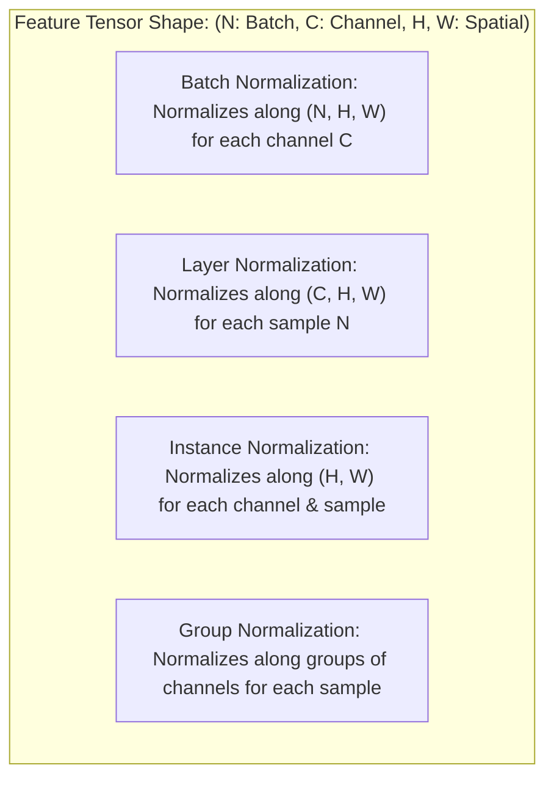
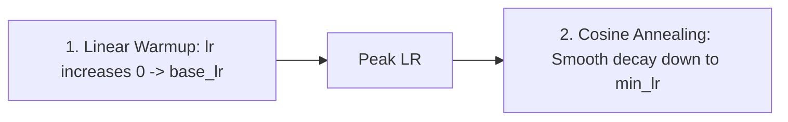
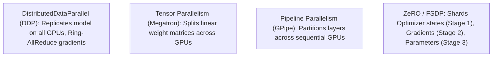

# Deep Learning Training Dynamics: Regularization, Normalization, Schedules & Distributed Scale

A comprehensive guide to production deep learning training: regularization strategies, normalization mechanics (BatchNorm vs. LayerNorm vs. GroupNorm), data augmentation, optimization schedules, mixed-precision acceleration, and distributed training paradigms (DDP, FSDP, ZeRO).

---

## 1. Normalization Taxonomy

Normalizing internal activation distributions stabilizes gradient propagation and allows significantly higher learning rates.

### 1.1 Batch Normalization (Ioffe & Szegedy, 2015)
For mini-batch $\mathcal{B} = \{x_1, \dots, x_m\}$:
$$\mu_{\mathcal{B}} = \frac{1}{m} \sum_{i=1}^m x_i, \quad \sigma_{\mathcal{B}}^2 = \frac{1}{m} \sum_{i=1}^m (x_i - \mu_{\mathcal{B}})^2$$
$$\hat{x}_i = \frac{x_i - \mu_{\mathcal{B}}}{\sqrt{\sigma_{\mathcal{B}}^2 + \epsilon}}$$
$$y_i = \gamma \hat{x}_i + \beta \quad \text{(Learnable Scale and Shift)}$$

- **Why It Works**: Contrary to initial belief about "Internal Covariate Shift", Santurkar et al. (2018) proved that BatchNorm primarily **smooths the optimization landscape**, making the loss Lipschitz continuous and preventing explosive gradients.
- **Limitations**:
  - Unstable when batch size is small ($m < 16$).
  - Train/test discrepancy: requires maintaining running exponential moving averages for inference.
  - Difficult in distributed settings without Synchronized BatchNorm (SyncBN).

### 1.2 Layer Normalization (Ba, Kiros & Hinton, 2016)
Computes statistics across all hidden units within a single sample, completely independent of the mini-batch:
$$\mu_i = \frac{1}{H} \sum_{j=1}^H x_{ij}, \quad \sigma_i^2 = \frac{1}{H} \sum_{j=1}^H (x_{ij} - \mu_i)^2$$
- **Advantages**: Identical computation during training and evaluation; fully compatible with batch size 1 and variable-length sequences (standard in NLP and Transformers).

---

## 2. Regularization Dynamics

### 2.1 Inverted Dropout (Srivastava et al., 2014)
During training, each neuron is dropped independently with probability $p$. To avoid modifying test-time code, activations are scaled by $\frac{1}{1 - p}$ during training:
$$r \sim \text{Bernoulli}(1 - p)$$
$$\tilde{x} = \frac{r \odot x}{1 - p}$$
At inference time, the layer is a clean identity pass: $\tilde{x} = x$.

### 2.2 Advanced Data Augmentation
- **Mixup (Zhang et al., 2018)**: Creates linear interpolations of input images and labels:
  $$\tilde{x} = \lambda x_i + (1 - \lambda) x_j, \quad \tilde{y} = \lambda y_i + (1 - \lambda) y_j, \quad \lambda \sim \text{Beta}(\alpha, \alpha)$$
- **CutMix (Yun et al., 2019)**: Replaces an image bounding box with a patch from another image while proportionally mixing one-hot target labels.

---

## 3. Learning Rate Schedules & Diagnostics

### 3.1 Cosine Annealing with Warmup
Linear warmup prevents early gradient explosion before moment accumulators stabilize, followed by cosine decay:
$$\eta_t = \eta_{\min} + \frac{1}{2} (\eta_{\max} - \eta_{\min}) \left( 1 + \cos\left( \frac{t - T_{\text{warm}}}{T_{\text{max}} - T_{\text{warm}}} \pi \right) \right)$$

### 3.2 Gradient Norm Clipping
Prevents runaway parameters in recurrent or deep architectures:
$$g \leftarrow g \cdot \min\left( 1, \frac{\text{max\_norm}}{\|g\|_2 + \epsilon} \right)$$
Preserves the exact update **direction** while capping the update **magnitude**.

---

## 4. Modern Acceleration & Distributed Training

### 4.1 Automatic Mixed Precision (AMP)
Modern GPUs (Tensor Cores) execute FP16 / BF16 operations up to 4x faster than FP32 while halving VRAM consumption.
- **BF16 vs. FP16**:
  - FP16 has 5 exponent bits and 10 mantissa bits (dynamic range limited; prone to underflow, requires dynamic loss scaling).
  - BF16 has 8 exponent bits (same as FP32) and 7 mantissa bits (identical dynamic range as FP32, eliminating underflow).
- **Master Weights**: Model parameters are stored and accumulated in FP32; forward and backward passes execute in BF16/FP16.

### 4.2 Distributed Training Paradigms

1. **DistributedDataParallel (DDP)**:
   - Each GPU holds a full copy of the model parameters.
   - Synchronizes gradients across workers via efficient asynchronous **Ring-AllReduce**.
2. **Fully Sharded Data Parallel (FSDP / ZeRO-Stage 3)**:
   - Eliminates redundant memory across GPUs by sharding model parameters, gradients, and optimizer states across all nodes.
   - Gathers parameters on-demand during forward and backward passes, enabling training of 70B+ LLMs without pipeline bubbles.

---

## 5. Implementation & Module Reference

- **Core Module**: [`code/training_toolkit.py`](./code/training_toolkit.py) provides:
  - `ScratchBatchNorm1d`: Full BatchNorm layer with running statistics.
  - `ScratchLayerNorm`: Batch-independent layer normalization.
  - `get_cosine_warmup_lr`: Analytical cosine learning rate schedule with warmup.
  - `clip_grad_norm_scratch`: Global vector gradient norm clipper.
  - `EarlyStoppingHandler`: Monitored validation early termination callback.
- **Unit Tests**: [`code/test_training_tricks.py`](./code/test_training_tricks.py) tests normalization moments, warmup steps, and clipping factors.
- **Interactive Lab**: [`notebook.ipynb`](./notebook.ipynb) visualizes normalization outputs, learning rate schedules, and early stopping triggers.
- **Interview Preparation**: [`interview.md`](./interview.md) details deep-dive training dynamics questions.
- **Curated References**: [`references.md`](./references.md) lists seminal papers from Ioffe & Szegedy to ZeRO.
