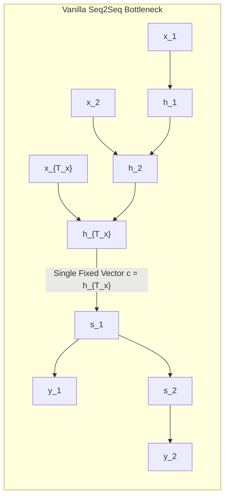
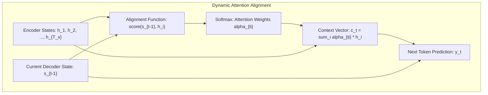

# Sequence-to-Sequence & Attention Mechanisms: Translation, Summarization & Evaluation

A comprehensive guide to sequence transduction: the encoder-decoder paradigm, the information bottleneck, additive vs. multiplicative attention mechanisms, teacher forcing dynamics, exposure bias, and translation evaluation metrics (BLEU, ROUGE).

---

## 1. The Encoder-Decoder Paradigm & The Bottleneck Problem

Sequence-to-sequence (Seq2Seq) models map variable-length input sequences $\mathbf{x} = (x_1, \dots, x_{T_x})$ to variable-length output sequences $\mathbf{y} = (y_1, \dots, y_{T_y})$ (Sutskever et al., 2014; Cho et al., 2014).

### The Information Bottleneck
In vanilla Seq2Seq, the encoder compresses the entire input sequence into a single fixed-size vector $c = h_{T_x}$.
For long sequences ($T_x > 20$), this fixed-dimensional vector cannot retain fine-grained lexical and syntactic details, resulting in catastrophic translation degradation on complex paragraphs.

---

## 2. Dynamic Attention Mechanisms

Bahdanau et al. (ICLR 2015) introduced the **Attention Mechanism** to eliminate the bottleneck: instead of relying on a single context vector, the decoder dynamically computes a custom context vector $c_t$ at every generation step by attending over *all* encoder hidden states $(h_1, \dots, h_{T_x})$.

### 2.1 Bahdanau (Additive) Attention
Bahdanau et al. (2015) uses a single-hidden-layer feed-forward network to compute alignment energies:
$$e_{ti} = \mathbf{v}_a^T \tanh\left( W_s s_{t-1} + W_h h_i \right)$$
$$\alpha_{ti} = \frac{\exp(e_{ti})}{\sum_{k=1}^{T_x} \exp(e_{tk})}$$
$$\mathbf{c}_t = \sum_{i=1}^{T_x} \alpha_{ti} h_i$$

### 2.2 Luong (Multiplicative) Attention Variants
Luong et al. (EMNLP 2015) explored simplified multiplicative alignment scores:
$$\text{score}(s_t, h_i) = \begin{cases} s_t^T h_i & \text{Dot (requires } \dim(s) = \dim(h)) \\ s_t^T W_a h_i & \text{General (bilinear mapping)} \\ \mathbf{v}_a^T \tanh(W_a [s_t \,\|\, h_i]) & \text{Concat} \end{cases}$$

---

## 3. Training Dynamics: Teacher Forcing & Exposure Bias

### 3.1 Teacher Forcing
During training, the decoder receives the **ground-truth previous target token** $y_{t-1}^*$ as input to step $t$, rather than its own generated token $\hat{y}_{t-1} \sim P(y \mid s_t)$.
- *Benefit*: Accelerates training convergence; prevents early erroneous predictions from destabilizing gradient updates across subsequent steps.

### 3.2 Exposure Bias & Scheduled Sampling
- **The Problem**: During test-time inference, ground-truth tokens $y^*$ are unavailable. The model must feed its own past predictions $\hat{y}_{t-1}$ into the next step. If it makes an error at step 1, it enters a state space never encountered during training, causing compounding errors that derail the rest of the sentence.
- **Scheduled Sampling (Bengio et al., 2015)**: Gradually anneals the probability of teacher forcing $\epsilon$ from $1.0$ down to $0.0$ over the course of training:
  $$P(\text{Teacher Forcing}) = \max(\epsilon_{\min}, 1.0 - k \cdot \text{epoch})$$

---

## 4. Sequence Evaluation Metrics

### 4.1 BLEU (Bilingual Evaluation Understudy)
Standard metric in Machine Translation (Papineni et al., 2002). Measures modified precision of candidate n-grams against reference translations:

$$\text{BLEU} = \text{BP} \cdot \exp\left( \sum_{n=1}^N w_n \log p_n \right)$$

1. **Modified n-gram Precision $p_n$**: Clips candidate n-gram counts to the maximum count observed in any reference translation (preventing repetitive output like "the the the the" from achieving 100% precision).
2. **Brevity Penalty (BP)**: Penalizes candidate translations that are shorter than the reference:
   $$\text{BP} = \begin{cases} 1 & \text{if } c > r \\ \exp(1 - r/c) & \text{if } c \le r \end{cases}$$
   where $c$ is candidate word count and $r$ is reference word count.

### 4.2 ROUGE (Recall-Oriented Understudy for Gisting Evaluation)
Standard metric in Text Summarization (Lin, 2004). Prioritizes **recall** over precision:
- **ROUGE-N**: Overlap of n-grams between candidate and reference:
  $$\text{ROUGE-N} = \frac{\sum_{S \in \text{Ref}} \sum_{\text{gram}_n \in S} \text{Count}_{\text{match}}(\text{gram}_n)}{\sum_{S \in \text{Ref}} \sum_{\text{gram}_n \in S} \text{Count}(\text{gram}_n)}$$
- **ROUGE-L**: Measures the Longest Common Subsequence (LCS) to capture sentence-level structure without requiring contiguous n-gram matches.

---

## 5. Implementation & Module Reference

- **Core Module**: [`code/seq2seq_engine.py`](./code/seq2seq_engine.py) provides:
  - `BahdanauAttention`: Parameterized additive attention mechanism.
  - `LuongAttention`: Multiplicative bilinear attention scoring.
  - `Seq2SeqEncoder`, `Seq2SeqAttentionDecoder`, `Seq2SeqModel`: End-to-end translation pipeline with scheduled teacher forcing.
  - `compute_bleu_score`: Exact sentence-level BLEU score with modified n-gram clipping and brevity penalty.
- **Unit Tests**: [`code/test_seq2seq.py`](./code/test_seq2seq.py) tests attention weight normalization, decoder teacher forcing shapes, and BLEU precision.
- **Interactive Lab**: [`notebook.ipynb`](./notebook.ipynb) inspects attention weight matrices and evaluates sentence BLEU curves.
- **Interview Preparation**: [`interview.md`](./interview.md) details deep-dive Seq2Seq and metric screening questions.
- **Curated References**: [`references.md`](./references.md) lists seminal papers from Sutskever to Bahdanau and Luong.
