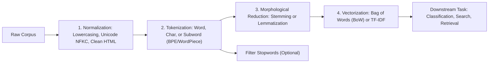

# Text Preprocessing: Tokenization, Stemming, Lemmatization, Bag-of-Words & TF-IDF

A comprehensive guide to textual data preparation: text normalization, subword tokenization paradigms (BPE, WordPiece), morphological reduction (stemming vs. lemmatization), and classical statistical vector space models (CountVectorizer and TF-IDF).

---

## 1. The Classical NLP Pipeline

---

## 2. Tokenization Paradigms

Tokenization partitions a continuous string of text into discrete units (tokens) suitable for numerical mapping.

### 2.1 Word-Level vs. Character-Level
- **Word-Level**: Splits on whitespace and punctuation.
  - *Limitation*: Infinite vocabulary problem and Out-Of-Vocabulary (OOV) tokens for unseen words, typos, and compounds.
- **Character-Level**: Treats individual characters as tokens.
  - *Limitation*: Long sequences ($4-5\times$ longer than word sequences); loses individual semantic meaning per token.

### 2.2 Subword Tokenization (Modern Standard)
Balances vocabulary size with representation fidelity:
1. **Byte-Pair Encoding (BPE - Sennrich et al., 2016)**:
   - Starts with all unique characters as the base vocabulary.
   - Iteratively counts the most frequent pair of adjacent bytes/symbols and merges them into a single new subword token.
   - Used in GPT-2, GPT-4, RoBERTa, and LLaMA.
2. **WordPiece (Schuster & Nakajima, 2012)**:
   - Similar to BPE, but scores candidate pairs based on maximizing language model likelihood rather than raw frequency count.
   - Used in BERT.
3. **Unigram Language Model (Kudo, 2018)**:
   - Starts with a massive initial vocabulary and iteratively trims tokens that minimize the increase in corpus perplexity.
   - Used in SentencePiece and T5.

---

## 3. Stemming vs. Lemmatization

| Dimension | Stemming (e.g., Porter, Snowball) | Lemmatization (e.g., WordNet, spaCy) |
| :--- | :--- | :--- |
| **Approach** | Rule-based heuristic suffix stripping | Morphological analysis with dictionary lookup & POS tags |
| **Output** | May produce non-words (`comput`, `operat`) | Always produces valid dictionary headwords (lemmas) |
| **Speed** | Very fast (simple string slicing) | Slower (requires linguistic analysis and POS disambiguation) |
| **Example 1** | `caring` $\to$ `care`, `caresses` $\to$ `caress` | `better` (ADJ) $\to$ `good`, `was` (VERB) $\to$ `be` |
| **Example 2** | `corpora` $\to$ `corpora` (fails to stem) | `corpora` (NOUN) $\to$ `corpus` |

---

## 4. Vector Space Models: Bag-of-Words & TF-IDF

### 4.1 Bag-of-Words (CountVectorizer)
Represents document $d$ as a sparse vector of raw word frequencies:
$$\mathbf{x}_d = [c(w_1, d), c(w_2, d), \dots, c(w_V, d)]$$
*Limitation*: Frequent, uninformative words ("the", "is", "of") dominate vector magnitudes and obscure rare, discriminative domain terms.

### 4.2 Term Frequency - Inverse Document Frequency (TF-IDF)
Weights terms by their local frequency in a document and discounts them by their global prevalence across the entire corpus:

1. **Term Frequency $\text{TF}(t, d)$**:
   $$\text{TF}(t, d) = \frac{f_{t, d}}{\sum_{t' \in d} f_{t', d}} \quad \text{or raw count } f_{t, d}$$
   - *Sublinear TF Scaling*: $\text{TF}_{\text{sub}}(t, d) = 1 + \log(f_{t, d})$ for $f_{t, d} > 0$ (prevents a word occurring 20 times from having $20\times$ more importance than a word occurring once).
2. **Inverse Document Frequency $\text{IDF}(t, D)$**:
   Measures how much information term $t$ provides across corpus $D$:
   $$\text{IDF}_{\text{smooth}}(t, D) = \log\left( \frac{1 + |D|}{1 + |\{d \in D : t \in d\}|} \right) + 1$$
3. **Compound Score**:
   $$\text{TF-IDF}(t, d, D) = \text{TF}(t, d) \times \text{IDF}(t, D)$$
4. **L2 Euclidean Normalization**:
   Document length varies wildly. Normalizing each document vector to unit length guarantees that vector comparisons reflect topic distribution rather than document verbosity:
   $$\mathbf{v}_{\text{norm}} = \frac{\mathbf{v}}{\|\mathbf{v}\|_2}$$

---

## 5. Information Retrieval via Cosine Similarity

Given a query vector $\mathbf{q}$ and document vectors $\mathbf{d}_1, \dots, \mathbf{d}_N$ in a common TF-IDF vector space:
$$\text{CosineSimilarity}(\mathbf{q}, \mathbf{d}_i) = \frac{\mathbf{q} \cdot \mathbf{d}_i}{\|\mathbf{q}\|_2 \|\mathbf{d}_i\|_2} = \mathbf{q}_{\text{norm}} \cdot \mathbf{d}_{i, \text{norm}}$$
Since all vectors are pre-normalized to unit norm, document relevance ranking reduces to a single vectorized matrix-vector multiplication:
$$\mathbf{s} = X_{\text{tfidf}} \mathbf{q}_{\text{norm}}^T$$

---

## 6. Implementation & Module Reference

- **Core Module**: [`code/text_processor.py`](./code/text_processor.py) provides:
  - `SimpleTokenizer`: Regex token extractor with stopword handling.
  - `PorterStemmerMini`: Step 1a/1b suffix reduction rules.
  - `BagOfWords`: Vocabulary building and frequency matrix generator.
  - `TfidfVectorizerScratch`: Smooth IDF weighting and L2 vector normalization.
- **Unit Tests**: [`code/test_text_preprocessing.py`](./code/test_text_preprocessing.py) validates stemming rules, TF-IDF unit norms, and inverse frequency ordering.
- **Interactive Lab**: [`notebook.ipynb`](./notebook.ipynb) runs document normalization, builds TF-IDF matrices, and executes cosine similarity query ranking.
- **Interview Preparation**: [`interview.md`](./interview.md) details deep-dive tokenization and vectorization screening questions.
- **Curated References**: [`references.md`](./references.md) lists seminal papers from Porter to Sennrich.
