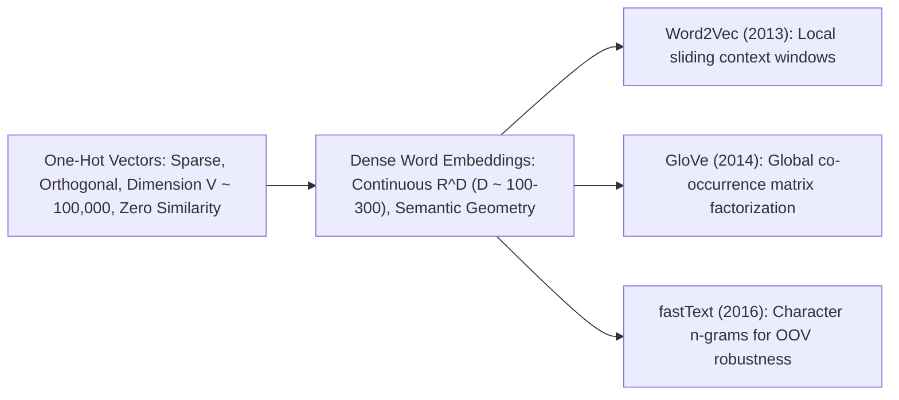

# Word Embeddings: Distributed Representations, Word2Vec, GloVe & fastText

A comprehensive guide to static word representation: the distributional hypothesis, Word2Vec architectures (Skip-Gram with Negative Sampling and CBOW), GloVe global matrix factorization, fastText subword extensions, and semantic vector space arithmetic.

---

## 1. The Distributional Hypothesis

The foundational premise of modern NLP is J.R. Firth's (1957) linguistic axiom:
> *"You shall know a word by the company it keeps."*

Unlike one-hot encodings where all word vectors are equidistant and orthogonal ($\mathbf{e}_i^T \mathbf{e}_j = 0$), dense word embeddings project vocabulary terms into a continuous metric space $\mathbb{R}^D$ where geometric proximity corresponds to semantic and syntactic similarity.

---

## 2. Word2Vec: CBOW & Skip-Gram

Mikolov et al. (2013) proposed two complementary architectures to learn word embeddings via shallow two-layer neural networks:

### 2.1 Continuous Bag-of-Words (CBOW)
Predicts the center target word $w_t$ given the sum or average of its surrounding context words within window $C$:
$$\mathbf{h} = \frac{1}{2C} \sum_{-C \le j \le C, j \neq 0} \mathbf{v}_{w_{t+j}}$$
$$\hat{\mathbf{y}} = \text{Softmax}(W_{\text{out}} \mathbf{h})$$
- *Strengths*: Faster to train, slightly better accuracy for frequent words due to context averaging.

### 2.2 Skip-Gram with Negative Sampling (SGNS)
Predicts surrounding context words $w_{t+j}$ given the center word $w_t$.
Because standard softmax normalization $\sum_{w=1}^V \exp(\dots)$ requires $O(V)$ operations per token step, SGNS replaces full multi-class classification with a set of $K$ **binary logistic regressions**:

$$\mathcal{L}_{\text{SGNS}} = -\log \sigma\left( \mathbf{v}'_{w_O} \cdot \mathbf{v}_{w_I} \right) - \sum_{k=1}^K \mathbb{E}_{w_{i, k} \sim P_n(w)} \left[ \log \sigma\left( -\mathbf{v}'_{w_{i, k}} \cdot \mathbf{v}_{w_I} \right) \right]$$

- **Target and Context Vectors**: Each vocabulary word maintains two distinct vectors: target representation $\mathbf{v}_w$ and context representation $\mathbf{v}'_w$. The final representation is typically $\mathbf{v}_w + \mathbf{v}'_w$.
- **Noise Distribution**: Negative samples are drawn from the unigram distribution raised to the $3/4$ power:
  $$P_n(w) = \frac{U(w)^{3/4}}{\sum_{w'} U(w')^{3/4}}$$
  The exponent $\frac{3}{4}$ suppresses overwhelming dominance of stop words while giving rare words a higher probability of being sampled.

---

## 3. GloVe: Global Vectors for Word Representation

Pennington et al. (EMNLP 2014) argued that Word2Vec fails to leverage the vast statistical information contained in global co-occurrence counts across the full corpus.

### 3.1 Log-Bilinear Formulation
Let $X_{ij}$ be the count of word $j$ appearing in the context of word $i$. GloVe models the ratio of co-occurrence probabilities:
$$\mathbf{w}_i^T \tilde{\mathbf{w}}_j + b_i + \tilde{b}_j = \log X_{ij}$$

### 3.2 Weighted Least Squares Objective
To prevent extremely frequent pairs from dominating the loss and to avoid computing $\log(0)$ for unobserved pairs, GloVe minimizes:
$$J = \sum_{i, j=1}^V f(X_{ij}) \left( \mathbf{w}_i^T \tilde{\mathbf{w}}_j + b_i + \tilde{b}_j - \log X_{ij} \right)^2$$
where the weighting function $f(x)$ caps frequent co-occurrences:
$$f(x) = \begin{cases} \left( \frac{x}{x_{\max}} \right)^\alpha & \text{if } x < x_{\max} \quad (\text{typically } x_{\max} = 100, \alpha = 0.75) \\ 1 & \text{otherwise} \end{cases}$$

---

## 4. fastText: Subword Morphological Embeddings

Bojanowski et al. (2017) extended Skip-Gram to represent words as a bag of **character n-grams**:
- For word `where` with $n=3$, n-grams include: `<wh`, `whe`, `her`, `ere`, `re>`, and special token `<where>`.
- The representation of word $w$ is the sum of its character n-gram vectors:
  $$\mathbf{v}_w = \sum_{g \in \mathcal{G}_w} \mathbf{z}_g$$

### Advantages of fastText:
1. **Out-of-Vocabulary (OOV) Generalization**: Novel, misspelled, or compound words (e.g., `bioinformatics`) can be embedded by summing vectors of their constituent character n-grams.
2. **Morphologically Rich Languages**: Highly inflected languages (German, Russian, Finnish, Turkish) share subword roots across thousands of grammatical permutations.

---

## 5. Semantic Vector Space Arithmetic

A remarkable emergent property of distributed representations is linear compositionality:
$$\mathbf{v}_{\text{king}} - \mathbf{v}_{\text{man}} + \mathbf{v}_{\text{woman}} \approx \mathbf{v}_{\text{queen}}$$
$$\mathbf{v}_{\text{Paris}} - \mathbf{v}_{\text{France}} + \mathbf{v}_{\text{Italy}} \approx \mathbf{v}_{\text{Rome}}$$

Directional offsets in the embedding space encode specific semantic relations (gender, capital-country, tense, pluralization).

---

## 6. Comparison Matrix

| Model | Training Objective | Representation Unit | Handles OOV? | Primary Advantage |
| :--- | :--- | :--- | :--- | :--- |
| **Word2Vec (SGNS)** | Binary Logistic Negative Sampling | Whole word tokens | No | Efficient streaming over large corpora |
| **Word2Vec (CBOW)** | Multi-class cross-entropy / Negative sampling | Whole word tokens | No | Fast training, excellent on common words |
| **GloVe** | Weighted Least Squares on Co-occurrences | Whole word tokens | No | Direct matrix factorization of global corpus statistics |
| **fastText** | SGNS over Character n-grams | Character n-grams + word | **Yes** | Exceptional on rare words, typos, and morphologically rich languages |

---

## 7. Implementation & Module Reference

- **Core Module**: [`code/embedding_engine.py`](./code/embedding_engine.py) provides:
  - `SkipGramNegativeSampling`: Dual-embedding SGNS module with forward loss computation.
  - `CBOW`: Context averaging feed-forward classifier.
  - `GloVeLoss`: Weighted least squares co-occurrence objective.
  - `find_most_similar` & `solve_analogy`: Cosine ranking and linear analogy solver.
- **Unit Tests**: [`code/test_word_embeddings.py`](./code/test_word_embeddings.py) tests SGNS loss gradients, CBOW projections, and analogy arithmetic.
- **Interactive Lab**: [`notebook.ipynb`](./notebook.ipynb) trains SGNS on word pairs and solves semantic vector analogies.
- **Interview Preparation**: [`interview.md`](./interview.md) details deep-dive embedding derivation questions.
- **Curated References**: [`references.md`](./references.md) lists seminal papers from Mikolov to Bojanowski.
