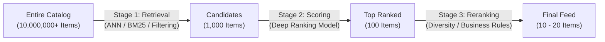

# Machine Learning System Design: Core Architecture Patterns

Comprehensive architectural guide and reference implementations of foundational machine learning system patterns, covering cascade ranking, lambda/kappa architectures, async event-driven inference, and model deployment topologies.

---

## 1. Foundational Architecture Patterns

### 1.1 The Multi-Stage Cascade Ranking Pattern
Large-scale recommendation and search systems cannot run deep neural networks over millions of items within a $50\text{ ms}$ SLA. They divide scoring into a cascade:



1. **Stage 1 (Retrieval / Candidate Generation)**:
   - Evaluates: Millions of items down to hundreds.
   - Algorithms: Two-Tower vector search (HNSW/IVF-PQ), inverted indexes, collaborative filtering heuristics.
   - Latency budget: $5 - 15\text{ ms}$.
2. **Stage 2 (Scoring / Fine Ranking)**:
   - Evaluates: Hundreds of items down to top-50.
   - Models: Cross-features, DLRM, Multi-Task GBDT / Transformer.
   - Latency budget: $20 - 35\text{ ms}$.
3. **Stage 3 (Reranking / Post-Processing)**:
   - Evaluates: Top-50 down to final 10.
   - Operations: Deduplication, category diversity (Maximal Marginal Relevance), sponsored insertion, fresh content exploration.
   - Latency budget: $2 - 5\text{ ms}$.

---

### 1.2 Serving Topologies
1. **Model-as-a-Service (MaaS)**:
   - Models hosted as standalone microservices behind gRPC/REST APIs (e.g. Triton, TorchServe).
   - *Pros*: Independent autoscaling, heterogeneous hardware allocation (GPUs vs CPUs), decoupled release cycles.
   - *Cons*: Network serialization/deserialization latency overhead.
2. **Embedded Model**:
   - Model run directly inside application process via C++/Rust bindings or ONNX Runtime.
   - *Pros*: Zero network latency ($< 1\text{ ms}$).
   - *Cons*: Memory contention with application, language/version coupling.

---

## 2. Directory Structure

```
08-system-design/architecture-patterns/
├── README.md
├── notebook.ipynb
├── interview.md
├── references.md
└── code/
    ├── patterns.py
    └── test_patterns.py
```
