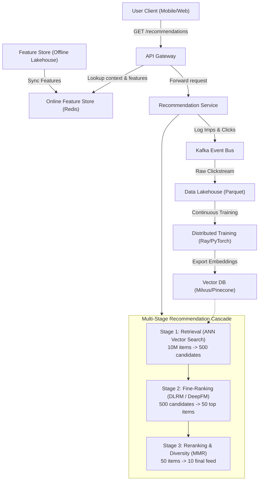

# Case Study 01: Personalized Recommendation System

System design for an enterprise-scale personalized recommendation engine (e.g., Netflix video streaming or e-commerce homepage feed) serving hundreds of millions of users over catalogs of tens of millions of items.



---

## 1. Requirements
The platform must present a hyper-personalized ranked list of items on the home screen upon every page load, optimizing long-term engagement, click-through rate (CTR), and conversion rate.

## 2. Functional Requirements
- Retrieve personalized recommendations for logged-in and guest users.
- Support real-time interaction feedback (instant update of feed upon watching/clicking an item).
- Enforce business rules: category diversity, deduplication of already consumed items, sponsored content insertion.

## 3. Non-Functional Requirements
- **Latency**: P95 latency $\le 50\text{ ms}$, P99 latency $\le 80\text{ ms}$.
- **Availability**: $99.99\%$ uptime (fallback to cached popular items if ranking fails).
- **Scalability**: Support $100,000$ queries per second (QPS) at peak.
- **Freshness**: User interaction events reflected in recommendations within $< 5\text{ seconds}$.

## 4. Scale Assumptions
- **Active Users**: $200\text{M}$ Monthly Active Users (MAU), $30\text{M}$ Daily Active Users (DAU).
- **Catalog Size**: $10\text{M}$ active items.
- **Traffic**: Peak $100,000\text{ QPS}$; Average $35,000\text{ QPS}$.
- **Storage**: User profiles ($200\text{M} \times 1\text{ KB} = 200\text{ GB}$), Item catalog ($10\text{M} \times 5\text{ KB} = 50\text{ GB}$), Embeddings ($10\text{M} \times 256 \times 4\text{ bytes} = 10.2\text{ GB}$).

## 5. Architecture
A three-stage cascade:
1. **Candidate Retrieval (Two-Tower Model)**: Embeds user history and candidate items into a shared 128D metric space; retrieves top 500 items via Approximate Nearest Neighbor (ANN) search (HNSW index).
2. **Fine-Ranking Model (Deep & Cross Network / DLRM)**: Evaluates detailed user-item cross-features, real-time context, and historical engagement over the 500 candidates.
3. **Reranking & Diversity Layer**: Evaluates business constraints, deduplicates previously watched items, and applies Maximal Marginal Relevance (MMR) across content genres.

## 6. Data Flow
1. User opens app $\to$ API Gateway fetches user real-time features from Redis online feature store.
2. Query vector passed to Vector DB (Milvus) $\to$ returns 500 candidate item IDs in $8\text{ ms}$.
3. Candidate IDs + feature vectors forwarded to Triton Inference Server hosting DLRM $\to$ returns calibrated probability of click $P(\text{click})$ in $25\text{ ms}$.
4. Diversity reranker filters duplicates and caps genres at $\le 30\%$ of total slots $\to$ returns top 10 items to client.
5. Client logs impressions and clicks to Apache Kafka.

## 7. Model Choice
- **Retrieval**: Two-Tower DNN (User Tower: dense sequence of past 50 interactions via Transformer; Item Tower: item text, genre, creator embeddings).
- **Ranking**: Deep & Cross Network (DCN-v2) or DLRM with learned embedding tables for sparse categorical features and cross-layers for feature interactions.
- **Loss**: Binary Cross-Entropy with focal weighting on positive engagement labels.

## 8. Storage
- **Online Feature Store**: Redis / Amazon DynamoDB for user real-time counters and recent interaction sequences.
- **Offline Data Lake**: Apache Iceberg on Amazon S3 storing historical clickstream logs and daily snapshots in Parquet format.
- **Vector Index**: Milvus / Pinecone running HNSW index with FP16 vector quantization.

## 9. APIs
```
GET /api/v1/recommendations
Headers: Authorization: Bearer <token>
Query Params: user_id=string, limit=int, context_device=string

Response:
{
  "recommendations": [
    {"item_id": "item_8912", "score": 0.942, "reason": "Because you watched Sci-Fi"},
    {"item_id": "item_1204", "score": 0.887, "reason": "Trending in your region"}
  ],
  "request_id": "rec_01h89z",
  "latency_ms": 32.4
}
```

## 10. Training Pipeline
- **Offline Continuous Training**: Hourly Airflow DAG processes new impressions and clicks from Iceberg, computing labels ($1 = \text{click/watch} \ge 30\text{s}$, $0 = \text{impression without click}$).
- Distributed training on GPU cluster (Ray Train + PyTorch) over 7-day rolling window.
- Candidate embeddings exported to S3 and hot-swapped into Milvus vector indexes.

## 11. Serving Architecture
- Kubernetes cluster with auto-scaled Triton Inference Server pods on NVIDIA T4/L4 GPUs.
- Client requests load-balanced using Envoy with round-robin and circuit breaking.
- Local L1 in-process LRU cache on serving pods for popular item metadata ($90\%$ hit rate).

## 12. Monitoring
- **System Metrics**: Request latency percentiles (P50, P95, P99), GPU utilization, Redis connection pool saturation.
- **ML Metrics**: Daily click-through rate (CTR), mean reciprocal rank (MRR) of clicked items, prediction calibration (ratio of average predicted CTR to observed CTR).
- **Drift**: Kolmogorov-Smirnov test on user continuous features; alerts on feature store staleness $> 10\text{ minutes}$.

## 13. Failure Modes
- **Vector DB Outage**: Fall back immediately to popularity-ranked cached items segmented by country/genre.
- **Cold Start (New User)**: Serve demographic-based trending items; gather first 3 clicks to bootstrap user tower vector.
- **Feature Store Timeout**: Impute missing features with population medians and proceed with reduced confidence.

## 14. Trade-Offs
- **Two-Tower vs Cross-Encoder in Retrieval**: Two-Tower decouples user and item representations, allowing $O(\log N)$ ANN vector search, but sacrifices explicit user-item cross-feature interactions at stage 1.
- **Freshness vs Compute Cost**: Real-time streaming updates to user embeddings cost significantly more than hourly batch updates.

## 15. Cost Considerations
- Caching popular item candidate sets reduces vector search queries by $40\%$.
- Model quantization (FP16 $\to$ INT8 via TensorRT) halves GPU instance count from 40 to 20 nodes, saving $\approx \$18,000/\text{month}$.
