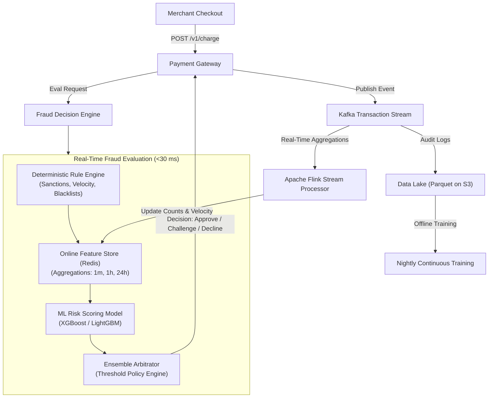

# Case Study 02: Real-Time Payment Fraud Detection System

System design for an ultra-low latency, mission-critical credit card and payment processing fraud detection engine (e.g., Stripe or Visa) scoring transactions within tens of milliseconds to approve, decline, or challenge payments.



---

## 1. Requirements
Evaluate incoming financial transactions in real time, assigning a risk score $[0.0, 1.0]$ and making automated authorization decisions (Approve, Challenge via 3DS/OTP, Decline) to minimize fraud loss while minimizing false positives for legitimate cardholders.

## 2. Functional Requirements
- Evaluate single transaction events in real time.
- Enforce hard regulatory rules (OFAC sanctions, blacklisted accounts).
- Compute real-time velocity features (e.g. number of transactions on this card in the last 1 minute and 1 hour).
- Output deterministic audit explanations for compliance and chargeback disputes.

## 3. Non-Functional Requirements
- **Latency**: Hard ceiling: P99 latency $\le 30\text{ ms}$ (payment rails enforce timeouts at 100 ms).
- **Availability**: $99.999\%$ (Five Nines) uptime. Zero downtime allowed.
- **Throughput**: Peak $25,000\text{ QPS}$; sustained $8,000\text{ QPS}$.
- **Consistency**: High consistency for velocity counters across active clusters.

## 4. Scale Assumptions
- **Volume**: $500\text{M}$ transactions per day.
- **Cardholders**: $150\text{M}$ active accounts.
- **Traffic**: Peak $25,000\text{ QPS}$.
- **Storage**: Real-time feature store cache: $150\text{M}$ card keys $\times 500\text{ bytes} \approx 75\text{ GB}$ RAM in Redis.

## 5. Architecture
1. **Rule Engine**: Evaluates fast static checks (blacklisted BINs, blocked countries, high-risk merchant categories).
2. **Feature Store Retrieval**: Fetches pre-aggregated sliding window statistics from Redis in $< 5\text{ ms}$.
3. **ML Scoring Model**: Evaluates tabular features using an optimized tree ensemble (LightGBM/XGBoost compiled with Treelite).
4. **Policy Engine**: Combines model probability with business risk appetite thresholds:
   - Risk $< 0.70 \to \text{APPROVE}$
   - $0.70 \le \text{Risk} < 0.90 \to \text{CHALLENGE (Trigger 2FA / OTP)}$
   - Risk $\ge 0.90 \to \text{DECLINE}$

## 6. Data Flow
1. Payment gateway sends transaction event to Fraud Service.
2. Rule engine runs synchronously; if rule trips $\to$ returns immediate Decline.
3. Concurrently, Flink stream processor updates sliding window counters in Redis (e.g., `count_tx_1m`, `sum_amt_1h`).
4. Fraud Service reads features from Redis $\to$ runs Treelite compiled model $\to$ produces score in $3\text{ ms}$.
5. Final decision dispatched to payment gateway; transaction logged to Kafka.

## 7. Model Choice
- **Primary Model**: Gradient Boosted Decision Trees (LightGBM / XGBoost) or CatBoost for tabular data.
- **Rationale**: GBDTs consistently outperform deep neural networks on tabular financial data, handle missing values natively, and execute with sub-millisecond latency when compiled to C code via Treelite.
- **Objective**: Binary Logloss with severe class imbalance weighting (frauds are typically $< 0.1\%$ of transactions).

## 8. Storage
- **Online Feature Store**: Redis Enterprise Cluster with in-memory persistence and active-active multi-region replication.
- **Stream Processing**: Apache Kafka with a 7-day retention topic partitioned by `card_token`.
- **Historical Data Store**: Amazon S3 / Snowflake storing historical transaction logs and chargeback outcomes (which arrive 30-90 days later).

## 9. APIs
```
POST /v1/fraud/evaluate
Headers: Content-Type: application/json, X-API-Key: string
Body:
{
  "transaction_id": "tx_99812",
  "card_token": "tok_visa_4111",
  "amount_usd": 420.50,
  "currency": "USD",
  "merchant_category_code": "5732",
  "ip_address": "198.51.100.42",
  "device_fingerprint": "dev_abc123"
}

Response (200 OK):
{
  "action": "APPROVE",
  "risk_score": 0.1240,
  "rules_triggered": [],
  "latency_ms": 14.8
}
```

## 10. Training Pipeline
- Nightly batch retraining on 90-day rolling dataset with point-in-time correct labels.
- Automated evaluation gate: Challenger model must achieve PR-AUC (Precision-Recall AUC) $\ge$ Champion without increasing false positive rate on legitimate VIP accounts.
- Model compiled to standalone C shared library (`.so`) via Treelite and pushed to model registry.

## 11. Serving Architecture
- Stateless Go / C++ serving proxy calling Treelite C runtime inside the same memory address space (Embedded Model pattern).
- Zero network hops between serving daemon and model runtime, keeping inference latency under $2\text{ ms}$.
- Multi-region deployment in `us-east`, `us-west`, `eu-west` with local Redis replicas.

## 12. Monitoring
- **Real-Time Dashboards**: Authorization rate, decline rate, 2FA challenge success rate.
- **Drift Detection**: Population Stability Index (PSI) on amount and velocity features calculated hourly.
- **Delayed Metrics**: Chargeback rate (evaluated 30-60 days later to calibrate historical ground-truth performance).

## 13. Failure Modes
- **Redis Feature Store Outage**: Fall back to in-memory card rules and transaction-only features (amount, merchant code, country) with a conservative decline threshold.
- **Network Partition**: Local node authorization autonomy: approve transactions $< \$50$ for established cards, challenge others.

## 14. Trade-Offs
- **Precision vs Recall**: Prioritizing recall catches more fraud but increases false declines, driving away legitimate paying customers. High-stakes edge cases are challenged with 2FA rather than outright declined.
- **Embedded vs Microservice Model**: Embedded Treelite offers $2\text{ ms}$ latency but requires redeploying the serving binary to update weights.

## 15. Cost Considerations
- Compiling models to C via Treelite enables CPU-based serving (no expensive GPUs needed), running 25k QPS on 30 standard EC2 `c6i.4xlarge` instances ($\approx \$14,000/\text{month}$).
