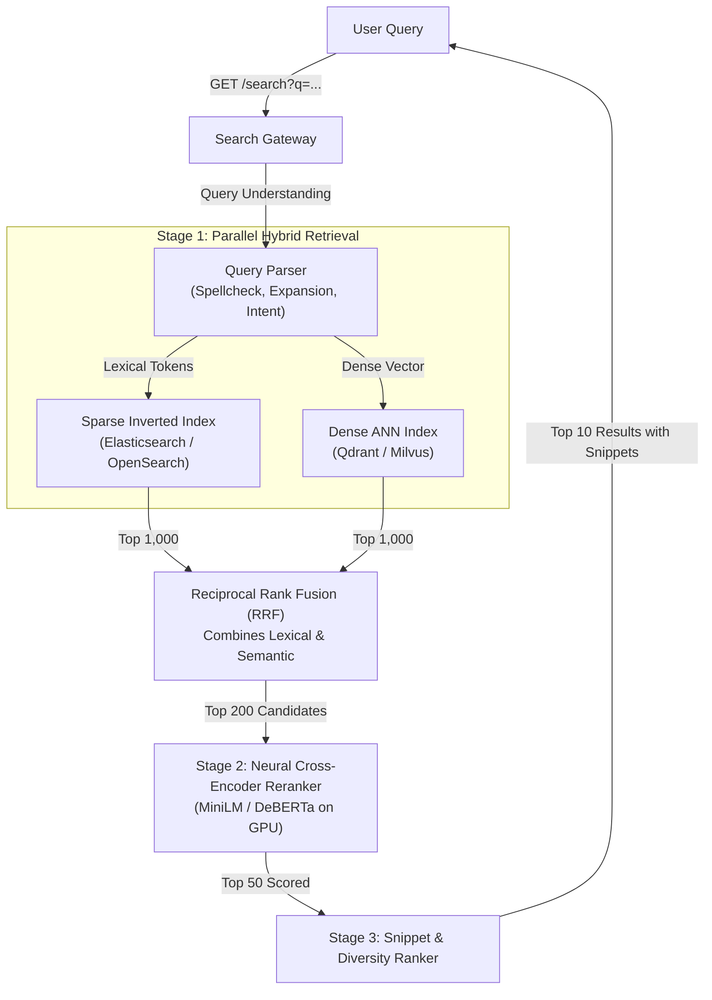

# Case Study 03: Hybrid Web Search Engine

System design for an enterprise-grade web search engine (e.g., Google or Bing search architecture) combining dense semantic vector search with sparse inverted index retrieval (BM25) and multi-stage neural reranking.



---

## 1. Requirements
Index hundreds of millions of web documents and return the most relevant, authoritative, and fresh results in response to user search queries in under $100\text{ ms}$.

## 2. Functional Requirements
- Support free-form natural language queries, keyword searches, and boolean operators.
- Query understanding: automated spell checking, synonym expansion, and entity recognition.
- Return snippet highlights matching search keywords.
- Support filtering by date, domain, language, and content type.

## 3. Non-Functional Requirements
- **Latency**: P95 latency $\le 80\text{ ms}$; P99 $\le 120\text{ ms}$.
- **Throughput**: Peak $50,000\text{ QPS}$.
- **Relevance**: High Recall@10 and nDCG@10 ($\ge 0.85$).
- **Freshness**: Breaking news and updated web documents indexed within $< 15\text{ minutes}$.

## 4. Scale Assumptions
- **Corpus Size**: $500\text{M}$ documents.
- **Average Document Length**: $1,000$ words ($5\text{ KB}$ text).
- **Index Footprint**:
  - Inverted Index (BM25): $\approx 500\text{ GB}$ distributed across cluster.
  - Dense Vector Embeddings (384D FP16): $500\text{M} \times 384 \times 2\text{ bytes} \approx 384\text{ GB}$.

## 5. Architecture
1. **Query Processing Layer**: Normalization, query expansion via synonyms, embedding generation using a lightweight bi-encoder.
2. **Hybrid Retrieval (Stage 1)**: Parallel fan-out to OpenSearch (lexical BM25) and Milvus (dense vector ANN). Merges candidate lists using Reciprocal Rank Fusion (RRF).
3. **Cross-Encoder Reranker (Stage 2)**: Re-ranks top 200 candidates using a transformer cross-encoder modeling full token-level query-document interactions.
4. **Result Blending (Stage 3)**: Enforces domain diversity (max 2 links per domain), extracts text snippet highlights, and formats final JSON.

## 6. Data Flow
1. Query arrives at Gateway $\to$ Query parser extracts tokens and computes 384D query vector via ONNX Runtime in $4\text{ ms}$.
2. Parallel queries issued to OpenSearch and Milvus $\to$ return top 1,000 lexical and top 1,000 vector candidates in $25\text{ ms}$.
3. Reciprocal Rank Fusion (RRF with $k=60$) deduplicates and merges into top 200 candidates in $2\text{ ms}$.
4. Reranker GPU service scores 200 candidate passages in batches in $30\text{ ms}$.
5. Top 10 documents formatted with generated snippet highlights and returned to user.

## 7. Model Choice
- **Bi-Encoder Embedding Model**: `BGE-small-en-v1.5` (384 dimensions) for fast sub-5ms query embedding.
- **Cross-Encoder Reranker**: `bge-reranker-large` or fine-tuned `MiniLM-L6-v2` cross-encoder.
- **Ranking Metric**: nDCG@10 and Mean Reciprocal Rank (MRR).

## 8. Storage
- **Lexical Index**: Distributed OpenSearch cluster sharded by document ID.
- **Dense Vector Store**: Milvus cluster with IVF-PQ (Inverted File Product Quantization) keeping vector search inside RAM.
- **Document Store**: Apache Cassandra / Amazon DynamoDB for raw document text and metadata retrieval.

## 9. APIs
```
GET /v1/search
Query Params: q=machine+learning+system+design&lang=en&page=1&limit=10

Response (200 OK):
{
  "query": "machine learning system design",
  "total_hits": 142050,
  "latency_ms": 68.2,
  "results": [
    {
      "doc_id": "doc_8412",
      "title": "Machine Learning Systems Design Handbook",
      "url": "https://example.org/ml-systems",
      "snippet": "A comprehensive guide on <em>machine learning system design</em>...",
      "score": 0.941
    }
  ]
}
```

## 10. Training Pipeline
- Weakly supervised mining of click logs: queries paired with clicked URLs form positive pairs; unclicked impressions form hard negatives.
- Contrastive fine-tuning using MultipleNegativesRankingLoss.
- Daily offline validation on a curated gold evaluation benchmark set.

## 11. Serving Architecture
- Kubernetes cluster with horizontal autoscaling on CPU worker pods for query parsing and GPU worker pods for neural reranking.
- Redis L1 cache for top-10,000 most frequent queries ($35\%$ cache hit rate), reducing backend load.

## 12. Monitoring
- P95 and P99 search latency.
- Zero-results rate (queries returning 0 hits).
- Click-Through Rate (CTR) on rank 1 vs rank 2-10.
- Mean Reciprocal Rank (MRR) of first user click.

## 13. Failure Modes
- **Dense Vector Store Degraded**: Fall back purely to lexical OpenSearch BM25 results.
- **Cross-Encoder Timeout**: Skip Stage 2 reranking and serve directly from RRF blended results.

## 14. Trade-Offs
- **Pure Vector vs Hybrid Search**: Pure vector search struggles with exact keywords, part numbers, and acronyms ("RFC 7540"). Hybrid search balances semantic understanding with exact lexical keyword recall.
- **Bi-Encoder vs Cross-Encoder**: Bi-encoders are fast enough for retrieval ($O(\log N)$) but miss cross-attention nuances; cross-encoders are accurate but computationally too expensive to run on more than a few hundred items.

## 15. Cost Considerations
- Product Quantization (IVF-PQ) compresses dense vectors by $4\times$, allowing 500M vectors to fit in 96 GB RAM rather than 384 GB, saving $\$6,000/\text{month}$ in memory costs.
