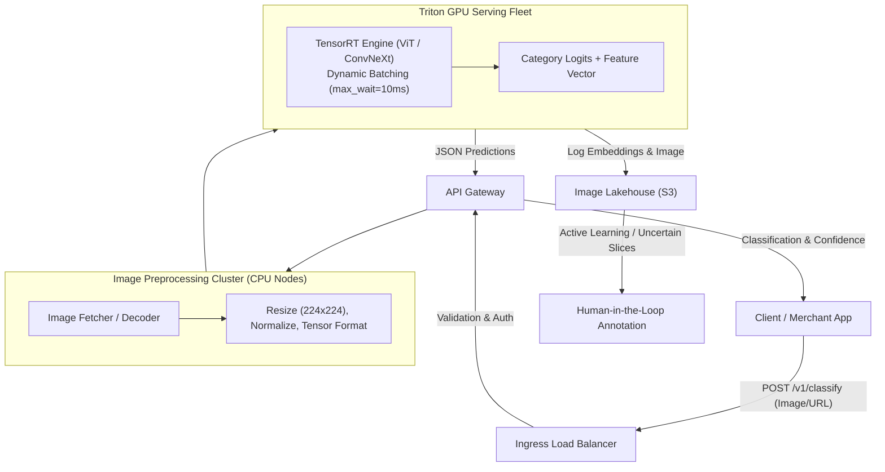

# Case Study 04: Enterprise Image Classification Platform

System design for an automated, high-throughput image classification platform (e.g., e-commerce product categorization, medical imaging diagnosis, or photo organization at scale).



---

## 1. Requirements
Classify millions of uploaded user and merchant images into a hierarchical taxonomy of thousands of product and object categories with high confidence and sub-second latency.

## 2. Functional Requirements
- Accept raw image binary bytes (JPEG, PNG, WebP) or remote image URLs.
- Return top-$K$ predicted categories with calibrated probability scores.
- Return dense image embeddings (512D) for visual search and deduplication.
- Flag uncertain classifications ($< 70\%$ confidence) for human review queue.

## 3. Non-Functional Requirements
- **Latency**: End-to-end P95 latency $\le 150\text{ ms}$ (including image decoding and transfer).
- **Throughput**: Support peak $5,000$ images/second.
- **Availability**: $99.95\%$ uptime.
- **Accuracy**: Top-1 Accuracy $\ge 88\%$; Top-5 Accuracy $\ge 97\%$.

## 4. Scale Assumptions
- **Daily Volume**: $50\text{M}$ images uploaded per day.
- **Average Image Size**: $1.5\text{ MB}$ raw; resized to $224 \times 224 \times 3$ ($150\text{ KB}$ tensor).
- **Taxonomy Size**: $5,000$ distinct categories across 3 hierarchical levels.
- **Storage**: Raw images stored in S3 ($50\text{M} \times 1.5\text{ MB} = 75\text{ TB}/\text{day}$ with 30-day lifecycle tiering to Glacier).

## 5. Architecture
1. **Preprocessing Workers (CPU)**: Download images, validate dimensions, decode formats using libjpeg-turbo, resize, and normalize into standard FP16 tensor batches.
2. **Inference Fleet (Triton Inference Server on NVIDIA L4 GPUs)**: Runs TensorRT-compiled Vision Transformer (ViT) with dynamic micro-batching.
3. **Post-Processing & Thresholding**: Applies temperature calibration to logits, maps class indices to hierarchical human labels, and computes entropy for uncertainty detection.

## 6. Data Flow
1. Client POSTs image multipart payload to API Gateway.
2. CPU worker decodes image and transforms into tensor in $15\text{ ms}$.
3. Tensor queued in Triton dynamic batcher $\to$ batched with other concurrent requests $\to$ TensorRT GPU forward pass in $8\text{ ms}$.
4. Top-5 categories and confidence scores assembled and returned to client in $45\text{ ms}$.
5. Low-confidence predictions ($< 0.65$) asynchronously routed to Active Learning annotation queue.

## 7. Model Choice
- **Primary Backbone**: ConvNeXt-Base or Vision Transformer (ViT-B/16) pretrained on ImageNet-22k and fine-tuned on company taxonomy.
- **Rationale**: ConvNeXt combines the global receptive field benefits of Transformers with the fast inference and lower memory consumption of pure convolutions.
- **Optimization**: Post-Training Quantization (PTQ) to INT8 via TensorRT, delivering $2.5\times$ higher throughput than FP32.

## 8. Storage
- **Object Storage**: Amazon S3 / Google Cloud Storage for original images and preprocessed shards.
- **Metadata Store**: PostgreSQL storing image ID, predicted labels, confidence scores, and review status.
- **Model Registry**: MLflow storing versioned TensorRT model plans (`model.plan`).

## 9. APIs
```
POST /v1/images/classify
Headers: Content-Type: multipart/form-data
Body: file: binary_image_bytes, top_k: 3

Response (200 OK):
{
  "image_id": "img_987123",
  "predictions": [
    {"category": "Apparel > Footwear > Sneakers", "confidence": 0.942},
    {"category": "Apparel > Footwear > Running Shoes", "confidence": 0.041},
    {"category": "Apparel > Footwear > Casual", "confidence": 0.012}
  ],
  "is_uncertain": false,
  "inference_latency_ms": 12.4
}
```

## 10. Training Pipeline
- Weekly retraining pipeline orchestrating multi-GPU distributed data-parallel training (PyTorch DDP on 8x A100 nodes).
- Mixup and CutMix data augmentation to prevent overfitting on minority taxonomy classes.
- Automated gate: Model promoted only if overall Top-1 accuracy $\ge$ baseline AND no category drops $> 3\%$.

## 11. Serving Architecture
- Autoscaling Kubernetes pod fleet partitioned into CPU preprocessing pods and GPU inference pods.
- Preprocessing and inference decoupled via local high-speed gRPC Unix sockets.

## 12. Monitoring
- Prediction confidence distributions over time (detecting covariate image shift from new camera sensors).
- Preprocessing vs GPU inference latency breakdowns.
- P99 image payload size.

## 13. Failure Modes
- **Corrupted Image Upload**: Preprocessor catches format errors and returns HTTP 422 Unprocessable Entity immediately without wasting GPU cycles.
- **GPU Driver Crash**: Kubernetes readiness probe detects failing health check and terminates pod; traffic redirected to healthy replicas.

## 14. Trade-Offs
- **Image Resolution ($224 \times 224$ vs $384 \times 384$)**: Higher resolution improves fine-grained detail classification by $+2\%$ accuracy but quadruples computation and latency. $224 \times 224$ is chosen for the real-time tier.

## 15. Cost Considerations
- Compiling to TensorRT INT8 allows one NVIDIA L4 GPU to serve $600\text{ images/second}$, reducing total GPU cluster size from 35 GPUs to 9 GPUs, saving $\approx \$22,000/\text{month}$.
