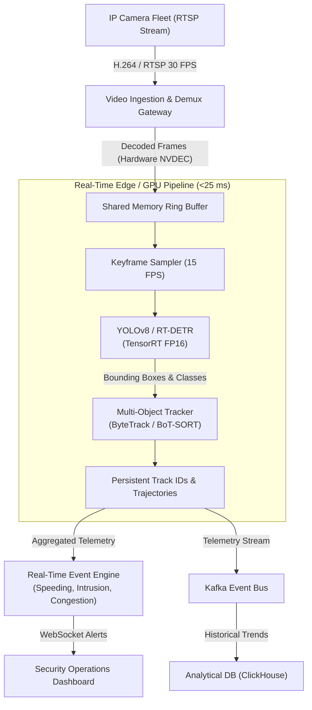

# Case Study 05: Real-Time Video Object Detection & Tracking

System design for a real-time, low-latency video object detection and multi-object tracking platform (e.g., smart city traffic monitoring, automated checkout retail, or autonomous vehicle perception pipelines).



---

## 1. Requirements
Process hundreds of continuous real-time video streams simultaneously at 15-30 frames per second (FPS), detecting and tracking objects (vehicles, pedestrians, bicycles) and generating real-time spatial events with $< 100\text{ ms}$ glass-to-alert latency.

## 2. Functional Requirements
- Ingest live RTSP/H.264/H.265 video streams.
- Detect objects with high bounding box precision and recall.
- Maintain consistent object IDs across occlusions and motion using multi-object tracking.
- Trigger automated alarms (e.g. vehicle moving wrong way, perimeter breach).

## 3. Non-Functional Requirements
- **Latency**: Glass-to-alert end-to-end latency $\le 50\text{ ms}$.
- **Throughput**: Process 500 concurrent camera feeds at $15\text{ FPS}$ ($7,500\text{ frames/second}$).
- **Tracking Consistency**: Track ID switches $< 1.5$ per minute per target.
- **Hardware Efficiency**: Target density $\ge 20$ high-definition camera streams per single NVIDIA L4 GPU.

## 4. Scale Assumptions
- **Camera Feeds**: $500$ continuous 1080p RTSP streams.
- **Frame Rate**: Sampled at $15\text{ FPS}$ ($7,500\text{ FPS}$ cluster aggregate).
- **Network Ingestion**: $500 \times 4\text{ Mbps} = 2\text{ Gbps}$ continuous incoming bandwidth.
- **Metadata Output**: $7,500\text{ frames/s} \times 10\text{ objects/frame} \times 100\text{ bytes} \approx 7.5\text{ MB/s}$ telemetry.

## 5. Architecture
1. **Video Ingestion & Hardware Decoding**: Hardware-accelerated decoding using NVIDIA DeepStream / NVDEC to directly populate GPU memory buffers without roundtripping through CPU RAM.
2. **Object Detection**: YOLOv8 or RT-DETR compiled with TensorRT FP16 executing at $4\text{ ms}$ per frame.
3. **Multi-Object Tracking (MOT)**: ByteTrack association algorithm running Kalman filtering and Hungarian matching on bounding box overlaps (IoU).
4. **Spatial Analytics Engine**: Geometric polygon intersection tests evaluating boundary crossings and direction vectors.

## 6. Data Flow
1. RTSP packets ingested over UDP/TCP $\to$ NVDEC decodes directly into GPU tensor in $3\text{ ms}$.
2. Tensor scaled and normalized $\to$ forwarded to YOLOv8 TensorRT engine $\to$ bounding boxes in $5\text{ ms}$.
3. Non-Maximum Suppression (NMS) executed directly on GPU Tensor Cores.
4. ByteTrack associates detections with active track IDs in $1\text{ ms}$.
5. If an object trajectory intersects a restricted polygon, an alert JSON is dispatched over WebSockets to operators.

## 7. Model Choice
- **Detector**: YOLOv8m (Medium) or RT-DETR-L.
- **Rationale**: Single-stage anchor-free detectors deliver the optimal Pareto curve between mean Average Precision (mAP) and real-time inference latency.
- **Tracker**: ByteTrack (preserves low-confidence detections during partial occlusion).

## 8. Storage
- **Short-Term Video Buffer**: Local SSD circular buffer storing past 24 hours of raw video.
- **Telemetry Store**: ClickHouse columnar database for querying trajectories, counts, and spatial heatmaps.
- **Alert Store**: MongoDB / PostgreSQL storing event snapshots and bounding box coordinates.

## 9. APIs
```
POST /v1/streams/register
{
  "camera_id": "cam_junction_42",
  "rtsp_url": "rtsp://10.0.4.15:554/live",
  "detection_zones": [
    {"zone_name": "crosswalk", "polygon": [[100, 200], [400, 200], [400, 350], [100, 350]]}
  ]
}

WebSocket Stream: /v1/streams/cam_junction_42/events
Message (JSON):
{
  "timestamp": 1698240001.12,
  "track_id": 481,
  "class": "vehicle",
  "bbox": [120, 210, 250, 310],
  "velocity_kmh": 42.5,
  "alert": null
}
```

## 10. Training Pipeline
- Automated mining of challenging frames (low-confidence detections, track lost events) sent to CVAT/Label Studio.
- Transfer learning on domain-specific dataset using PyTorch + Mosaic augmentation.
- Automated export to ONNX followed by TensorRT engine serialization.

## 11. Serving Architecture
- Edge servers or cloud GPU instances running NVIDIA DeepStream SDK within Docker containers.
- Zero-copy pipeline: Frame decoding $\to$ Scaling $\to$ Model Inference $\to$ NMS occurs exclusively in GPU VRAM.

## 12. Monitoring
- Inference FPS per camera stream.
- Hardware metrics: NVDEC utilization, GPU Core %, GPU VRAM.
- Track Fragmentation Rate and ID switch frequency.

## 13. Failure Modes
- **Stream Dropout (Camera Offline)**: Watchdog thread detects RTSP keep-alive failure and initiates exponential backoff reconnects while alerting operators.
- **Severe Weather / Glare**: Model confidence drops; fallback rules widen IoU tracking windows and emit weather degradation warnings.

## 14. Trade-Offs
- **15 FPS vs 30 FPS Processing**: Processing at 15 FPS halves compute costs while maintaining sufficient temporal continuity for urban traffic tracking.

## 15. Cost Considerations
- Zero-copy NVDEC decoding allows 25 camera streams per NVIDIA L4 GPU (\$0.70/hour on cloud), resulting in a per-camera infrastructure cost of $\approx \$20/\text{month}$.
