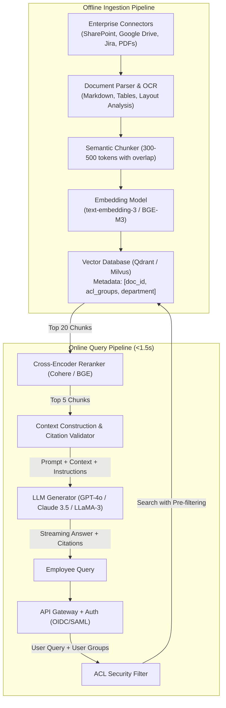

# Case Study 06: Enterprise Knowledge Retrieval-Augmented Generation (RAG) System

System design for an enterprise-wide Retrieval-Augmented Generation (RAG) system querying millions of private internal documents (Confluence, Google Drive, Jira, PDF manuals) with strict Access Control Lists (ACLs) and zero hallucination tolerances.



---

## 1. Requirements
Enable enterprise employees to ask natural language questions across all corporate knowledge repositories, receiving grounded, accurate answers backed by verifiable source citations with strict role-based access control (RBAC).

## 2. Functional Requirements
- Multi-source document ingestion (Word, PDF, Markdown, Confluence, Slack).
- Role-based Access Control (RBAC): Users must never see answers synthesized from documents they lack permission to view.
- Citation attribution: Every assertion in the response must cite the exact source document and page number.
- Guardrails: Refuse to answer if context is missing; abstain rather than hallucinate.

## 3. Non-Functional Requirements
- **Latency**: Time to First Token (TTFT) $\le 1.0\text{ second}$; total streaming response $\le 3.5\text{ seconds}$.
- **Accuracy**: Faithfulness / Groundedness $\ge 98\%$; zero PII leakage across access barriers.
- **Availability**: $99.9\%$ uptime.
- **Freshness**: New document revisions indexed and searchable within $< 10\text{ minutes}$.

## 4. Scale Assumptions
- **Document Count**: $5\text{M}$ documents ($50\text{M}$ chunks after splitting).
- **Concurrent Users**: $50,000$ active enterprise employees; peak query volume $250\text{ QPS}$.
- **Storage**: Vector index ($50\text{M} \times 1024\text{D} \times 2\text{ bytes} \approx 102\text{ GB}$ index memory).

## 5. Architecture
1. **Document Ingestion Service**: Apache Tika / unstructured.io parsing text, table extraction via layout models, chunking using recursive token splitters.
2. **Metadata-Aware Vector Store**: Qdrant / Milvus cluster running HNSW with payload filtering on `acl_groups`.
3. **Retrieval & Reranking**: Hybrid dense + sparse search filtered by user security groups, followed by cross-encoder reranking.
4. **LLM Synthesis & Citation Guard**: Injects top-5 reranked chunks into a structured system prompt requiring bracketed citations `[1]`.

## 6. Data Flow
1. Employee submits query $\to$ Gateway validates SAML/OIDC identity and extracts group memberships (e.g. `['engineering', 'finance']`).
2. Embedder generates query vector $\to$ Vector DB executes HNSW search with mandatory pre-filter `acl_groups IN user_groups`.
3. Top-20 retrieved candidate chunks sent to Cross-Encoder Reranker $\to$ scores reduced to top-5 highest relevance chunks in $40\text{ ms}$.
4. Prompt context packaged with explicit chunk numbering `[1], [2]...` $\to$ streamed to LLM.
5. Post-generation guardrail verifies that citations in the text map directly to the supplied context before streaming to user.

## 7. Model Choice
- **Embedding Model**: `text-embedding-3-large` (1536D) or open-weights `BGE-M3` (dense + sparse multi-linguality).
- **Reranker**: `Cohere Rerank v3` or `bge-reranker-large`.
- **Generation LLM**: `GPT-4o` / `Claude 3.5 Sonnet` for complex reasoning, or fine-tuned `LLaMA-3-8B-Instruct` for on-premises deployments.

## 8. Storage
- **Vector Database**: Qdrant running on Kubernetes with persistent SSD storage and in-memory HNSW index.
- **Document Store**: Amazon S3 / MinIO storing parsed markdown chunks and original source PDFs.
- **Cache**: Redis caching frequent queries and embedding vectors for identical queries ($25\%$ hit rate).

## 9. APIs
```
POST /v1/rag/query
Headers: Authorization: Bearer <user_jwt>
Body:
{
  "query": "What is our company travel policy regarding domestic flight business class?",
  "temperature": 0.0,
  "top_k": 5
}

Response (Streamed SSE or JSON):
{
  "answer": "According to the Travel Policy 2026, domestic flights under 5 hours must be booked in economy class [1]. Business class is only permitted for flights exceeding 5 continuous hours with VP approval [2].",
  "citations": [
    {"citation_id": 1, "doc_title": "Corporate Travel Policy 2026", "url": "https://wiki.corp/travel", "page": 4},
    {"citation_id": 2, "doc_title": "Expense Approval Matrix", "url": "https://wiki.corp/expenses", "page": 12}
  ],
  "faithfulness_score": 1.0,
  "latency_ms": 1120.0
}
```

## 10. Training / Evaluation Pipeline
- **RAG Triad Automated Evaluation (RAGAS)**: Nightly evaluation of 1,000 synthetic gold question-answer pairs:
  - Context Relevance $\ge 0.85$
  - Groundedness / Faithfulness $\ge 0.98$
  - Answer Relevance $\ge 0.90$

## 11. Serving Architecture
- FastAPI microservice deployed on Kubernetes.
- Streaming responses delivered via Server-Sent Events (SSE) to ensure TTFT $< 800\text{ ms}$.
- Fallback circuit breaker: If primary LLM provider times out, failover to secondary provider within $1.5\text{ seconds}$.

## 12. Monitoring
- Latency percentiles: TTFT, Token Generation Speed (tokens/s), Total Request Duration.
- Groundedness degradation alerts via LLM-as-a-judge sampling ($5\%$ of live queries).
- Missing Knowledge Rate: Percentage of queries triggering "I do not have sufficient information in the provided context".

## 13. Failure Modes
- **Access Control Leak**: Defensive enforcement: Security filtering occurs in the vector DB engine *prior* to index traversal, making it mathematically impossible to return unauthorized chunks.
- **Hallucination under Sparse Context**: Strict system prompt instruction: "If the provided context does not contain the answer, reply exactly: 'The internal knowledge base does not contain this information'".

## 14. Trade-Offs
- **Pre-Filtering vs Post-Filtering ACLs**: Post-filtering (retrieving top-K then dropping unauthorized chunks) can result in 0 results if all top candidates belong to restricted folders. Pre-filtering inside HNSW is essential.
- **Chunk Size (256 vs 1024 tokens)**: Smaller chunks improve retrieval precision; larger chunks provide better context for complex multi-hop synthesis. 500-token chunks with 100-token overlap provide the best balance.

## 15. Cost Considerations
- Caching prompt embeddings and LLM completions via semantic cache in Redis saves $\approx 22\%$ of operational LLM token costs ($\approx \$8,500/\text{month}$).
