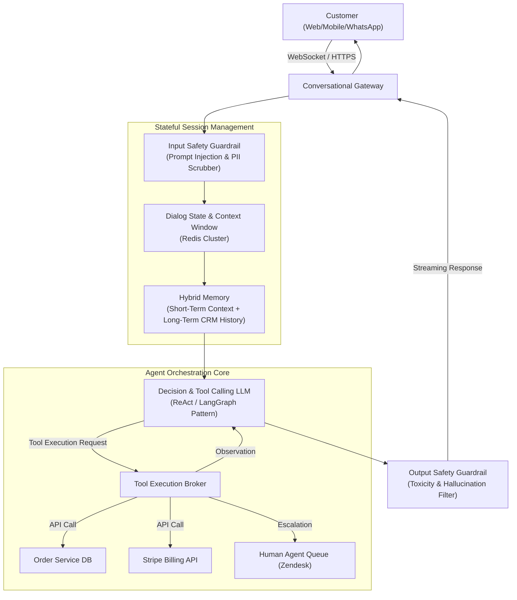

# Case Study 07: Enterprise Customer Support Chatbot

System design for an autonomous, multi-turn enterprise conversational AI agent (e.g., customer service support for banking, telecom, or e-commerce) resolving user inquiries, executing transactional workflows via tool calling, and escalating gracefully to human agents.



---

## 1. Requirements
Provide 24/7 conversational customer support resolving common queries (order tracking, refunds, address changes, troubleshooting) autonomously while maintaining conversational context across turns and seamlessly handing off complex cases to human support agents.

## 2. Functional Requirements
- Multi-turn conversational memory with session state persistence.
- Intent classification and tool execution (checking order status, initiating refunds $< \$50$).
- Human-in-the-Loop escalation with conversation transcript preservation.
- Omnichannel support (Web widget, iOS/Android apps, WhatsApp, Zendesk integration).

## 3. Non-Functional Requirements
- **Latency**: Time to First Token (TTFT) $\le 800\text{ ms}$; streaming output at $\ge 25\text{ tokens/second}$.
- **Concurrency**: Support $10,000$ simultaneous active chat sessions.
- **Availability**: $99.99\%$ uptime.
- **Security**: Strict PII masking (credit card numbers, SSNs, passwords) before logging.

## 4. Scale Assumptions
- **Daily Sessions**: $250,000$ customer conversations per day.
- **Average Turns per Session**: $6$ turns (User + Assistant = 12 messages).
- **Session Memory Footprint**: $10,000\text{ concurrent} \times 15\text{ KB/session} \approx 150\text{ MB}$ active state in Redis.

## 5. Architecture
1. **Conversational Gateway**: Manages stateful WebSocket connections and message acknowledgments.
2. **Session & Memory Store**: Redis cluster tracking rolling conversational history and customer profile attributes.
3. **Agent Orchestration Core**: LangGraph-style state machine executing:
   - State 1: Intent & Sentiment Classification
   - State 2: Retrieval of relevant policies (RAG)
   - State 3: Tool Execution (Function Calling)
   - State 4: Response Synthesis & Escalation Decision
4. **Tool Broker**: Secure proxy executing internal enterprise APIs with scoped authentication.

## 6. Data Flow
1. User message arrives via WebSocket $\to$ Input guardrail redacts PII and checks for prompt injection.
2. Gateway fetches past 8 message turns and user CRM tier from Redis.
3. LLM evaluates message; if user asks "Where is my order #1234?", LLM emits structured tool call `getOrderStatus(order_id="1234")`.
4. Tool broker queries Order Database $\to$ returns status `"SHIPPED, Delivery expected tomorrow"`.
5. LLM generates empathetic response with tracking details $\to$ Output guardrail verifies no policy violations $\to$ streamed to customer.

## 7. Model Choice
- **Agent Policy & Tool Calling**: `GPT-4o-mini` or fine-tuned `LLaMA-3.1-8B-Instruct` for routing and tool calling (fast, cost-effective).
- **Fallback / Complex Reasoning**: `Claude 3.5 Sonnet` or `GPT-4o` for high-sentiment disputes or complex troubleshooting.
- **Embedding Model**: `text-embedding-3-small` for knowledge base policy retrieval.

## 8. Storage
- **Session Store**: Redis cluster with 24-hour TTL per session key.
- **Conversation Lake**: Amazon S3 / Snowflake storing anonymized transcripts for quality review and model fine-tuning.
- **Relational DB**: PostgreSQL for CRM profiles, ticket mappings, and agent resolution logs.

## 9. APIs
```
WebSocket: /v1/chat/ws
Client sends:
{
  "session_id": "sess_89123",
  "text": "Can I cancel order #99182?",
  "timestamp": 1698241000
}

Server streams chunks:
{
  "delta": "I can certainly help you cancel order #99182. Let me check its shipping status...",
  "turn_id": 4
}
```

## 10. Training & Evaluation Pipeline
- **Automated Synthetic Testing**: Nightly simulation of 500 persona-based conversations (e.g. angry customer, ambiguous request, attempted prompt injection).
- **Containment Rate Metric**: Percentage of sessions resolved without human escalation (target $\ge 72\%$).
- **Customer Satisfaction (CSAT)**: Correlation analysis between bot sentiment scores and post-chat 5-star ratings.

## 11. Serving Architecture
- Asynchronous FastAPI / Node.js gateway managing persistent WebSockets.
- Celery / Temporal background task workers executing external tools with timeout budgets ($\le 2\text{ seconds}$).
- Zero-downtime rolling deployments via Kubernetes.

## 12. Monitoring
- Real-time containment rate and human escalation rate.
- Tool execution error rates and API latency.
- Cost per conversation (target $\le \$0.04$ per completed chat).

## 13. Failure Modes
- **API Tool Failure (Order DB Timeout)**: Catch error gracefully and respond: "I am having trouble reaching our shipping system right now. Let me connect you directly with a specialist."
- **Customer Frustration Detection**: If sentiment score drops below threshold across two consecutive turns, trigger immediate automated escalation to human queue.

## 14. Trade-Offs
- **Context Window Length**: Keeping 20 turns provides richer history but triples token cost and increases TTFT latency. Sliding window of last 6-8 turns with a persistent 2-sentence summary provides the best tradeoff.

## 15. Cost Considerations
- Routing 80% of routine inquiries to `GPT-4o-mini` ($0.15/$0.60 per 1M tokens) and reserving frontier models only for escalation saves $> \$40,000/\text{month}$ compared to uniform GPT-4o usage.
