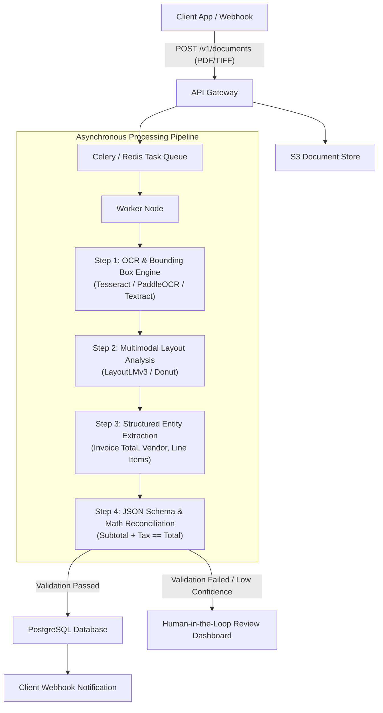

# Case Study 08: Intelligent Document Processing (IDP) Platform

System design for an automated document intelligence platform (e.g., enterprise processing of invoices, tax forms, insurance claims, and legal contracts) combining optical character recognition (OCR), visual layout transformers, and structured JSON entity extraction.



---

## 1. Requirements
Extract structured, schema-compliant JSON data (vendor name, invoice number, line items, unit prices, tax amounts, totals) from unstructured multi-page PDF documents and images with $> 99\%$ field-level accuracy and mathematical reconciliation.

## 2. Functional Requirements
- Ingest multi-page scanned PDFs, native digital PDFs, and mobile camera photos.
- Optical Character Recognition (OCR) with word-level 2D bounding box spatial coordinates.
- Table detection and line-item grid parsing.
- Mathematical verification (validating line item sums against invoice grand totals).
- Human-in-the-Loop (HITL) exception routing for low-confidence fields.

## 3. Non-Functional Requirements
- **Latency**: Asynchronous SLA: document processing completed in $< 5\text{ seconds}$ per page.
- **Accuracy**: Field-level F1 score $\ge 98\%$ on standard invoices; $\ge 95\%$ on unconstrained receipts.
- **Throughput**: Process $500,000$ document pages per day.
- **Compliance**: SOC-2 and HIPAA compliance (encryption at rest and in transit).

## 4. Scale Assumptions
- **Document Volume**: $100,000$ documents per day (average 5 pages/document = $500,000\text{ pages/day}$).
- **Peak Throughput**: $20\text{ pages/second}$.
- **Storage**: Raw PDFs ($500\text{ KB/page} \times 500\text{k pages} = 250\text{ GB/day}$); JSON metadata $\approx 10\text{ GB/day}$.

## 5. Architecture
1. **Asynchronous Ingestion**: Ingests files into Amazon S3, generating pre-signed URLs and queuing background tasks via Celery.
2. **OCR & Layout Engine**: High-performance OCR (PaddleOCR or Tesseract) extracting text tokens and bounding box coordinates $[x_0, y_0, x_1, y_1]$.
3. **Multimodal Layout Model**: LayoutLMv3 processing text tokens, visual image patches, and 2D spatial positions simultaneously.
4. **Validation & Business Logic**: Reconciles mathematical constraints ($\sum \text{line\_items} + \text{tax} = \text{total}$) and formats schema-validated JSON.

## 6. Data Flow
1. Client POSTs PDF $\to$ Gateway stores in S3 and pushes task ID to Redis queue.
2. Worker downloads PDF and splits into page images using `pdf2image`.
3. OCR engine extracts text tokens and 2D bounding boxes in $800\text{ ms/page}$.
4. LayoutLMv3 predicts token classification labels (B-VENDOR, I-VENDOR, B-TOTAL, etc.) in $300\text{ ms/page}$ on GPU.
5. Post-processor groups tokens into structured entities and checks math reconciliation.
6. If all checks pass and confidence $\ge 0.90$, structured JSON is stored and webhook fired; otherwise, flagged for human review.

## 7. Model Choice
- **Primary Extraction**: `LayoutLMv3-base` (jointly models text tokens, 2D coordinates, and visual patch features).
- **Alternative / Modern VLM**: `Qwen2-VL` or fine-tuned `Donut` (OCR-free document understanding).
- **OCR Engine**: GPU-accelerated `PaddleOCR` (delivers $4\times$ faster throughput than Tesseract on complex receipts).

## 8. Storage
- **Document Store**: Amazon S3 with SSE-KMS encryption.
- **Relational Metadata**: PostgreSQL storing document status, extracted structured entities, and audit trails.
- **Task Broker**: Redis / Amazon SQS managing worker queues.

## 9. APIs
```
POST /v1/documents
Headers: Content-Type: multipart/form-data
Body: file: invoice.pdf, document_type: "invoice"

Response (202 Accepted):
{
  "document_id": "doc_inv_10928",
  "status": "PROCESSING",
  "estimated_seconds": 4.5
}

GET /v1/documents/doc_inv_10928
Response (200 OK):
{
  "document_id": "doc_inv_10928",
  "status": "COMPLETED",
  "extracted_data": {
    "vendor_name": "Acme Industrial Supplies",
    "invoice_number": "INV-2026-991",
    "invoice_date": "2026-09-15",
    "currency": "USD",
    "subtotal": 1250.00,
    "tax_amount": 100.00,
    "total_amount": 1350.00,
    "line_items": [
      {"description": "Steel Bolts M8", "quantity": 500, "unit_price": 1.50, "total": 750.00},
      {"description": "Industrial Lubricant 5L", "quantity": 10, "unit_price": 50.00, "total": 500.00}
    ]
  },
  "math_verified": true,
  "confidence_score": 0.984
}
```

## 10. Training Pipeline
- Continuous active learning: Documents reviewed by human operators in the HITL interface generate gold correction annotations.
- Monthly fine-tuning of LayoutLMv3 using PyTorch on 50,000 verified enterprise documents.
- Synthetic document generator (altering fonts, rotations, noise, tables) to improve robustness on mobile photo uploads.

## 11. Serving Architecture
- Asynchronous worker pool orchestrated by Kubernetes KEDA autoscaling on queue depth.
- GPU nodes (NVIDIA L4) for LayoutLMv3 inference; CPU nodes for image parsing and PDF splitting.

## 12. Monitoring
- Extraction accuracy across key fields (Vendor, Date, Total).
- Human review escalation rate (target $\le 12\%$).
- Mathematical reconciliation failure rate.
- Processing latency per page.

## 13. Failure Modes
- **Rotated or Upside-Down Scan**: Orientation detection preprocessing layer auto-rotates pages ($0^\circ, 90^\circ, 180^\circ, 270^\circ$) before OCR.
- **Unclear Handwriting**: Falls back to specialized handwriting model or routes immediately to HITL queue.

## 14. Trade-Offs
- **OCR + LayoutLM vs End-to-End VLM (Donut / GPT-4o)**: OCR + LayoutLM produces deterministic bounding box coordinates linked to every word (essential for visual verification overlays); pure autoregressive VLMs are easier to prompt but can hallucinate numbers.

## 15. Cost Considerations
- Running PaddleOCR and LayoutLMv3 on self-hosted NVIDIA L4 instances costs $\$0.0012$ per page, compared to commercial cloud document APIs costing $\$0.015 - \$0.05$ per page ($> 90\%$ cost reduction).
