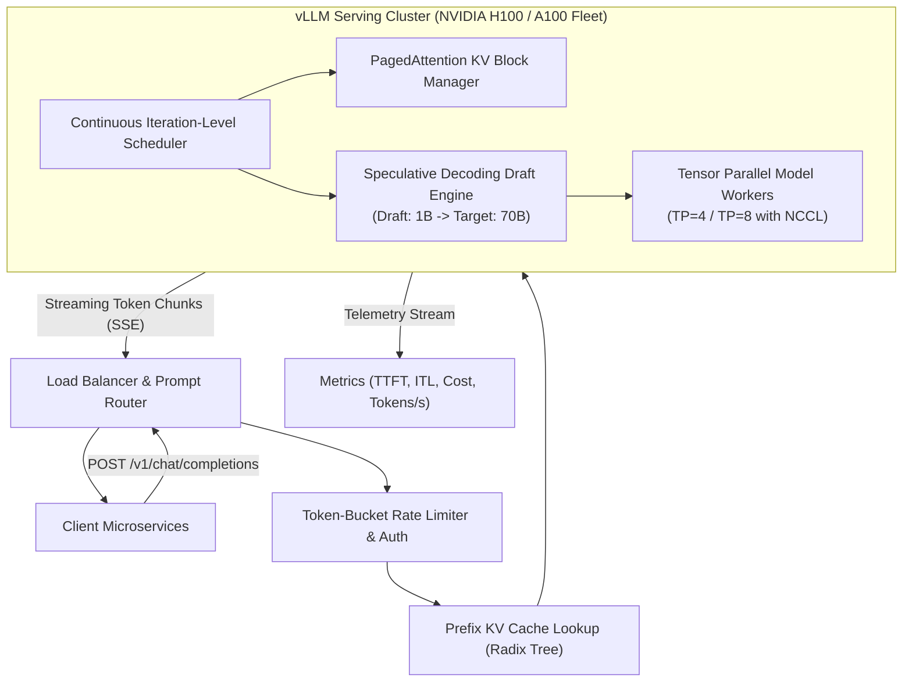

# Case Study 09: High-Throughput LLM Inference Service

System design for an enterprise-scale Large Language Model inference service (e.g., internal OpenAI-compatible model platform serving multiple teams with vLLM, continuous batching, and PagedAttention).



---

## 1. Requirements
Host and serve open-weights Large Language Models (LLaMA-3 70B, Mistral, Qwen) at scale, providing an OpenAI-compatible API with low latency, high token throughput, dynamic batching, and multi-tenant quota management.

## 2. Functional Requirements
- OpenAI-compatible REST API (`/v1/chat/completions`, `/v1/models`).
- Token streaming via Server-Sent Events (SSE).
- Structured output enforcement (JSON Schema / regex guided decoding via Outlines/XGrammar).
- Prompt prefix caching (reusing KV cache across requests sharing identical system prompts).

## 3. Non-Functional Requirements
- **Latency**: Time to First Token (TTFT) $\le 300\text{ ms}$; Inter-Token Latency (ITL) $\le 20\text{ ms}$ (50 tokens/s generation).
- **Throughput**: Support $2,500$ concurrent active generation streams ($> 100,000\text{ tokens/second}$ cluster capacity).
- **Availability**: $99.95\%$ uptime with zero dropped requests during worker auto-scaling.

## 4. Scale Assumptions
- **Daily Volume**: $500\text{M}$ tokens processed per day.
- **Model Size**: LLaMA-3 70B (140 GB in FP16, 70 GB in INT8/FP8).
- **Hardware Footprint**: 8x 8-GPU nodes (64x NVIDIA H100 80GB SXM5).

## 5. Architecture
1. **Intelligent Router**: Routes requests to model engine pools based on context length and model name.
2. **Prefix Caching Engine**: Radix-tree based KV-cache lookup identifying shared prefixes across prompts.
3. **vLLM Inference Engine**:
   - PagedAttention: Partitions KV cache into non-contiguous 16-token virtual blocks, achieving $> 96\%$ GPU memory utilization.
   - Continuous (Iteration-Level) Batching: Requests enter and exit the running batch dynamically at each forward step.
   - Speculative Decoding: A 1B draft model drafts 4 tokens per step, verified in parallel by the 70B target model ($2.2\times$ decode speedup).

## 6. Data Flow
1. Client issues streaming chat completion request with JSON Schema constraint.
2. Router verifies API key and checks Radix tree cache for shared system prompt prefix.
3. Request admitted to vLLM continuous batching queue.
4. Prefill Phase: Computes prompt KV cache in single parallel forward pass (TTFT completed in $180\text{ ms}$).
5. Decode Phase: Generates tokens iteratively at $18\text{ ms/token}$, streaming tokens to user via HTTP SSE chunks.
6. Generation finishes on `<|eot_id|>` or max token limit; KV cache blocks returned to free pool.

## 7. Model Choice
- **Target Foundation Model**: `Meta-Llama-3-70B-Instruct` in FP8 quantization.
- **Speculative Draft Model**: `Meta-Llama-3-8B-Instruct` or `Llama-3.2-1B`.
- **Quantization Engine**: FP8 (native H100 Transformer Engine) providing $2\times$ throughput without perplexity degradation.

## 8. Storage
- **Weights Cache**: High-speed local NVMe SSDs ($7\text{ GB/s}$ read) storing uncompressed HuggingFace safetensors checkpoints.
- **Telemetry Store**: VictoriaMetrics / Prometheus storing latency and token generation metrics.
- **KV Cache Allocation**: Dedicated 48 GB per H100 GPU allocated strictly for PagedAttention dynamic blocks.

## 9. APIs
```
POST /v1/chat/completions
Headers: Authorization: Bearer <key>, Content-Type: application/json
Body:
{
  "model": "llama-3-70b-instruct",
  "messages": [{"role": "user", "content": "Explain PagedAttention in 2 sentences."}],
  "temperature": 0.7,
  "stream": true
}

Response (Streamed SSE chunks):
data: {"id":"chatcmpl-01","choices":[{"delta":{"content":"PagedAttention"}}]}
data: {"id":"chatcmpl-01","choices":[{"delta":{"content":" partitions"}}]}
data: [DONE]
```

## 10. Training Pipeline
- Continuous benchmarking using `vllm benchmark throughput` across token distribution lengths (short input / long output vs long input / short output).
- Quantization calibration: Evaluating FP8 scales on corporate domain prompts to eliminate activation outlier clipping.

## 11. Serving Architecture
- Kubernetes cluster using KEDA with custom Prometheus metrics (`vllm:num_requests_waiting`).
- Scale-up trigger: If queued requests $> 50$ for $> 30\text{ seconds}$, spin up additional 8-GPU node.
- Model parallelism: Tensor Parallelism ($\text{TP}=4$ or $\text{TP}=8$) across GPUs on each node via NVLink.

## 12. Monitoring
- **Core Telemetry**:
  - Time To First Token (TTFT) P50, P95, P99.
  - Inter-Token Latency (ITL).
  - KV Cache Usage percentage.
  - Speculative Decoding acceptance rate ($\approx 75\%$).
  - Requests waiting in queue.

## 13. Failure Modes
- **Out of KV Cache Memory**: PagedAttention preemption engine preempts lower-priority requests, re-computing or swapping their KV blocks to CPU RAM to protect active generation streams.
- **GPU Engine Desynchronization**: NCCL watchdog detects communication timeout across TP workers and triggers worker pod restart.

## 14. Trade-Offs
- **Throughput vs Latency**: Max throughput is achieved with large batch sizes (e.g. 128), but this degrades ITL. Capping batch size at 64 delivers the optimal balance ($18\text{ ms}$ ITL with high GPU utilization).

## 15. Cost Considerations
- FP8 quantization allows a 70B model to fit on 4x H100 GPUs instead of 8x GPUs, cutting hardware infrastructure costs by $50\%$ ($\approx \$28,000/\text{month}$ savings per serving cluster).
