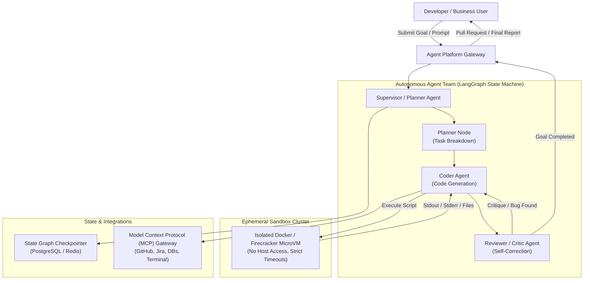

# Case Study 10: Autonomous AI Agent Platform

System design for an enterprise autonomous AI agent execution platform (e.g., Devin / OpenDevin / AutoGen style multi-agent software engineering or automated data analysis platform) orchestrating multi-agent collaboration, sandboxed code execution, durable state checkpointing, and Model Context Protocol (MCP) integrations.



---

## 1. Requirements
Orchestrate autonomous, multi-step AI agents capable of planning complex goals, writing and executing code inside secure ephemeral sandboxes, recovering from execution errors, and integrating with external enterprise tools via standardized protocols (MCP).

## 2. Functional Requirements
- Multi-step planning, reflection, and iterative self-correction.
- Dynamic tool use via Model Context Protocol (MCP).
- Sandboxed isolated code execution (Python, Bash, Node.js) with zero access to production host environments.
- Durable checkpointing allowing human pause, inspection, approval, and time-travel replay.

## 3. Non-Functional Requirements
- **Security**: Complete sandbox isolation (Firecracker microVM or gVisor container) preventing host breakout.
- **Reliability**: Resilient to agent crashes; state graphs resume from last checkpoint.
- **Execution Timeout**: Per-step timeout $\le 60\text{ seconds}$; total agent session budget $\le 60\text{ minutes}$.
- **Auditability**: Complete audit logs of every prompt, action, tool call, and environmental observation.

## 4. Scale Assumptions
- **Concurrent Agent Runs**: $1,000$ active long-running agent workflows.
- **Sandbox Density**: $10$ ephemeral microVMs per physical bare-metal host.
- **Average Run Steps**: $15 - 40$ steps per autonomous task.

## 5. Architecture
1. **Planner / Supervisor Agent**: Decomposes macro-goal into a directed acyclic task graph.
2. **Specialized Worker Agents**: Coder, Tester, Researcher nodes operating within a cyclic state graph (LangGraph pattern).
3. **Ephemeral Sandbox Engine (Firecracker / Docker)**: Instantiates lightweight microVMs in $< 150\text{ ms}$ for untrusted code execution.
4. **State Checkpointer**: Stores serializable state dictionaries after every step in PostgreSQL.
5. **Model Context Protocol (MCP) Server Pool**: Standardized JSON-RPC 2.0 tool endpoints connecting to GitHub, Jira, and SQL databases.

## 6. Data Flow
1. User submits task: "Fix bug #412 in repository and open a Pull Request".
2. Supervisor initializes state graph and checks out Git repository into a fresh Firecracker microVM.
3. Coder Agent reads issue $\to$ runs grep via terminal tool $\to$ inspects source code.
4. Coder modifies Python file $\to$ executes `pytest` inside the microVM.
5. Pytest fails with error $\to$ error observation fed back to Coder agent context $\to$ Coder reflects and patches bug.
6. Reviewer Agent validates passing tests and opens GitHub PR via MCP GitHub tool.

## 7. Model Choice
- **Primary Coding & Reasoning Agent**: `Claude 3.5 Sonnet` or `GPT-4o` (exceptional coding benchmarks and long-horizon tool execution).
- **Sub-Task / Filtering Agent**: `GPT-4o-mini` or `Claude 3.5 Haiku` for fast grep filtering, syntax verification, and commit message drafting.

## 8. Storage
- **State & Checkpoints**: PostgreSQL with JSONB columns storing full graph state after every transition.
- **Artifacts**: MinIO / Amazon S3 storing diff patches, execution logs, and generated test coverage reports.
- **Active Task Queue**: Redis Streams managing step execution workers.

## 9. APIs
```
POST /v1/agents/tasks
Body:
{
  "task_description": "Add exponential backoff to HTTP client in src/network.py",
  "repository_url": "git@github.com:enterprise/core-lib.git",
  "max_budget_usd": 5.00
}

Response (202 Accepted):
{
  "task_id": "agent_tsk_9021",
  "status": "RUNNING",
  "current_step": "CLONING_REPO"
}

GET /v1/agents/tasks/agent_tsk_9021/checkpoints
Response:
{
  "step_number": 6,
  "last_action": "pytest tests/test_network.py",
  "observation": "2 passed, 0 failed in 0.4s",
  "state_summary": "Bug fixed, tests verified"
}
```

## 10. Training & Evaluation Pipeline
- SWE-bench automated evaluation harness: Benchmarking agent success rate across 300 real-world GitHub issues.
- Trajectory optimization: Distilling successful multi-step execution traces into fine-tuning datasets for smaller open models.

## 11. Serving Architecture
- Kubernetes cluster with bare-metal worker nodes supporting KVM hardware virtualization for Firecracker microVMs.
- Node autoscale triggered by active sandbox count.

## 12. Monitoring
- Task completion rate ($\%$ of tasks successfully opening valid PRs).
- Mean steps and token cost per completed task.
- Sandbox security violation alerts (abnormal network socket attempts, fork bombs).

## 13. Failure Modes
- **Infinite Loop / Hallucinated Tool Calls**: Hard guardrail capping maximum consecutive failed steps at 5; triggers emergency pause for human intervention.
- **Sandbox Resource Exhaustion (Memory Leak / Fork Bomb)**: cgroup limits strictly enforce $2\text{ GB}$ RAM and $2\text{ CPUs}$ per sandbox; killed automatically if limits exceeded.

## 14. Trade-Offs
- **Full Autonomous Mode vs Human-in-the-Loop (HITL)**: Full autonomy is faster but can execute destructive git pushes. The platform requires explicit human approval for state-altering actions (merging PRs, deleting databases).

## 15. Cost Considerations
- Capping per-task budget at $\$5.00$ and routing low-level searches (file lookups) to deterministic Python scripts rather than LLM prompts cuts operational costs by $65\%$.
