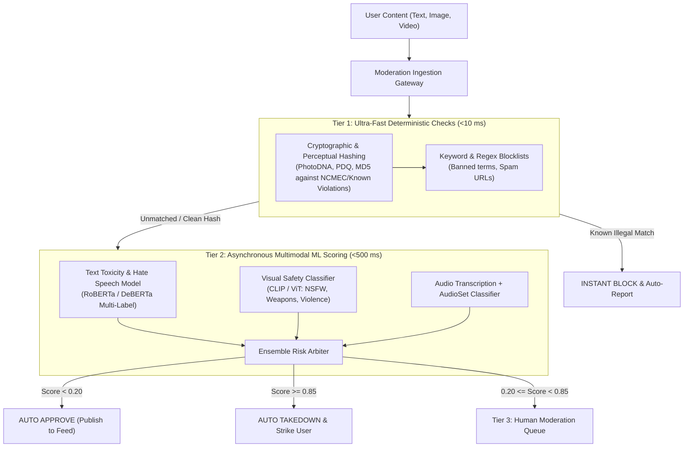

# Case Study 11: Multimodal Content Moderation Platform

System design for a planetary-scale, multi-modal content moderation system (e.g., YouTube, TikTok, or Meta safety platform) analyzing text comments, images, video frames, and audio streams for hate speech, severe toxicity, violent extremism, copyright infringement, and Child Sexual Abuse Material (CSAM).



---

## 1. Requirements
Scan and moderate user-generated content (text comments, images, and live video uploads) across a global social media platform, detecting policy violations with high precision and low latency to protect user safety and comply with global regulatory frameworks (EU Digital Services Act, UK Online Safety Act).

## 2. Functional Requirements
- Multi-modal analysis: Text, Images, Video frames, and Audio streams.
- Hash-based instant takedown for known illegal content (CSAM via PhotoDNA, terrorist content via PDQ/TMK).
- Granular policy classification: Hate Speech, Harassment, Self-Harm, Violent Extremism, Sexual Content, and Copyright.
- Human review queue with prioritized escalation based on severity score.

## 3. Non-Functional Requirements
- **Latency**:
  - Tier 1 (Text comments): P95 latency $\le 50\text{ ms}$ (pre-publish blocking).
  - Tier 2 (Images & Video uploads): Asynchronous scoring within $\le 3\text{ seconds}$ post-upload.
- **Throughput**: Support $100,000$ items/second at peak.
- **Accuracy**: High Recall ($\ge 99\%$ on severe harms like self-harm and CSAM); Low False Positive Rate ($\le 0.5\%$ on benign text).
- **Auditability**: Complete timestamped audit log of all automated actions and human appeals.

## 4. Scale Assumptions
- **Daily Volume**: $1\text{B}$ text comments, $100\text{M}$ images, $10\text{M}$ video uploads per day.
- **Peak Throughput**: $100,000\text{ items/second}$ (text); $3,000\text{ items/second}$ (media).
- **Known Hash Database**: $50\text{M}$ perceptual hashes stored in in-memory Hamming distance index.

## 5. Architecture
A 3-tier defense-in-depth architecture:
1. **Tier 1 (Deterministic Fast Path, $< 10\text{ ms}$)**:
   - Evaluates perceptual image hashes (PDQ, PhotoDNA) and text regexes against global law enforcement databases. Instant takedown if matched.
2. **Tier 2 (Multimodal ML Classifiers, $50 - 500\text{ ms}$)**:
   - Text: DistilRoBERTa multi-label toxicity classifier.
   - Image: Fine-tuned Vision Transformer (ViT-B) scoring safety categories.
   - Video: Keyframe extraction (1 frame/sec) scored by image model + Whisper audio transcription.
3. **Tier 3 (Human Review & Appeals Queue)**:
   - Ambiguous items ($0.20 \le \text{Risk} < 0.85$) routed to human moderator workforce based on urgency score.

## 6. Data Flow
1. User posts comment or uploads photo $\to$ Gateway sends payload to Tier 1 hash service in $2\text{ ms}$.
2. If image hash matches known CSAM/terrorist hash within Hamming distance $\le 30 \to$ instant block and law enforcement notification.
3. If clean $\to$ forwarded to Tier 2 GPU scoring fleet.
4. Text model scores toxicity across 6 policy dimensions; Vision model scores frame patches.
5. Ensemble risk arbiter computes composite violation score:
   - $\text{Score} < 0.20 \to$ Auto-Approve.
   - $0.20 \le \text{Score} < 0.85 \to$ Routed to Human Review Queue.
   - $\text{Score} \ge 0.85 \to$ Auto-Remove and issue user strike.

## 7. Model Choice
- **Text Classifier**: `DeBERTa-v3-small` fine-tuned on multi-label toxicity (Jigsaw dataset).
- **Image Safety Model**: `CLIP ViT-L/14` with specialized safety heads (NSFW, violence, hate symbols).
- **Perceptual Hashes**: Facebook PDQ (256-bit binary hash for images) and TMK (Temporal Match Kernel for video).

## 8. Storage
- **Perceptual Hash Index**: In-memory Milvus / Hnswlib index optimized for binary Hamming distance lookups.
- **Audit Store**: Apache Cassandra / ScyllaDB for immutable append-only decision audit trails.
- **Human Review DB**: PostgreSQL managing moderator review queues and ticketing states.

## 9. APIs
```
POST /v1/moderation/scan
Headers: Authorization: Bearer <token>, Content-Type: application/json
Body:
{
  "content_id": "post_781290",
  "content_type": "text",
  "text": "I hope you suffer and bad things happen to you",
  "author_id": "usr_9912"
}

Response (200 OK):
{
  "action": "AUTO_DELETE",
  "risk_score": 0.942,
  "categories": {
    "harassment": 0.942,
    "hate_speech": 0.312,
    "self_harm": 0.001,
    "violence": 0.045
  },
  "latency_ms": 18.2
}
```

## 10. Training Pipeline
- Continuous active learning: Disputed decisions and human appeals feed directly into training sets.
- Semi-supervised contrastive learning on adversarial benign examples (counterspeech, reclaimed slang).
- Model qualification gate: False positive rate on verified benign samples must be $\le 0.5\%$.

## 11. Serving Architecture
- Kubernetes cluster with CPU worker pods running text classification and GPU worker pods running vision models.
- Auto-scaled based on Kafka queue lag.

## 12. Monitoring
- False Positive Rate (measured via user appeal win rate, target $\le 2\%$).
- Moderator review queue depth and time-to-decision SLA ($< 15\text{ minutes}$ for high-priority self-harm).
- Model drift on evolving slang and adversarial leetspeak ("un-alived", "sewerslide").

## 13. Failure Modes
- **Adversarial Obfuscation (Leetspeak / Emojis)**: Character-level CNN or BPE byte-level tokenizers (ByT5) normalize leetspeak before classification.
- **Queue Overflow**: In the event of catastrophic traffic spikes (e.g. major world event), rate limit new uploads and prioritize safety models on severe harms (self-harm, terrorism) over minor spam.

## 14. Trade-Offs
- **Pre-Publish Blocking vs Post-Publish Takedown**: Pre-publish blocking on text prevents users from ever seeing toxic comments, but adds $30\text{ ms}$ latency to every post. Post-publish async takedown on video avoids upload delays but exposes content for a 2-second window.

## 15. Cost Considerations
- Running Tier 1 hash checks and lightweight text models on CPU handles $92\%$ of all traffic, reserving expensive GPU vision models only for the $8\%$ of media uploads, reducing annual compute spend by $\$1.4\text{M}$.
