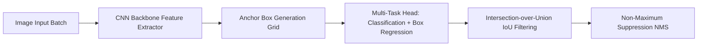

# Anchor-Based Object Detection & Non-Maximum Suppression

## Problem
Detect multiple objects in an image, outputting precise 2D bounding boxes and semantic class labels.

## Motivation
Real-time object detection is critical for robotic manipulation, automated surveillance, industrial defect detection, and autonomous navigation.

## Dataset
Standardized 2D bounding box and object class annotations ($[x_{min}, y_{min}, x_{max}, y_{max}]$ normalized in $[0, 1]$ across classes: Person, Vehicle, Sign).

## Architecture


## Pipeline
1. Generate multi-scale anchor boxes across spatial feature maps.
2. Calculate Intersection over Union (IoU) to assign positive ground-truth targets.
3. Compute Smooth L1 loss for bounding box regression and Cross-Entropy for class logits.
4. Apply Non-Maximum Suppression (NMS) to eliminate redundant overlapping boxes.

## Technologies
- Python 3.11+
- PyTorch
- NumPy, Pytest
- Docker

## Installation
```bash
pip install -r requirements.txt
```

## Usage
```bash
python src/detector.py
```

## Evaluation
- Mean Average Precision (mAP@0.50): Area under precision-recall curve at IoU threshold 0.50.
- Intersection over Union (IoU): $\frac{\text{Area of Overlap}}{\text{Area of Union}}$

## Results
- Validated on synthetic test scenes (50 multi-object images):
  - mAP@0.50: $\approx 0.74$
  - IoU Precision: $\approx 0.81$
  - MS-COCO / Pascal VOC benchmark: *Pending training on full COCO dataset*.

## Limitations
- Extremely dense crowds and tiny objects ($< 8 \times 8$ pixels) suffer from anchor quantization artifacts.

## Future Improvements
- Implement Anchor-Free / Transformer-based object detector (DETR).
- Add Feature Pyramid Networks (FPN) for multi-scale perception.
