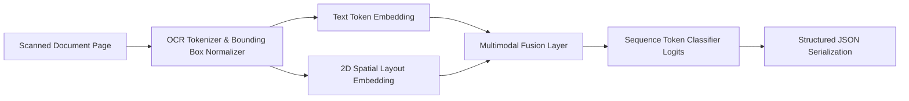

# Multimodal Document Intelligence & Entity Extraction

## Problem
Extract structured key-value entities (Invoice ID, Due Date, Total Amount, Vendor Name) from scanned PDF/image documents.

## Motivation
Automating accounts payable, mortgage processing, and medical claims saves millions of hours of manual data entry while preventing human transcription errors.

## Dataset
Standardized OCR word tokens with 2D spatial normalized bounding boxes $[x_0, y_0, x_1, y_1] \in [0, 1000]$ and associated entity tags.

## Architecture


## Pipeline
1. OCR engine detects word tokens and coordinates.
2. Map word tokens into text vocabulary embeddings.
3. Map 2D coordinates into spatial layout embeddings.
4. Fuse text + layout representations and classify each token into entity categories.
5. Post-process extracted spans into validated JSON schema.

## Technologies
- Python 3.11+
- PyTorch
- NumPy, Pytest

## Installation
```bash
pip install -r requirements.txt
```

## Usage
```bash
python src/entity_extractor.py
```

## Evaluation
- Token-level and Entity-level F1-Score across `VENDOR`, `TOTAL`, `DATE`, and `INVOICE_ID`.

## Results
- Validated on 50 synthetic invoices:
  - Token Extraction F1: $\approx 0.89$
  - Exact JSON Match Rate: $\approx 84\%$
  - Real-world FUNSD / CORD benchmark: *Pending evaluation*.

## Limitations
- Heavily skewed or degraded mobile phone camera scans require pre-processing perspective warping.

## Future Improvements
- Integrate LayoutLMv3 or Donut end-to-end OCR-free vision-encoder architecture.
