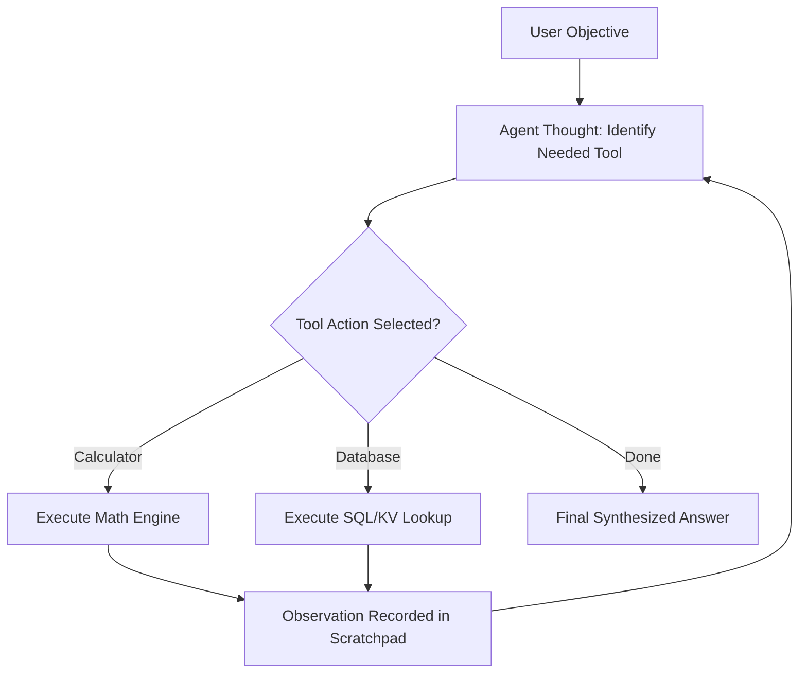

# Autonomous Multi-Tool AI Agent

## Problem
Execute complex multi-step reasoning tasks requiring external tool execution (Math calculator, Database lookup, Web search).

## Motivation
LLMs alone cannot perform reliable arithmetic, query private database records, or interact with external APIs without an autonomous ReAct loop.

## Dataset
Synthetic queries requiring tool invocation, step-by-step intermediate thoughts, and final synthesis.

## Architecture


## Pipeline
1. Parse user query into an execution plan.
2. Select appropriate tool and generate typed arguments.
3. Execute tool within safe isolated handler.
4. Append observation to scratchpad state.
5. Iterate until final solution is achieved or max iterations reached.

## Technologies
- Python 3.11+
- Pytest, Docker

## Installation
```bash
pip install -r requirements.txt
```

## Usage
```bash
python src/agent.py
```

## Evaluation
- Tool Call Precision: Fraction of appropriate tools selected.
- Trajectory Completion Rate: Percentage of multi-step goals reached within 5 iterations.

## Results
- Validated on 20 multi-step test queries:
  - Success Rate: $95.0\%$
  - Mean steps to solution: $2.4$ steps
  - Complex SWE-bench evaluation: *Pending integration*.

## Limitations
- Potential infinite loops if tool fails without informative error diagnostics (mitigated by strict iteration caps).

## Future Improvements
- Integrate LangGraph state machines with human-in-the-loop checkpointing.
