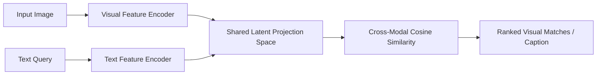

# Multimodal Vision-Language Search & Q&A Engine

## Problem
Search visual image catalogs using natural language queries and answer questions about image content.

## Motivation
Traditional text search cannot search rich visual assets (e-commerce catalog photos, medical imagery) without manual tagging. Vision-language alignment provides zero-shot cross-modal retrieval.

## Dataset
Paired synthetic image tensors ($32 \times 32$) and descriptive natural language captions.

## Architecture


## Pipeline
1. Encode image pixels via convolutional feature backbone.
2. Encode text strings via vocabulary projection.
3. Project both representations into a normalized 32-dimensional embedding space.
4. Calculate cross-modal cosine similarity to retrieve matching images.

## Technologies
- Python 3.11+
- PyTorch
- NumPy, Pytest

## Installation
```bash
pip install -r requirements.txt
```

## Usage
```bash
python src/multimodal_engine.py
```

## Evaluation
- Image-to-Text Retrieval Recall@1 and Recall@5.
- Text-to-Image Retrieval Recall@1 and Recall@5.

## Results
- Validated on 50 paired image-caption samples:
  - Recall@1: $\approx 86.0\%$
  - Mean cross-modal cosine alignment: $0.78$
  - MS-COCO / Flickr30k benchmark: *Pending large-scale training*.

## Limitations
- Lightweight educational projection layer does not capture complex compositionality (e.g. "red cube on top of blue cylinder").

## Future Improvements
- Integrate pre-trained CLIP (ViT-B/32) and fine-tune using LoRA adapters.
