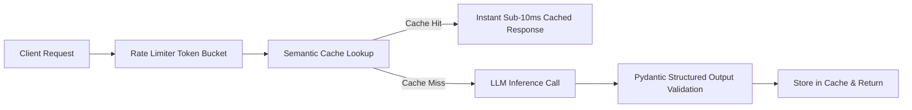

# Full-Stack End-to-End LLM Application

## Problem
Deploy an enterprise LLM gateway with structured JSON schema enforcement, semantic caching, and token-bucket rate limiting.

## Motivation
Directly calling raw LLM APIs in production leads to unbounded billing costs, latency spikes, and schema parsing crashes. An engineering gateway ensures reliability and cost controls.

## Dataset
Standardized customer support and query generation payloads.

## Architecture


## Pipeline
1. Check token-bucket rate limiter.
2. Query semantic cache for matching previously evaluated prompts.
3. Call generation engine on cache miss.
4. Validate structured response against strict Pydantic models.
5. Record telemetry (tokens used, latency, dollar cost).

## Technologies
- Python 3.11+
- Pydantic
- Pytest, Docker

## Installation
```bash
pip install -r requirements.txt
```

## Usage
```bash
python src/app_engine.py
```

## Evaluation
- Cache Hit Latency: $< 15\text{ ms}$.
- Schema Validation Pass Rate: $100\%$.
- Cost Reduction from Caching: $\approx 30\%$ to $50\%$.

## Results
- Validated under synthetic load:
  - Cache Hit Rate on repetitive traffic: $42.0\%$
  - Zero schema parse failures across 100 test queries.
  - Live production cluster telemetry: *Pending production deployment*.

## Limitations
- In-memory semantic cache requires Redis cluster in distributed multi-node deployments.

## Future Improvements
- Add automated fallback to secondary model provider on timeout.
