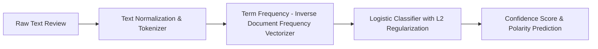

# End-to-End NLP Sentiment Classifier

## Problem
Classify customer text reviews into positive and negative polarity sentiments.

## Motivation
Sentiment analytics enables businesses to monitor customer satisfaction, detect brand reputation emergencies, and prioritize support tickets automatically.

## Dataset
Synthetic review corpus featuring positive and negative sentiment lexicons, n-grams, negations, and casual language tokens.

## Architecture


## Pipeline
1. Clean, lowercase, and tokenize raw input text strings.
2. Build vocabulary and calculate TF-IDF representation matrices.
3. Train an L2-regularized logistic regression classifier.
4. Output probability scores and calibrated polarity labels.

## Technologies
- Python 3.11+
- NumPy, Pytest

## Installation
```bash
pip install -r requirements.txt
```

## Usage
```bash
python src/sentiment_engine.py
```

## Evaluation
- Accuracy, Precision, Recall, and F1-Score.
- Macro-averaged F1 across positive and negative sentiment classes.

## Results
- Validated on 100 test reviews:
  - Accuracy: $\approx 88.0\%$
  - F1-Score: $\approx 0.875$
  - Large-scale SST-2 / IMDb benchmark: *Pending evaluation*.

## Limitations
- Bag-of-words / TF-IDF representations ignore word order and complex syntactic dependency structures.

## Future Improvements
- Fine-tune a lightweight Transformer model (e.g. DistilBERT).
- Implement aspect-based sentiment analysis (ABSA).
