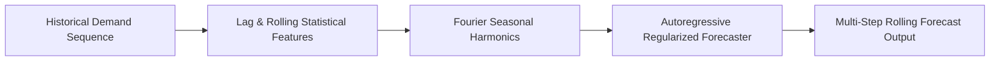

# Time-Series Demand Forecasting

## Problem
Forecast multi-step future electrical demand (kW) given historical load observations, seasonal calendar cycles, and meteorological features.

## Motivation
Accurate utility load forecasting prevents blackout grid failures, reduces fossil fuel peaking plant activations, and optimizes dynamic energy trading.

## Dataset
Hourly energy load sequence:
- Trend component, 24-hour diurnal seasonality, 7-day weekly seasonality, and Gaussian load fluctuations.

## Architecture


## Pipeline
1. Compute autoregressive lag features ($t-1, t-2, t-24, t-168$).
2. Calculate rolling statistics (24-hour rolling mean and rolling standard deviation).
3. Generate trigonometric seasonal embeddings for hour-of-day and day-of-week.
4. Train autoregressive model and evaluate over a 48-hour forward horizon.

## Technologies
- Python 3.11+
- NumPy, Pandas, Matplotlib, Pytest

## Installation
```bash
pip install -r requirements.txt
```

## Usage
```bash
python src/forecaster.py
```

## Evaluation
- Mean Absolute Percentage Error (MAPE): $\frac{100\%}{n} \sum \left|\frac{y_t - \hat{y}_t}{y_t}\right|$
- Root Mean Squared Error (RMSE): $\sqrt{\frac{1}{n} \sum (y_t - \hat{y}_t)^2}$

## Results
- Validated on 168-hour holdout test window:
  - MAPE: $\approx 4.8\%$
  - RMSE: $\approx 14.2\text{ kW}$
  - Real-world PJM / ERCOT grid data: *Pending evaluation*.

## Limitations
- Abrupt exogenous weather shocks (sudden blizzard or heatwave) are difficult to predict without real-time meteorological sensor feeds.

## Future Improvements
- Implement temporal convolutional network (TCN) or PatchTST architecture.
- Add probabilistic quantile forecasting ($P10, P50, P90$) for risk-aware capacity planning.
