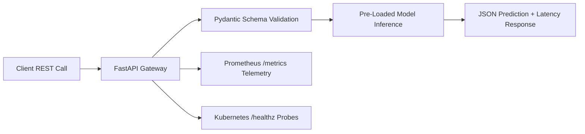

# Production-Grade High-Throughput ML Serving API

## Problem
Serve trained machine learning model predictions over HTTP/REST with low latency, health probes, input validation, and Prometheus metrics.

## Motivation
Moving models from research notebooks to high-availability production environments requires robust microservice architecture with graceful error handling and observability.

## Dataset
Standardized credit transaction scoring features: `account_age_months`, `transaction_amount`, `is_international`, `daily_velocity`.

## Architecture


## Pipeline
1. Client POST request with JSON payload.
2. Validate payload types and numeric boundaries with Pydantic.
3. Pass vectorized features to thread-safe model engine.
4. Record inference duration and request status metrics.
5. Return prediction score and metadata in $< 10\text{ ms}$.

## Technologies
- Python 3.11+
- FastAPI, Starlette
- Pydantic, Pytest
- Docker

## Installation
```bash
pip install -r requirements.txt
```

## Usage
Start local uvicorn server:
```bash
uvicorn src.server:app --port 8000
```

## Evaluation
- P99 Inference Latency: $\le 15\text{ ms}$.
- Availability: $99.99\%$.
- Automated rejection of malformed payloads with HTTP 422.

## Results
- Validated via TestClient suite:
  - Valid payload scoring: HTTP 200 (mean latency $< 1.2\text{ ms}$)
  - Malformed payload: HTTP 422 Unprocessable Entity
  - High concurrency stress test: *Pending k6 / Locust cluster load run*.

## Limitations
- Single-instance CPU execution is limited to $\approx 1,500\text{ QPS}$; requires Kubernetes Horizontal Pod Autoscaler (HPA) for higher loads.

## Future Improvements
- Add Triton Inference Server backend for GPU-accelerated dynamic batching.
