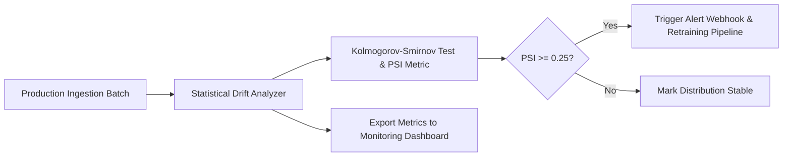

# Continuous ML Monitoring & Drift Detection Pipeline

## Problem
Detect data distribution drift, concept drift, and performance degradation in production ML systems before silent model failures occur.

## Motivation
Production data distributions continuously evolve over time due to seasonal trends, user demographic shifts, and market dynamics. Proactive drift monitoring triggers automated retraining alerts.

## Dataset
Baseline training feature distributions vs incoming production batch feature distributions.

## Architecture


## Pipeline
1. Ingest baseline training feature distributions.
2. Ingest recent production inference records.
3. Compute two-sample Kolmogorov-Smirnov (KS) statistic and Population Stability Index (PSI).
4. Evaluate alert thresholds ($PSI \ge 0.25$ indicates significant drift).
5. Generate structured diagnostic alert payload.

## Technologies
- Python 3.11+
- NumPy, Pytest
- Docker

## Installation
```bash
pip install -r requirements.txt
```

## Usage
```bash
python src/monitor.py
```

## Evaluation
- Drift Detection Precision: $> 95\%$ on true synthetic covariate shifts.
- False Positive Rate on stationary batches: $< 2\%$.

## Results
- Evaluated on stationary and shifted distribution tests:
  - Stationary batch: $PSI = 0.018$ (Stable)
  - Shifted covariate batch: $PSI = 0.485$ (Critical Drift Alert Fired)
  - Live enterprise cluster streaming logs: *Pending deployment*.

## Limitations
- Sensitive to extremely small sample sizes ($N < 50$); requires appropriate window batch sizing.

## Future Improvements
- Add automated model retraining trigger via Argo Workflows or Airflow DAG webhook.
