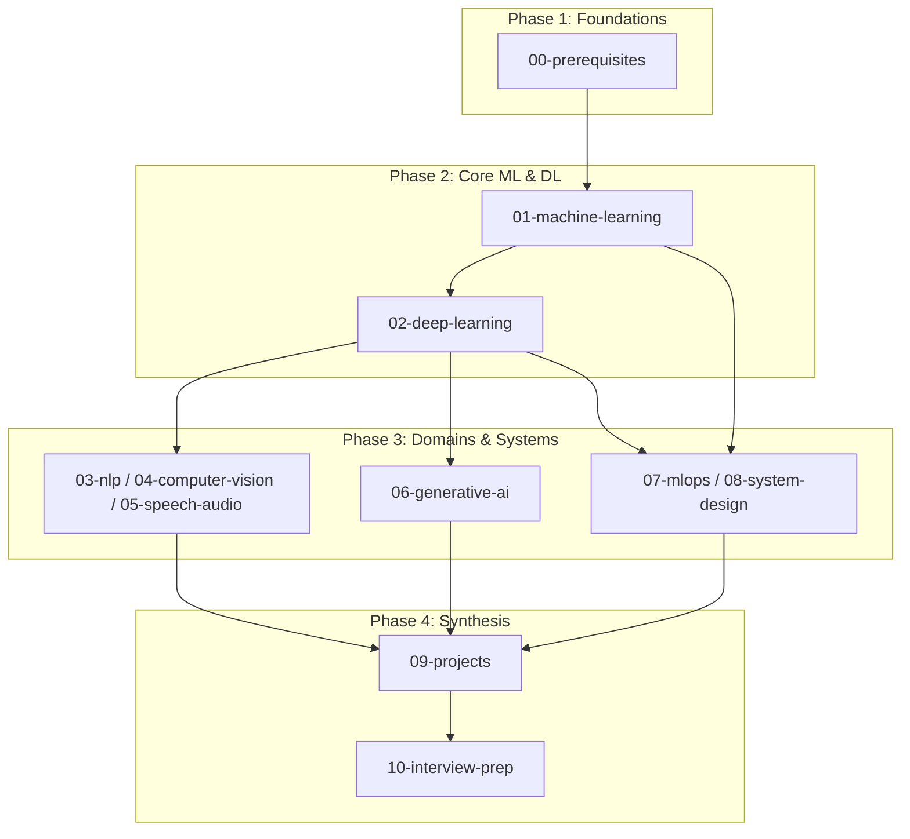

# Repository Roadmap & Learning Pathways

This roadmap outlines structured, goal-oriented learning journeys through the `ai-ml-handbook`, as well as our phased engineering milestones for expanding the repository.

---

## 1. Curated Learning Pathways

### Path 1: Beginner → Machine Learning Engineer
*Target Audience*: Developers or students starting with programming fundamentals aiming for a production ML engineer role.
1. [`00-prerequisites/python-for-ml`](00-prerequisites/python-for-ml/) & [`00-prerequisites/probability-statistics`](00-prerequisites/probability-statistics/)
2. [`00-prerequisites/math-linear-algebra`](00-prerequisites/math-linear-algebra/) & [`00-prerequisites/math-calculus-optimization`](00-prerequisites/math-calculus-optimization/)
3. [`01-machine-learning/supervised`](01-machine-learning/supervised/) & [`01-machine-learning/unsupervised`](01-machine-learning/unsupervised/)
4. [`01-machine-learning/feature-engineering`](01-machine-learning/feature-engineering/) & [`01-machine-learning/model-evaluation`](01-machine-learning/model-evaluation/)
5. [`01-machine-learning/ensemble`](01-machine-learning/ensemble/)
6. [`07-mlops/experiment-tracking`](07-mlops/experiment-tracking/) & [`07-mlops/serving`](07-mlops/serving/)
7. [`09-projects/beginner`](09-projects/beginner/)
8. [`10-interview-prep/coding-questions`](10-interview-prep/coding-questions/)

---

### Path 2: Beginner → Deep Learning Engineer
*Target Audience*: Learners wanting to specialize in modern neural networks, computer vision, and representation learning.
1. Complete Path 1 Foundations ([`00-prerequisites`](00-prerequisites/))
2. [`02-deep-learning/fundamentals`](02-deep-learning/fundamentals/)
3. [`02-deep-learning/cnn`](02-deep-learning/cnn/) & [`04-computer-vision/image-classification`](04-computer-vision/image-classification/)
4. [`02-deep-learning/rnn-lstm-gru`](02-deep-learning/rnn-lstm-gru/) & [`02-deep-learning/attention-transformers`](02-deep-learning/attention-transformers/)
5. [`02-deep-learning/training-tricks`](02-deep-learning/training-tricks/) (optimization, regularization, LR schedules)
6. [`02-deep-learning/generative-models`](02-deep-learning/generative-models/) & [`02-deep-learning/graph-neural-networks`](02-deep-learning/graph-neural-networks/)
7. [`09-projects/intermediate`](09-projects/intermediate/)
8. [`10-interview-prep/ml-theory-qa`](10-interview-prep/ml-theory-qa/)

---

### Path 3: ML Engineer → LLM Engineer
*Target Audience*: Practicing ML practitioners transitioning to modern large language models, retrieval pipelines, and fine-tuning.
1. [`02-deep-learning/attention-transformers`](02-deep-learning/attention-transformers/) & [`03-nlp/transformer-models`](03-nlp/transformer-models/)
2. [`06-generative-ai/llm-fundamentals`](06-generative-ai/llm-fundamentals/)
3. [`06-generative-ai/prompt-engineering`](06-generative-ai/prompt-engineering/)
4. [`06-generative-ai/rag`](06-generative-ai/rag/) (chunking, vector indexing, hybrid retrieval)
5. [`06-generative-ai/fine-tuning`](06-generative-ai/fine-tuning/) (PEFT, LoRA, QLoRA)
6. [`06-generative-ai/inference-optimization`](06-generative-ai/inference-optimization/) (quantization, vLLM, KV cache)
7. [`07-mlops/llmops`](07-mlops/llmops/)
8. [`10-interview-prep/system-design-interviews`](10-interview-prep/system-design-interviews/)

---

### Path 4: Beginner → Generative AI Engineer
*Target Audience*: Developers wanting to build end-to-end GenAI systems, agents, and multimodal applications.
1. [`00-prerequisites/python-for-ml`](00-prerequisites/python-for-ml/)
2. [`06-generative-ai/llm-fundamentals`](06-generative-ai/llm-fundamentals/)
3. [`06-generative-ai/prompt-engineering`](06-generative-ai/prompt-engineering/)
4. [`06-generative-ai/rag`](06-generative-ai/rag/)
5. [`06-generative-ai/agents`](06-generative-ai/agents/) (tool use, planning, multi-agent frameworks)
6. [`06-generative-ai/evaluation`](06-generative-ai/evaluation/) (LLM-as-a-judge, benchmark suites)
7. [`06-generative-ai/multimodal`](06-generative-ai/multimodal/)
8. [`09-projects/genai`](09-projects/genai/)

---

### Path 5: AI Research Path
*Target Audience*: Researchers and graduate students focused on novel model architectures, theoretical analysis, and paper implementations.
1. Complete mathematical rigor in [`00-prerequisites`](00-prerequisites/)
2. [`02-deep-learning`](02-deep-learning/) and [`03-nlp`](03-nlp/)
3. [`11-research-papers/paper-reading-guide`](11-research-papers/paper-reading-guide/)
4. [`11-research-papers/foundational-papers`](11-research-papers/foundational-papers/)
5. [`11-research-papers/modern-llm-breakthroughs`](11-research-papers/modern-llm-breakthroughs/)
6. [`06-generative-ai/safety-alignment`](06-generative-ai/safety-alignment/) (RLHF, DPO mechanics)
7. Code re-implementation of select papers in [`09-projects/research`](09-projects/research/)

---

### Path 6: ML System Design Path
*Target Audience*: Senior engineers and architects preparing for ML system design interviews and enterprise scale deployments.
1. Review classical and deep learning foundations ([`01-machine-learning`](01-machine-learning/), [`02-deep-learning`](02-deep-learning/))
2. [`08-system-design/architecture-patterns`](08-system-design/architecture-patterns/) (latency vs batching, feature store)
3. [`08-system-design/data-pipelines`](08-system-design/data-pipelines/) (streaming, validation)
4. [`08-system-design/scaling-infrastructure`](08-system-design/scaling-infrastructure/) (distributed training, sharding)
5. [`08-system-design/case-studies`](08-system-design/case-studies/) (recommendation feed, fraud detection)
6. [`07-mlops`](07-mlops/) (full production lifecycle)
7. [`10-interview-prep/system-design-interviews`](10-interview-prep/system-design-interviews/)

---

## 2. Engineering Milestones & Current Status

| Phase | Milestone | Focus Area | Status |
| :--- | :--- | :--- | :--- |
| **Phase 1** | **Repository Architecture & Infrastructure** | Complete folder structure, standard templates, CI workflows, quality gates, and documentation baselines | **Active / Completed** |
| **Phase 2** | **Prerequisites & Classical ML Modules** | Detailed step-by-step notebooks, numpy implementations, and benchmark comparisons for 00 & 01 | *Upcoming* |
| **Phase 3** | **Deep Learning, NLP, & Computer Vision** | PyTorch implementations, training dynamics, convolutional and transformer labs for 02, 03, 04, 05 | *Planned* |
| **Phase 4** | **Generative AI, LLMs, RAG, & Agents** | Hands-on RAG setups, PEFT fine-tuning labs, agent architectures, and quantization pipelines for 06 | *Planned* |
| **Phase 5** | **MLOps, System Design, & Capstones** | Microservice serving, CI/CD pipelines, telemetry, and end-to-end projects for 07, 08, 09 | *Planned* |
| **Phase 6** | **Interview Drills & Research Compendiums** | Comprehensive solutions for coding challenges, mock design templates, and annotated papers for 10, 11, 12 | *Planned* |
